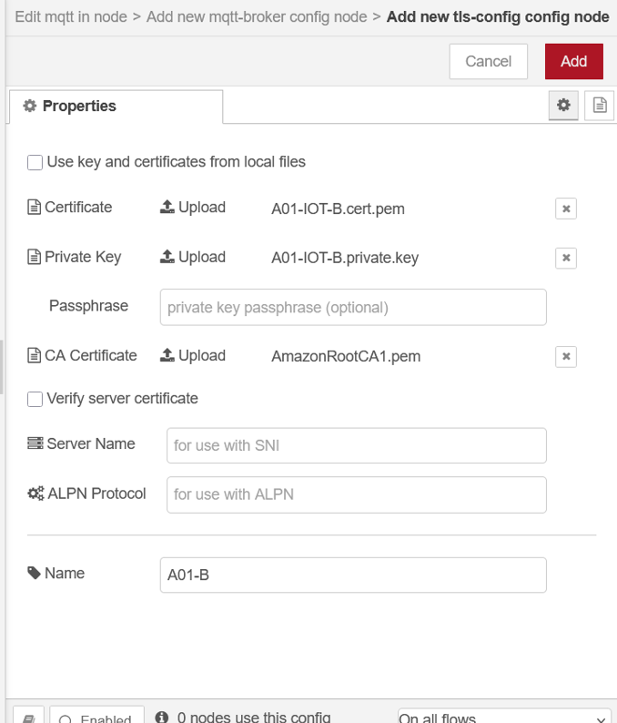

# Indice

## **1) Desplegar dos instancias t3.micro con Linux Debian 13 en AWS EC2: Instancia A e Instancia B.**

Las siguientes imagenes muestran el **inicio exitoso de las instancias EC2** en AWS, **Instancia A** e **Instancia B**.
El proceso de creación se completó correctamente, incluyendo la inicialización, la configuración de grupos y reglas de seguridad, y el lanzamiento final.
Las instancia quedaron listas para su conexión y posterior instalación de Node-RED.


---

## **2) Instalar “Node-RED” en ambas instancias.**

Primero configuramos las **reglas de entrada** del grupo de seguridad asociado a las instancias, habilitando el **puerto 22 (SSH)** para permitir el acceso remoto desde cualquier dirección IP, y se agregando una regla **TCP personalizada en el puerto 1880**, utilizada por **Node-RED** para su interfaz web.
Esta configuración permite acceder al panel de control de Node-RED desde el navegador, garantizando la comunicación externa necesaria para el proyecto.


Ya habiendo configurado las **reglas de entrada**, ejecutamos los siguientes comandos en ambas instancias para instalar **node-red**:

```bash
sudo apt update
sudo apt install snapd
sudo snap install core
sudo snap install node-red
```
---

Y para verificar su correcto funcionamiento utilizamos el comando `sudo apt install net-tools` para disponer de utilidades de red y, posteriormente, `sudo netstat -na | grep 1880` para confirmar que el servicio de Node-RED se encuentra escuchando en el **puerto 1880**, indicando que la instalación y el despliegue se realizaron correctamente.


Posteriormente probamos el acceso a la **interfaz gráfica de Node-RED** mediante el navegador, utilizando las direcciónes públicas de las instancias. 


Estos pasos confirman que la instalación y configuración del entorno Node-RED en las instancias se realizaron correctamente y que el servicio se encuentra operativo.

## **3) Instalar el nodo “node-red-dashboard”.**

En la siguientes imagenes se puede ver el menú de configuración de **Node-RED**, para instalar el paquete **`node-red-dashboard`**.
Este módulo permite crear interfaces gráficas interactivas (dashboards) para visualizar y controlar variables del sistema, como el estado de la iluminación o los temporizadores.
La instalación de este nodo es fundamental para el desarrollo del panel de control utilizado en el proyecto.


---

## **4) Registrar ambas instancias como objetos/dispositivos en AWS IoT para poder operar mediante el protocolo MQTT.**

En la siguiente imagen se muestra el paso de **descarga del kit de conexión** en el servicio **AWS IoT Core**, correspondiente al dispositivo **A01-IOT-A**.
El kit incluye los archivos necesarios para establecer la comunicación segura entre la instancia EC2 y el servicio IoT. Estos elementos permiten autenticar el dispositivo y garantizar una conexión segura mediante el protocolo **MQTT**.


Una configuracion necesaria para su correcto funcionamiento es la de la **política de seguridad**, la cual fue **actualizada** de la siguiente manera: Se configuro la versión activa de la política la **versión 2**, que tiene como proposito permitir todas las acciones (`iot:*`) sobre cualquier recurso (`*`).


**El mismo procesamiento fue realizado para el dispositivo **A01-IOT-B**.**

---

## **5) Desarrollar, en la instancia A, la solución de un “CONTROL REMOTO” para gestionar la iluminación de un ambiente: ´botón “ENCENDIDO/ON”, botón “APAGADO/OFF”, informe de estado de la luminaria y funcionalidad “TIMER de 5s” para que activada dicha funcionalidad, al encender la luminaria se apague a los 5 segundos.**

Dentro de la **Instancia A**, se pueden encontrar los botones **ON**, **OFF** y el **Timer ON/OFF** con distintas funciones que manejan la lógica del encendido, apagado y el temporizador de 5 segundos.
Cuando el temporizador está activo, la lámpara se apaga automáticamente después de esos 5 segundos de apretado el boton **ON**.
Todas las acciones se envían por **MQTT** al canal configurado en **AWS IoT**, que luego es recibido por la **Instancia B**, encargada de mostrar el estado de la luminaria.


Si nos fijamos en **panel de control hecho con Node-RED Dashboard**, podemos ver los tres elemento: los botones **ON** y **OFF** y un switch **Timer ON/OFF**.
Desde acá se puede encender y apagar la led o activar el temporizador de la luminaria, que la apaga automáticamente después de 5 segundos de apretado el boton **ON**.


### NODOS A DETALLAR:

* **Function 2** se encarga de **manejar el estado del temporizador** usando una variable global llamada **`TIMER_ON`**, cambiando cada vez que se ejecuta el estado de la variable: Si **`TIMER_ON` está en 1**, la función la cambia a **0** y si está en **0**, la cambia a **1**. De esta forma, el sistema alterna entre los dos modos (automático y manual) y mantiene sincronizado el estado del temporizador con el interruptor del panel.

* **Function 1** se encarga de manejar el apagado de la luz teniendo en cuenta si el temporizador está activo: Esto lo hace revisando el valor de la variable global **`TIMER_ON`**, que guarda el estado del temporizador.
Si el temporizador **está activado**, la función envía un mensaje al **delay** para que luego de 5 segundos se los transmita al la **Function 3**.
En cambio, si el temporizador **no está activo**, no se envía nada, y el delay no se activa.

* A su vez, si **delay** se activa, **Function 3** simplemente cambia el valor del payload a 0 (lo que representa el estado de apagado) y lo envía al mismo canal MQTT que controla la luz. De esta manera, cuando el temporizador está activo, el flujo primero enciende la luz con `payload = 1` y, tras los 5 segundos, esta función la apaga enviando `payload = 0`.
Así logramos un sistema automático que prende y apaga sin intervención manual.


---

## **6) Desarrollar, en la instancia B, la solución para controlar la “ILUMINACIÓN” de un ambiente simulando el “ENCENDIDO/APAGADO” de la luminaria, informando el estado de la “LUMINARIA” y el estado del “TIMER”.**

Dentro de la **Instancia B** se estableció la recepción de las señales recibidas por los canales **A01 - CANAL 1**, **A01 - CANAL 2**, que envian, respectivamente, sus valores hacia un gauge y a una celda de texto que indica el estado del timer. 


Los valores recibidos se muestran en tiempo real dentro del dashboard. 

### TODO: Que muestre el dashboard 


---

## **7) Las instancias A y B deben comunicarse por medio de MQTT utilizando el bróker de AWS IoT.**

En la intancia 1, en la **configuración del nodo MQTT** dentro de Node-RED, se incorporon los **certificados de seguridad proporcionados por AWS** para establecer una conexión segura con el bróker MQTT.
Se cargon: El **certificado del dispositivo (`A01-IOT-A.cert.pem`)**, la **clave privada (`A01-IOT-A.private.key`)** y el **certificado raíz de Amazon (`AmazonRootCA1.pem`)**, asegurando la autenticación y el cifrado de las comunicaciones.


El nodo está asociado al servidor **A01-ND**, que contiene los certificados de autenticación configurados previamente, y se define el **tópico “A0-CANALLL”**, que representa el canal de comunicación por el cual se enviarán los mensajes MQTT. Ademas, se le configuro el QoS para que tenga **tipo 0**.


Por ultimo, el nodo ademas tiene la siguiente configuracion: Se habilita la opción **“Use TLS”**, asociando el conjunto de certificados **A01-CERTIFICADOS** previamente cargado, garantizando así una conexión segura y cifrada.
Además, se utiliza el protocolo **MQTT versión 3.1.1**, con conexión automática y sesión limpia, lo que asegura una comunicación estable y autenticada con el servidor IoT.


### TODO: El nodo in 2:

**Nodo MQTT Out** configurado con el servidor **A01-ND** y el **tópico “A0-CANAL 2”**. Este nodo envía los mensajes al bróker de **AWS IoT** con **QoS 0**, estableciendo la comunicación entre las instancias.
A la derecha, el panel **debug** confirma el envío correcto de los datos (`msg.payload : number`).


---

### TODO: Similarmente, se hicieron las configuraciones necesarias para la instancia B

**Configuración TLS** para la **Instancia B**, donde se cargan los certificados necesarios para la conexión segura con **AWS IoT**:

* **A01-IOT-B.cert.pem** (certificado del dispositivo)
* **A01-IOT-B.private.key** (clave privada)
* **AmazonRootCA1.pem** (certificado raíz).

Con esto generamos la **comunicación cifrada y autenticada** entre Node-RED y el bróker MQTT.





# Imagenes finales que muestran el funcionamiento

## **Ejemplo** que muestra el funcionamiento esperado


---

## Resolucion


---

# JSON de instancias

### TODO: Intancia 1

```json
[
    {
        "id": "8e0cbc430664e608",
        "type": "function",
        "z": "5e1db891e60b5c59",
        "name": "function 2",
        "func": "// Obtener el valor de la variable global \"TIMER_ON\"\nvar timerOn = global.get(\"TIMER_ON\");\n\nif (timerOn) {\n    global.set('TIMER_ON', 0);\n    \n    msg.payload = 0;\n    return msg;  \n} else {\n    global.set('TIMER_ON', 1);\n\n\n\n    msg.payload = 1;\n    return msg;  \n}\n\nreturn null;\n",
        "outputs": 1,
        "timeout": 0,
        "noerr": 0,
        "initialize": "// Code added here will be run once\n// whenever the node is started.\nglobal.set('TIMER_ON', 0);\n",
        "finalize": "",
        "libs": [],
        "x": 720,
        "y": 440,
        "wires": [
            [
                "4643e7018dabdb67",
                "a9649b8b6a640eb1"
            ]
        ]
    }
]
```

### TODO: Instancia 2

```json
[
    {
        "id": "851e7fe4014bb0d5",
        "type": "tab",
        "label": "Flow 1",
        "disabled": false,
        "info": "",
        "env": []
    },
    {
        "id": "bf13f7c233638d0b",
        "type": "mqtt in",
        "z": "851e7fe4014bb0d5",
        "name": "",
        "topic": "A0 - CANAL 1",
        "qos": "0",
        "datatype": "auto-detect",
        "broker": "89528596d9aa8d87",
        "nl": false,
        "rap": true,
        "rh": 0,
        "inputs": 0,
        "x": 350,
        "y": 260,
        "wires": [
            [
                "d2dea35af5752b39",
                "92e0e2c9e46981de"
            ]
        ]
    },
    {
        "id": "d2dea35af5752b39",
        "type": "ui_gauge",
        "z": "851e7fe4014bb0d5",
        "name": "",
        "group": "93785911cc895a9d",
        "order": 0,
        "width": 0,
        "height": 0,
        "gtype": "gage",
        "title": "gauge",
        "label": "units",
        "format": "{{value}}",
        "min": 0,
        "max": "1",
        "colors": [
            "#00b500",
            "#e6e600",
            "#ca3838"
        ],
        "seg1": "",
        "seg2": "",
        "diff": false,
        "className": "",
        "x": 610,
        "y": 260,
        "wires": []
    },
    {
        "id": "da8eff1728975e77",
        "type": "mqtt in",
        "z": "851e7fe4014bb0d5",
        "name": "",
        "topic": "A0 - CANAL 2",
        "qos": "0",
        "datatype": "auto-detect",
        "broker": "89528596d9aa8d87",
        "nl": false,
        "rap": true,
        "rh": 0,
        "inputs": 0,
        "x": 170,
        "y": 360,
        "wires": [
            [
                "46131f48d11a2d93"
            ]
        ]
    },
    {
        "id": "43e3a7017615bf0b",
        "type": "ui_text",
        "z": "851e7fe4014bb0d5",
        "group": "93785911cc895a9d",
        "order": 1,
        "width": 0,
        "height": 0,
        "name": "",
        "label": "ESTADO DE TIMER",
        "format": "{{msg.payload}}",
        "layout": "row-spread",
        "className": "",
        "style": false,
        "font": "",
        "fontSize": 16,
        "color": "#000000",
        "x": 640,
        "y": 360,
        "wires": []
    },
    {
        "id": "c350c83e29f26b57",
        "type": "mqtt out",
        "z": "851e7fe4014bb0d5",
        "name": "",
        "topic": "A0 - CANAL 3",
        "qos": "0",
        "retain": "",
        "respTopic": "",
        "contentType": "",
        "userProps": "",
        "correl": "",
        "expiry": "",
        "broker": "89528596d9aa8d87",
        "x": 620,
        "y": 460,
        "wires": []
    },
    {
        "id": "92e0e2c9e46981de",
        "type": "function",
        "z": "851e7fe4014bb0d5",
        "name": "function 1",
        "func": "if (msg.payload === 1) {\n    msg.payload = true;\n    return msg;\n} else if (msg.payload === 0) {\n    msg.payload = false;\n    return msg;\n}\n\n// Si no es 0 ni 1, no enviar nada\nreturn null;\n",
        "outputs": 1,
        "timeout": 0,
        "noerr": 0,
        "initialize": "",
        "finalize": "",
        "libs": [],
        "x": 380,
        "y": 460,
        "wires": [
            [
                "c350c83e29f26b57",
                "ef083061253f6d22"
            ]
        ]
    },
    {
        "id": "ef083061253f6d22",
        "type": "ui_text",
        "z": "851e7fe4014bb0d5",
        "group": "93785911cc895a9d",
        "order": 1,
        "width": 0,
        "height": 0,
        "name": "",
        "label": "ESTADO DE LED",
        "format": "{{msg.payload}}",
        "layout": "row-spread",
        "className": "",
        "style": false,
        "font": "",
        "fontSize": 16,
        "color": "#000000",
        "x": 590,
        "y": 560,
        "wires": []
    },
    {
        "id": "46131f48d11a2d93",
        "type": "function",
        "z": "851e7fe4014bb0d5",
        "name": "function 2",
        "func": "if (msg.payload === 1) {\n    msg.payload = true;\n    return msg;\n} else if (msg.payload === 0) {\n    msg.payload = false;\n    return msg;\n}\n\n// Si no es 0 ni 1, no enviar nada\nreturn null;\n",
        "outputs": 1,
        "timeout": 0,
        "noerr": 0,
        "initialize": "",
        "finalize": "",
        "libs": [],
        "x": 400,
        "y": 380,
        "wires": [
            [
                "43e3a7017615bf0b"
            ]
        ]
    },
    {
        "id": "89528596d9aa8d87",
        "type": "mqtt-broker",
        "name": "",
        "broker": "a19dtnoi0vf30n-ats.iot.us-east-1.amazonaws.com",
        "port": "8883",
        "tls": "aea41aa768c86303",
        "clientid": "",
        "autoConnect": true,
        "usetls": true,
        "protocolVersion": "5",
        "keepalive": "60",
        "cleansession": true,
        "autoUnsubscribe": true,
        "birthTopic": "",
        "birthQos": "0",
        "birthRetain": "false",
        "birthPayload": "",
        "birthMsg": {},
        "closeTopic": "",
        "closeQos": "0",
        "closeRetain": "false",
        "closePayload": "",
        "closeMsg": {},
        "willTopic": "",
        "willQos": "0",
        "willRetain": "false",
        "willPayload": "",
        "willMsg": {},
        "userProps": "",
        "sessionExpiry": ""
    },
    {
        "id": "93785911cc895a9d",
        "type": "ui_group",
        "name": "Default",
        "tab": "32ebd9f119ce5fb1",
        "order": 1,
        "disp": true,
        "width": "6",
        "collapse": false,
        "className": ""
    },
    {
        "id": "aea41aa768c86303",
        "type": "tls-config",
        "name": "A01-B",
        "cert": "",
        "key": "",
        "ca": "",
        "certname": "A01-IOT-B.cert.pem",
        "keyname": "A01-IOT-B.private.key",
        "caname": "AmazonRootCA1.pem",
        "servername": "",
        "verifyservercert": false,
        "alpnprotocol": ""
    },
    {
        "id": "32ebd9f119ce5fb1",
        "type": "ui_tab",
        "name": "Home",
        "icon": "dashboard",
        "disabled": false,
        "hidden": false
    }
]
```

### Estas fueron todas las imagenes finales del proyecto


