# Indice

## **1) Desplegar dos instancias t3.micro con Linux Debian 13 en AWS EC2: Instancia A e Instancia B.**

Las siguientes imagenes muestran el **inicio exitoso de las instancias EC2** en AWS, **Instancia A** e **Instancia B**.
El proceso de creación se completó correctamente, incluyendo la inicialización, la configuración de grupos y reglas de seguridad, y el lanzamiento final.
Las instancia quedaron listas para su conexión y posterior instalación de Node-RED.

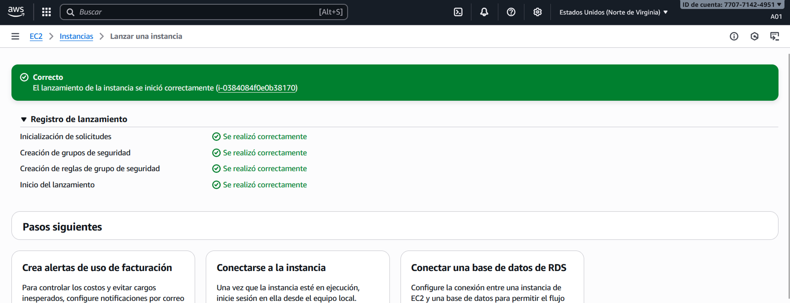


---

**2) Instalar “Node-RED” en ambas instancias.**

Primero configuramos las **reglas de entrada** del grupo de seguridad asociado a las instancias, habilitando el **puerto 22 (SSH)** para permitir el acceso remoto desde cualquier dirección IP, y se agregando una regla **TCP personalizada en el puerto 1880**, utilizada por **Node-RED** para su interfaz web.
Esta configuración permite acceder al panel de control de Node-RED desde el navegador, garantizando la comunicación externa necesaria para el proyecto.


Ya habiendo configurado las **reglas de entrada**, ejecutamos los siguientes comandos en ambas instancias para instalar **node-red**:

```bash
sudo apt update
sudo apt install snapd
sudo snap install core
sudo snap install node-red
```
---

Y para verificar su correcto funcionamiento utilizamos el comando `sudo apt install net-tools` para disponer de utilidades de red y, posteriormente, `sudo netstat -na | grep 1880` para confirmar que el servicio de Node-RED se encuentra escuchando en el **puerto 1880**, indicando que la instalación y el despliegue se realizaron correctamente.

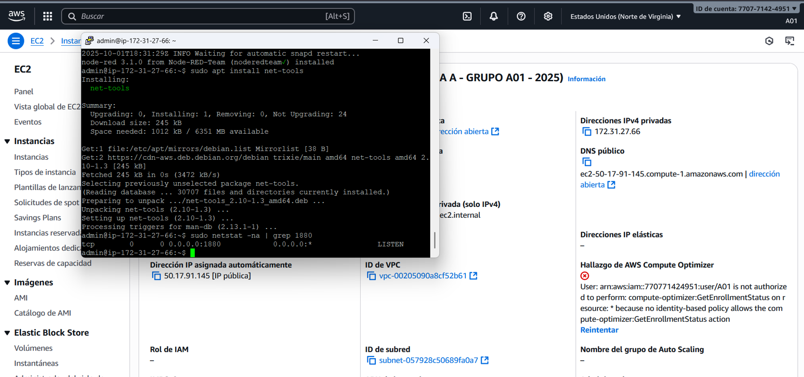

Posteriormente probamos el acceso a la **interfaz gráfica de Node-RED** mediante el navegador, utilizando las direcciónes públicas de las instancias. 

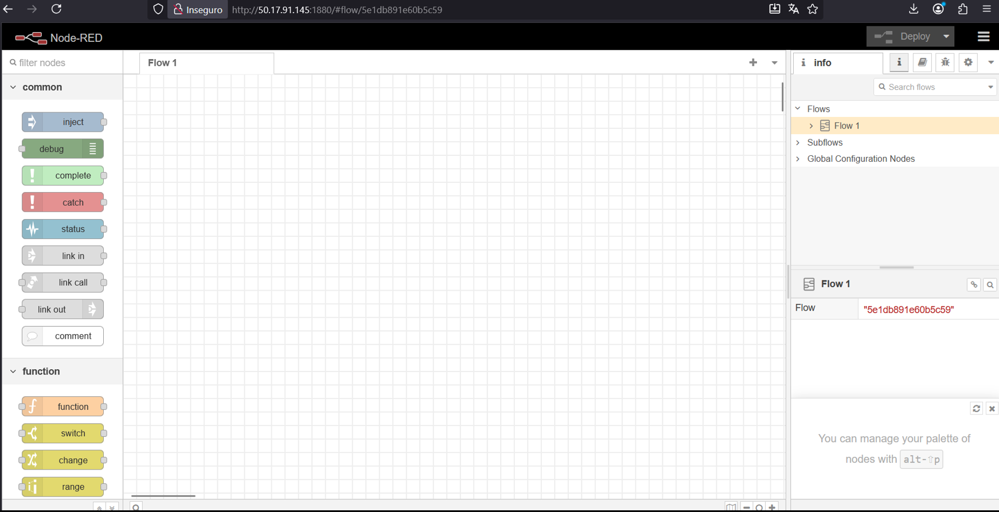

Estos pasos confirman que la instalación y configuración del entorno Node-RED en las instancias se realizaron correctamente y que el servicio se encuentra operativo.

**3) Instalar el nodo “node-red-dashboard”.**

En la siguiente imagen se puede ver el menú de configuración de **Node-RED**, para instalar el paquete **`node-red-dashboard`**.
Este módulo permite crear interfaces gráficas interactivas (dashboards) para visualizar y controlar variables del sistema, como el estado de la iluminación o los temporizadores.
La instalación de este nodo es fundamental para el desarrollo del panel de control utilizado en el proyecto.


---

**4) Registrar ambas instancias como objetos/dispositivos en AWS IoT para poder operar mediante el protocolo MQTT.**

En la imagen se muestra el paso de **descarga del kit de conexión** en el servicio **AWS IoT Core**, correspondiente al dispositivo **A01-IOT-A**.
El kit incluye los archivos necesarios para establecer la comunicación segura entre la instancia EC2 y el servicio IoT, tales como el **certificado digital (`.cert.pem`)**, la **clave privada (`.private.key`)** y la **política de acceso (`A01-IOT-A-Policy`)**.
Estos elementos permiten autenticar el dispositivo y garantizar una conexión segura mediante el protocolo **MQTT**.


En la imagen se observa la **política A01-IOT-A-Policy** dentro del servicio **AWS IoT Core**, la cual fue **creada y actualizada correctamente**.
La versión activa de la política (versión 2) tiene como efecto **“Allow”**, lo que permite todas las acciones (`iot:*`) sobre cualquier recurso (`*`).
Esta configuración es necesaria para que el dispositivo pueda **publicar y suscribirse a temas MQTT**, garantizando la comunicación entre las instancias EC2 y el bróker de AWS IoT.


La imagen muestra la **configuración del nodo MQTT** dentro de Node-RED, donde se incorporan los **certificados de seguridad proporcionados por AWS IoT Core** para establecer una conexión segura con el bróker MQTT.
Se cargan el **certificado del dispositivo (`A01-IOT-A.cert.pem`)**, la **clave privada (`A01-IOT-A.private.key`)** y el **certificado raíz de Amazon (`AmazonRootCA1.pem`)**, asegurando la autenticación y el cifrado de las comunicaciones.
En el flujo se observa un nodo de inyección con el mensaje “HOLA”, utilizado para probar la correcta transmisión de datos hacia AWS IoT.


La imagen muestra la **configuración del nodo MQTT** dentro de Node-RED, donde se incorporan los **certificados de seguridad proporcionados por AWS IoT Core** para establecer una conexión segura con el bróker MQTT.
Se cargan el **certificado del dispositivo (`A01-IOT-A.cert.pem`)**, la **clave privada (`A01-IOT-A.private.key`)** y el **certificado raíz de Amazon (`AmazonRootCA1.pem`)**, asegurando la autenticación y el cifrado de las comunicaciones.
En el flujo se observa un nodo de inyección con el mensaje “HOLA”, utilizado para probar la correcta transmisión de datos hacia AWS IoT.


---

**5) Desarrollar, en la instancia A, la solución de un “CONTROL REMOTO” para gestionar la iluminación de un ambiente: ´botón “ENCENDIDO/ON”, botón “APAGADO/OFF”, informe de estado de la luminaria y funcionalidad “TIMER de 5s” para que activada dicha funcionalidad, al encender la luminaria se apague a los 5 segundos.**

En la imagen se configura el **nodo de salida MQTT (`mqtt out`)** en Node-RED, utilizado para **publicar mensajes hacia AWS IoT Core**.
El nodo está asociado al servidor **A01-ND**, que contiene los certificados de autenticación configurados previamente, y se define el **tópico “A0-CANALLL”**, que representa el canal de comunicación por el cual se enviarán los mensajes MQTT.
El flujo mostrado envía el mensaje “HOLA”, comprobando la correcta transmisión de datos desde la **Instancia A** hacia el bróker de AWS IoT.


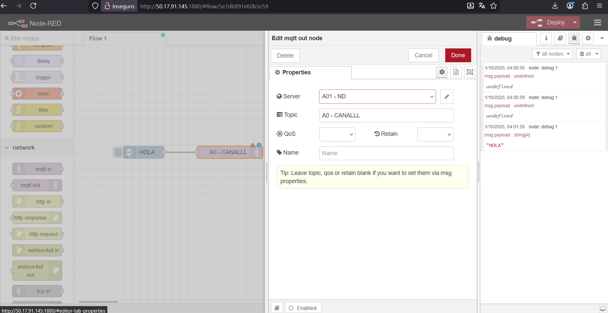

En la imagen se muestra la **política A01-IOT-B-Policy**, correspondiente al segundo dispositivo registrado en **AWS IoT Core**.
La política fue **creada y activada correctamente (versión 2)**, otorgando permisos con efecto **“Allow”** para todas las acciones del servicio IoT (`iot:*`) sobre cualquier recurso (`*`).
Esta configuración habilita a la **Instancia B** para comunicarse con el bróker MQTT de AWS IoT, permitiendo recibir y publicar mensajes en los tópicos definidos.


En la imagen se muestra la **configuración del bróker MQTT** en Node-RED para la **Instancia A**, donde se establecen los parámetros de conexión con **AWS IoT Core**.
Se habilita la opción **“Use TLS”**, asociando el conjunto de certificados **A01-CERTIFICADOS** previamente cargado, garantizando así una conexión segura y cifrada.
Además, se utiliza el protocolo **MQTT versión 3.1.1**, con conexión automática y sesión limpia, lo que asegura una comunicación estable y autenticada con el servidor IoT.


La imagen muestra la **configuración de seguridad TLS en Node-RED** correspondiente a la **Instancia B**, utilizada para la conexión con el servicio **AWS IoT Core**.
Se cargan los certificados del dispositivo **A01-IOT-B**, incluyendo el **certificado digital (`.cert.pem`)**, la **clave privada (`.private.key`)** y el **certificado raíz de Amazon (`AmazonRootCA1.pem`)**.
Esta configuración permite autenticar de forma segura la Instancia B como cliente MQTT, garantizando el cifrado de la comunicación con el bróker IoT.


La imagen muestra la configuración del **nodo de entrada MQTT (`mqtt in`)** en Node-RED, utilizado para **suscribirse al tópico “A0-CANALLL”** dentro de AWS IoT Core.
El nodo está vinculado al servidor **A01-ND**, configurado con conexión segura TLS y los certificados correspondientes.
Mediante esta suscripción, la instancia puede **recibir mensajes publicados** en dicho canal, verificando así la correcta comunicación entre las instancias a través del **protocolo MQTT**.


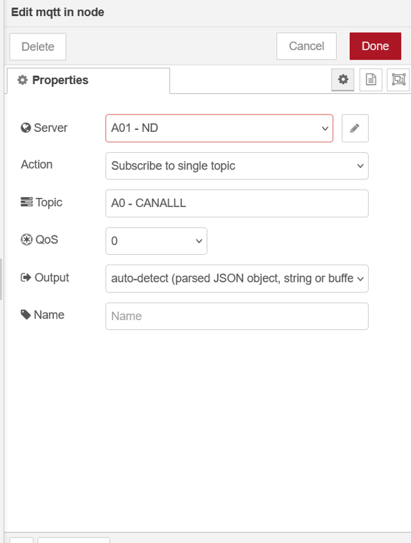

La imagen muestra la **configuración completa del bróker MQTT** en Node-RED, donde se establece la conexión con el **endpoint de AWS IoT Core**:
`a19dtnoi0vf30n-ats.iot.us-east-1.amazonaws.com`.
Se habilita la conexión automática y el uso de **TLS** con los certificados **A01-CERTIFICADOS**, utilizando el **protocolo MQTT v3.1.1** sobre el **puerto 1883**.
Esta configuración permite que la **Instancia A** publique mensajes de forma segura hacia el bróker IoT, garantizando la autenticación y la integridad de los datos transmitidos.


En la imagen se observa la configuración del **bróker MQTT en Node-RED**, estableciendo la conexión con el **endpoint de AWS IoT Core** mediante el protocolo **MQTT versión 5**.
Se habilita la conexión automática con cifrado **TLS**, utilizando el conjunto de certificados **A01-CERTIFICADOS** para la autenticación del dispositivo.
El uso de **MQTT v5** permite una comunicación más eficiente y confiable, optimizando el intercambio de mensajes entre la **Instancia A** y el servicio IoT de AWS.


La imagen muestra la **transmisión exitosa del mensaje “HOLA”** entre los nodos configurados en Node-RED mediante el **protocolo MQTT**.
El flujo se compone de un nodo de inyección, un **nodo de publicación (“A01-Input Canal”)** y un **nodo de suscripción (“A01-Output Canal”)**, ambos conectados al bróker de **AWS IoT Core**.
El panel de depuración (debug) confirma la correcta recepción del mensaje en el tópico configurado, demostrando la **comunicación bidireccional entre las instancias A y B** a través del servicio IoT.


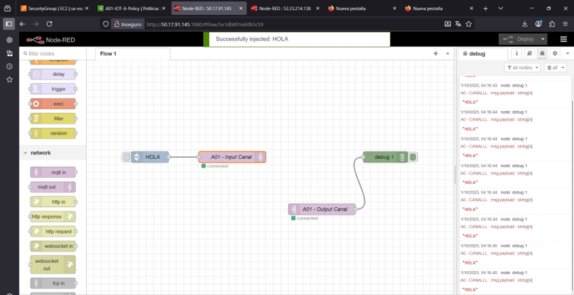


La imagen muestra el **flujo implementado en la Instancia A** para el **control remoto de la iluminación**.
Se incorporan tres botones del *dashboard*: **ON**, **OFF** y **Timer ON/OFF**, cada uno conectado a su respectivo nodo de publicación MQTT (*A01 - Input Canal*).
Este panel permite encender o apagar la luminaria y activar un temporizador de 5 segundos que apaga autom√°ticamente el sistema.
El flujo representa la lógica principal del control remoto, enviando las órdenes hacia la Instancia B mediante el **bróker MQTT de AWS IoT**.


En esta imagen se puede ver el **panel de control hecho con Node-RED Dashboard** desde la **Instancia A**.
Tiene tres controles principales: un **botón ON**, un **botón OFF** y un **switch Timer ON/OFF**.
Desde acá se puede encender, apagar o activar el temporizador de la luminaria, que la apaga automáticamente después de 5 segundos.
Cada acción envía un mensaje por **MQTT** hacia la **Instancia B**, que se encarga de simular el encendido o apagado del sistema de iluminación.


---

**6) Desarrollar, en la instancia B, la solución para controlar la “ILUMINACIÓN” de un ambiente simulando el “ENCENDIDO/APAGADO” de la luminaria, informando el estado de la “LUMINARIA” y el estado del “TIMER”.**

En esta parte se ve el **flujo completo armado en Node-RED** dentro de la **Instancia A**.
Acá conectamos los botones **ON**, **OFF** y el **Timer ON/OFF** con distintas funciones que manejan la lógica del encendido, apagado y el temporizador de 5 segundos.
Cuando el temporizador está activo, la lámpara se apaga automáticamente después de esos 5 segundos.
Todas las acciones se envían por **MQTT** al canal configurado en **AWS IoT**, que luego es recibido por la **Instancia B**, encargada de mostrar el estado de la luminaria.


En esta imagen se puede ver la **configuración del botón OFF** dentro del panel de control en Node-RED.
Desde esta ventana se definen las propiedades del botón, como el **grupo donde se muestra (CONTROL REMOTO)**, el **texto del botón**, y el **valor del payload** que se envía cuando se hace clic.
En este caso, al presionar el botón se envía el valor **0**, que representa la acción de apagar la luminaria.
De forma similar, el botón **ON** envía el valor **1** para encenderla.


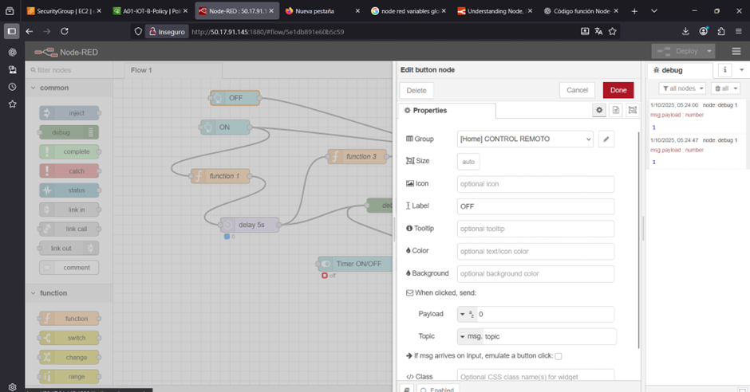

En esta imagen se ve la **configuración del botón ON** dentro del grupo *CONTROL REMOTO* en Node-RED.
Acá se define que al presionar el botón se envía un **payload con el valor 1**, lo que representa la acción de **encender la luminaria**.
Este mensaje se publica a través del nodo MQTT y se envía al **canal configurado en AWS IoT**, donde la Instancia B recibe la orden y actualiza el estado del sistema.
De esta forma, el panel permite controlar de manera sencilla el encendido de la luz desde la interfaz web.


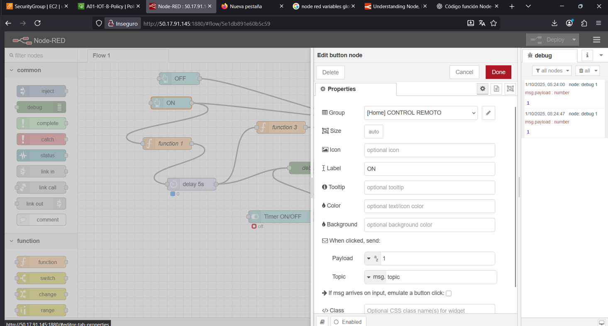

En este bloque se puede ver el código de la **Function 1**, que se encarga de manejar el encendido de la luz teniendo en cuenta si el temporizador está activo.
Primero obtiene el valor de la variable global **TIMER_ON**, que guarda el estado del temporizador.
Si el temporizador **no está activado**, la función envía un mensaje con **payload = 1**, lo que indica encender la luz.
En cambio, si **TIMER_ON está activo**, no se envía nada, ya que el temporizador se encarga de apagarla automáticamente después de los 5 segundos.


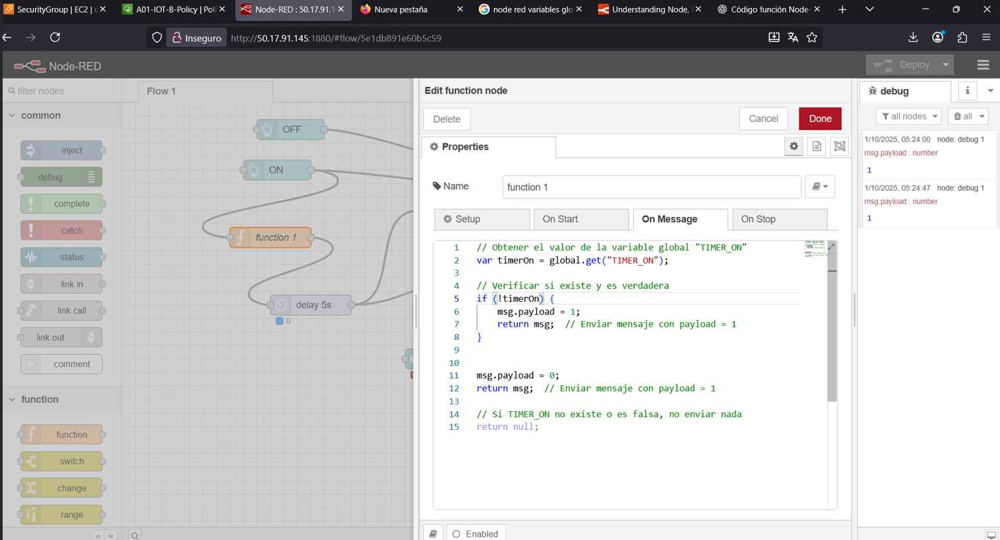


En esta parte se usa el **nodo Delay**, configurado para generar una pausa de **5 segundos** antes de enviar el siguiente mensaje.
Esto permite simular un **temporizador automático**, de manera que, después de encender la luz, el sistema espere 5 segundos antes de enviar la orden de apagado.
De esta forma, se logra un comportamiento automático cuando el **Timer ON/OFF** está activado, sin necesidad de presionar el botón manualmente.


En este paso se configuró el **nodo Delay** para que genere una **espera de 5 segundos** antes de continuar con el flujo.
La idea es que, cuando el temporizador esté activado, este nodo actúe como un **apagado automático**, mandando la señal de apagado después del tiempo establecido.
De esta forma, si el usuario prende la luz con el temporizador activado, el sistema la apaga solo pasados los 5 segundos, sin tener que presionar el botón OFF.
Así simulamos un control más inteligente y práctico. 😎

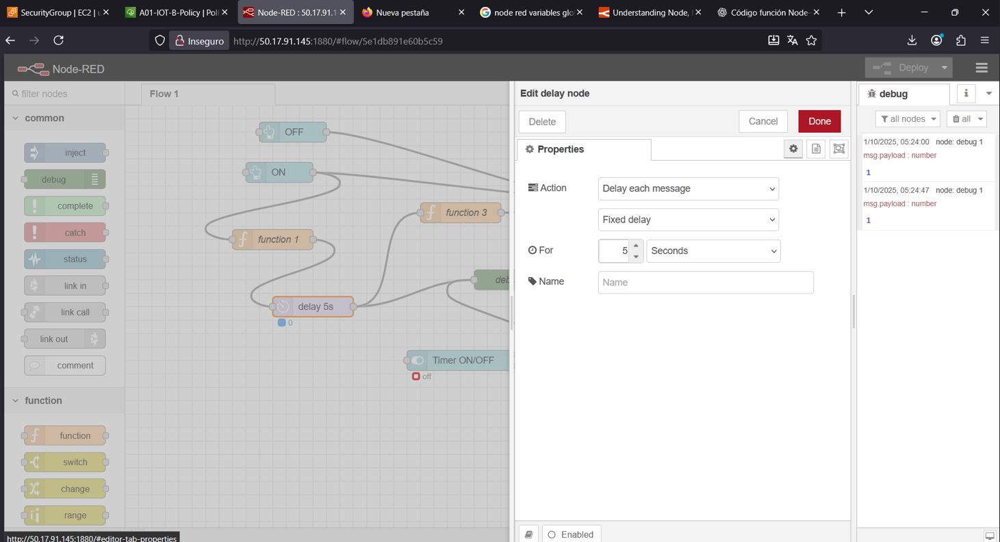

Esta función se encarga de **apagar la luz automáticamente** después del retardo del nodo *Delay*.
Simplemente cambia el valor del **payload a 0**, lo que representa el estado de apagado, y lo envía al mismo canal MQTT que controla la luz.
De esta manera, cuando el temporizador está activo, el flujo primero enciende la luz con `payload = 1` y, tras los 5 segundos, esta función la apaga enviando `payload = 0`.
Así logramos un sistema automático que prende y apaga sin intervención manual 👌.

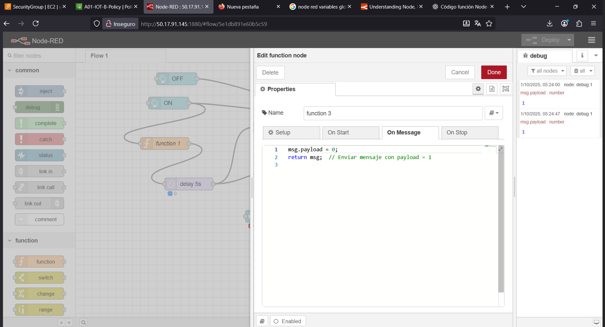

El **nodo Debug** se usa para **monitorear los mensajes que circulan por el flujo** y asegurarse de que cada paso funcione correctamente.
En este caso, est√° configurado para mostrar el valor de **`msg.payload`** en la ventana lateral de Node-RED.
De esa forma, podemos ver si los botones, las funciones y los temporizadores est√°n enviando los valores esperados (por ejemplo, `1` para encender y `0` para apagar).
Básicamente, este nodo es nuestro “visor de control” durante las pruebas 💡.

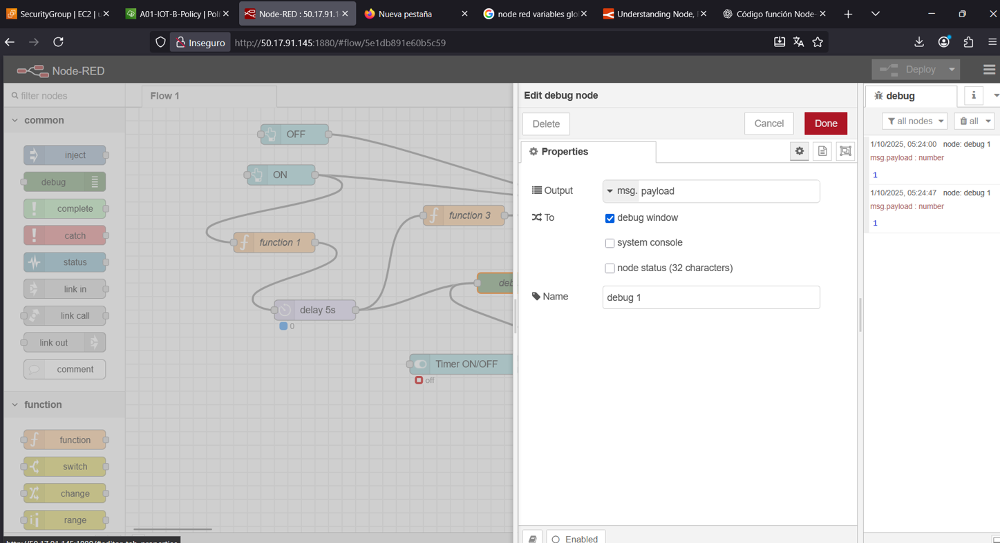

Este es el **nodo Switch**, que usamos como un interruptor para controlar si el **temporizador autom√°tico** est√° activo o no.
Cuando está en **ON**, el nodo envía `true` y guarda ese valor en una variable global llamada **`TIMER_ON`**, lo que permite que el sistema funcione en modo automático.
Si est√° en **OFF**, manda `false`, desactivando el temporizador y dejando el control totalmente manual (solo con los botones ON y OFF).
Básicamente, este nodo define si el sistema trabaja de forma automática o manual ⚙️.

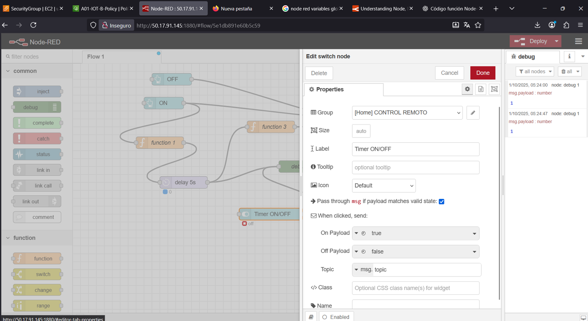

Esta función se encarga de **manejar el estado del temporizador** usando una variable global llamada **`TIMER_ON`**.
Cada vez que se ejecuta, verifica si la variable est√° activada o no:

* Si **`TIMER_ON` está en 1 (activado)**, la función la cambia a **0 (apagado)** y envía un `payload = 0`.
* Si está en **0 (apagado)**, la cambia a **1 (activado)** y envía un `payload = 1`.

De esta forma, el sistema alterna entre los dos modos (automático y manual) y mantiene sincronizado el estado del temporizador con el interruptor del panel. ⚙️


En esta parte del nodo **Function 2**, usamos la pestaña **“On Start”** para **inicializar la variable global** `TIMER_ON` con el valor `0`.
Esto significa que **cada vez que se arranca el flujo o se reinicia Node-RED**, el temporizador empieza desactivado por defecto.

De esa forma, nos aseguramos de que el sistema no quede encendido accidentalmente al reiniciar —es como arrancar con todo apagado y seguro ⚡.

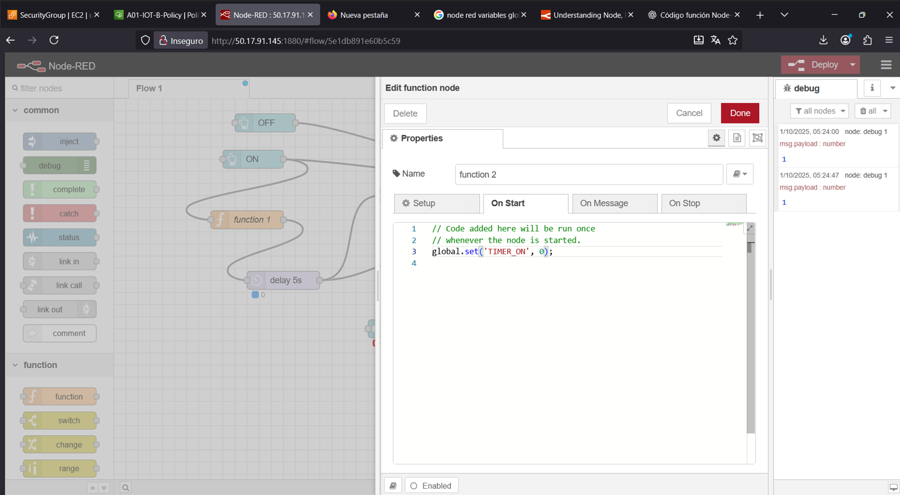


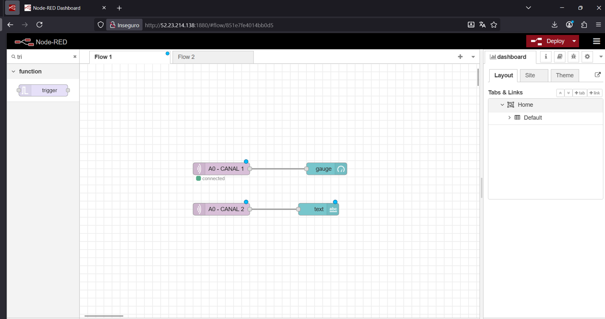

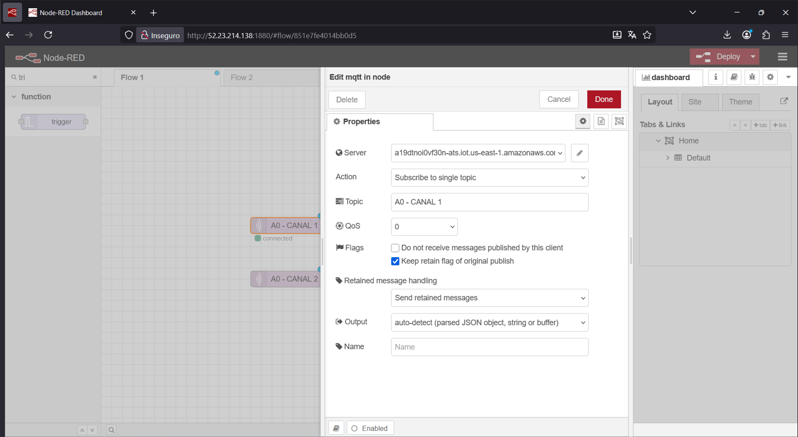

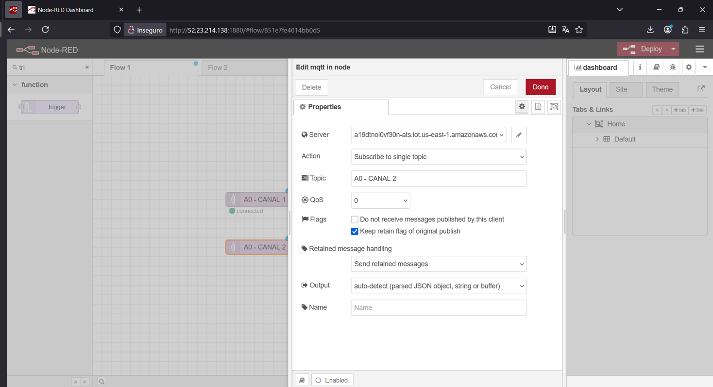


---

**7) Las instancias A y B deben comunicarse por medio de MQTT utilizando el bróker de AWS IoT.**

**Ejemplo**


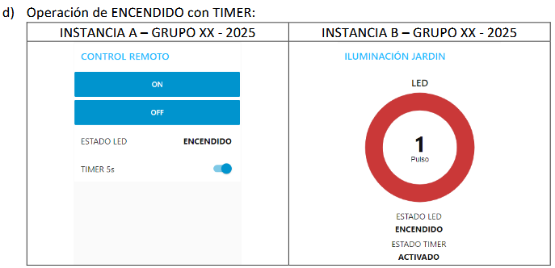

---

### Resolucion


---

### Intancia 1

```json
[
    {
        "id": "8e0cbc430664e608",
        "type": "function",
        "z": "5e1db891e60b5c59",
        "name": "function 2",
        "func": "// Obtener el valor de la variable global \"TIMER_ON\"\nvar timerOn = global.get(\"TIMER_ON\");\n\nif (timerOn) {\n    global.set('TIMER_ON', 0);\n    \n    msg.payload = 0;\n    return msg;  \n} else {\n    global.set('TIMER_ON', 1);\n\n\n\n    msg.payload = 1;\n    return msg;  \n}\n\nreturn null;\n",
        "outputs": 1,
        "timeout": 0,
        "noerr": 0,
        "initialize": "// Code added here will be run once\n// whenever the node is started.\nglobal.set('TIMER_ON', 0);\n",
        "finalize": "",
        "libs": [],
        "x": 720,
        "y": 440,
        "wires": [
            [
                "4643e7018dabdb67",
                "a9649b8b6a640eb1"
            ]
        ]
    }
]
```

### Instancia 2

```json
[
    {
        "id": "851e7fe4014bb0d5",
        "type": "tab",
        "label": "Flow 1",
        "disabled": false,
        "info": "",
        "env": []
    },
    {
        "id": "bf13f7c233638d0b",
        "type": "mqtt in",
        "z": "851e7fe4014bb0d5",
        "name": "",
        "topic": "A0 - CANAL 1",
        "qos": "0",
        "datatype": "auto-detect",
        "broker": "89528596d9aa8d87",
        "nl": false,
        "rap": true,
        "rh": 0,
        "inputs": 0,
        "x": 350,
        "y": 260,
        "wires": [
            [
                "d2dea35af5752b39",
                "92e0e2c9e46981de"
            ]
        ]
    },
    {
        "id": "d2dea35af5752b39",
        "type": "ui_gauge",
        "z": "851e7fe4014bb0d5",
        "name": "",
        "group": "93785911cc895a9d",
        "order": 0,
        "width": 0,
        "height": 0,
        "gtype": "gage",
        "title": "gauge",
        "label": "units",
        "format": "{{value}}",
        "min": 0,
        "max": "1",
        "colors": [
            "#00b500",
            "#e6e600",
            "#ca3838"
        ],
        "seg1": "",
        "seg2": "",
        "diff": false,
        "className": "",
        "x": 610,
        "y": 260,
        "wires": []
    },
    {
        "id": "da8eff1728975e77",
        "type": "mqtt in",
        "z": "851e7fe4014bb0d5",
        "name": "",
        "topic": "A0 - CANAL 2",
        "qos": "0",
        "datatype": "auto-detect",
        "broker": "89528596d9aa8d87",
        "nl": false,
        "rap": true,
        "rh": 0,
        "inputs": 0,
        "x": 170,
        "y": 360,
        "wires": [
            [
                "46131f48d11a2d93"
            ]
        ]
    },
    {
        "id": "43e3a7017615bf0b",
        "type": "ui_text",
        "z": "851e7fe4014bb0d5",
        "group": "93785911cc895a9d",
        "order": 1,
        "width": 0,
        "height": 0,
        "name": "",
        "label": "ESTADO DE TIMER",
        "format": "{{msg.payload}}",
        "layout": "row-spread",
        "className": "",
        "style": false,
        "font": "",
        "fontSize": 16,
        "color": "#000000",
        "x": 640,
        "y": 360,
        "wires": []
    },
    {
        "id": "c350c83e29f26b57",
        "type": "mqtt out",
        "z": "851e7fe4014bb0d5",
        "name": "",
        "topic": "A0 - CANAL 3",
        "qos": "0",
        "retain": "",
        "respTopic": "",
        "contentType": "",
        "userProps": "",
        "correl": "",
        "expiry": "",
        "broker": "89528596d9aa8d87",
        "x": 620,
        "y": 460,
        "wires": []
    },
    {
        "id": "92e0e2c9e46981de",
        "type": "function",
        "z": "851e7fe4014bb0d5",
        "name": "function 1",
        "func": "if (msg.payload === 1) {\n    msg.payload = true;\n    return msg;\n} else if (msg.payload === 0) {\n    msg.payload = false;\n    return msg;\n}\n\n// Si no es 0 ni 1, no enviar nada\nreturn null;\n",
        "outputs": 1,
        "timeout": 0,
        "noerr": 0,
        "initialize": "",
        "finalize": "",
        "libs": [],
        "x": 380,
        "y": 460,
        "wires": [
            [
                "c350c83e29f26b57",
                "ef083061253f6d22"
            ]
        ]
    },
    {
        "id": "ef083061253f6d22",
        "type": "ui_text",
        "z": "851e7fe4014bb0d5",
        "group": "93785911cc895a9d",
        "order": 1,
        "width": 0,
        "height": 0,
        "name": "",
        "label": "ESTADO DE LED",
        "format": "{{msg.payload}}",
        "layout": "row-spread",
        "className": "",
        "style": false,
        "font": "",
        "fontSize": 16,
        "color": "#000000",
        "x": 590,
        "y": 560,
        "wires": []
    },
    {
        "id": "46131f48d11a2d93",
        "type": "function",
        "z": "851e7fe4014bb0d5",
        "name": "function 2",
        "func": "if (msg.payload === 1) {\n    msg.payload = true;\n    return msg;\n} else if (msg.payload === 0) {\n    msg.payload = false;\n    return msg;\n}\n\n// Si no es 0 ni 1, no enviar nada\nreturn null;\n",
        "outputs": 1,
        "timeout": 0,
        "noerr": 0,
        "initialize": "",
        "finalize": "",
        "libs": [],
        "x": 400,
        "y": 380,
        "wires": [
            [
                "43e3a7017615bf0b"
            ]
        ]
    },
    {
        "id": "89528596d9aa8d87",
        "type": "mqtt-broker",
        "name": "",
        "broker": "a19dtnoi0vf30n-ats.iot.us-east-1.amazonaws.com",
        "port": "8883",
        "tls": "aea41aa768c86303",
        "clientid": "",
        "autoConnect": true,
        "usetls": true,
        "protocolVersion": "5",
        "keepalive": "60",
        "cleansession": true,
        "autoUnsubscribe": true,
        "birthTopic": "",
        "birthQos": "0",
        "birthRetain": "false",
        "birthPayload": "",
        "birthMsg": {},
        "closeTopic": "",
        "closeQos": "0",
        "closeRetain": "false",
        "closePayload": "",
        "closeMsg": {},
        "willTopic": "",
        "willQos": "0",
        "willRetain": "false",
        "willPayload": "",
        "willMsg": {},
        "userProps": "",
        "sessionExpiry": ""
    },
    {
        "id": "93785911cc895a9d",
        "type": "ui_group",
        "name": "Default",
        "tab": "32ebd9f119ce5fb1",
        "order": 1,
        "disp": true,
        "width": "6",
        "collapse": false,
        "className": ""
    },
    {
        "id": "aea41aa768c86303",
        "type": "tls-config",
        "name": "A01-B",
        "cert": "",
        "key": "",
        "ca": "",
        "certname": "A01-IOT-B.cert.pem",
        "keyname": "A01-IOT-B.private.key",
        "caname": "AmazonRootCA1.pem",
        "servername": "",
        "verifyservercert": false,
        "alpnprotocol": ""
    },
    {
        "id": "32ebd9f119ce5fb1",
        "type": "ui_tab",
        "name": "Home",
        "icon": "dashboard",
        "disabled": false,
        "hidden": false
    }
]
```