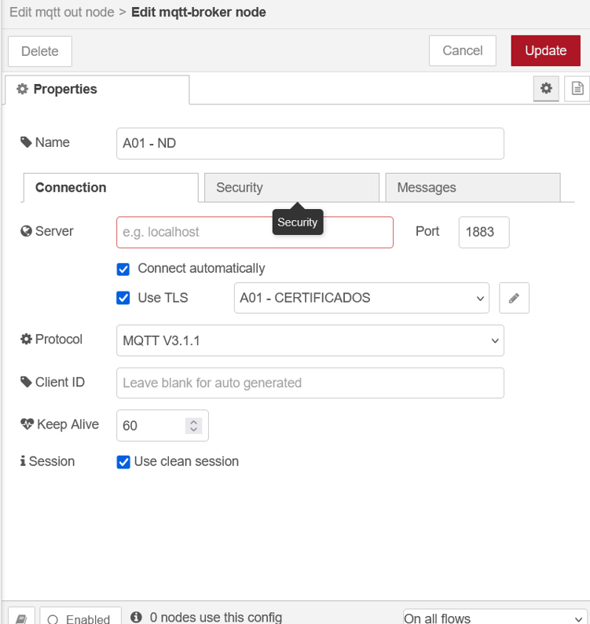
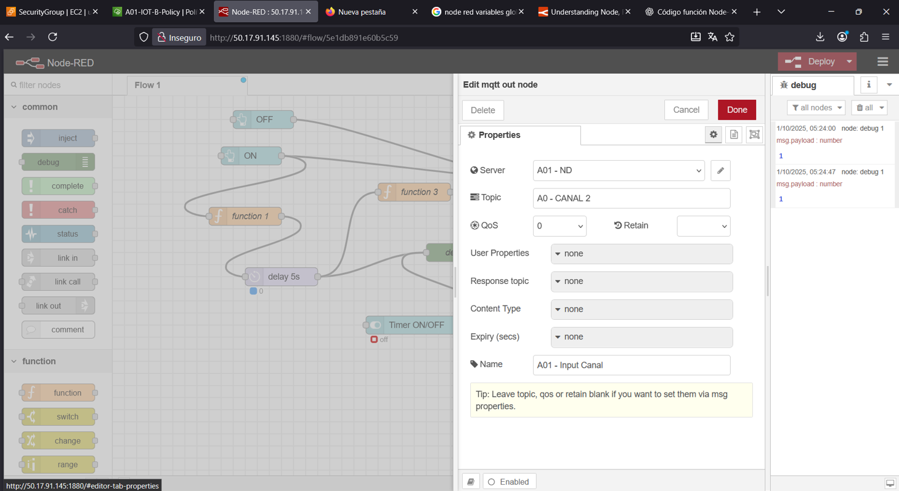

# Indice

### **1) Desplegar dos instancias t3.micro con Linux Debian 13 en AWS EC2: Instancia A e Instancia B.**

La imagen muestra el **inicio exitoso de una instancia EC2** en AWS, correspondiente a la **Instancia A**.
El proceso de creación se completó correctamente, incluyendo la inicialización, la configuración de grupos y reglas de seguridad, y el lanzamiento final.
La instancia quedó lista para su conexión y posterior instalación de Node-RED.


La imagen muestra el **lanzamiento exitoso de la Instancia B** en AWS, utilizada junto con la Instancia A para la comunicación mediante MQTT.
El sistema confirma que el proceso se completó correctamente, incluyendo la creación de los grupos y reglas de seguridad necesarios.
La instancia, identificada con el código **i-0195d62f16b49e964**, quedó lista para su conexión y posterior instalación de Node-RED.


---

**2) Instalar “Node-RED” en ambas instancias.**

Ejecutamos los siguientes comandos en ambas instancias:

```bash
sudo apt update
sudo apt install snapd
```

---

**3) Instalar el nodo “node-red-dashboard”.**

```bash
sudo apt update
sudo apt install snapd
```

La imagen muestra la **conexión por SSH a la Instancia A** desde la consola de AWS, donde se ejecutan los comandos necesarios para instalar herramientas complementarias y verificar el estado de Node-RED.
Se utilizó el comando `sudo apt install net-tools` para disponer de utilidades de red y, posteriormente, `sudo netstat -na | grep 1880` para confirmar que el servicio de Node-RED se encuentra escuchando en el **puerto 1880**, indicando que la instalación y el despliegue se realizaron correctamente.


En la imagen se muestra la **configuración de reglas de entrada** del grupo de seguridad asociado a la instancia EC2.
Se habilitó el **puerto 22 (SSH)** para permitir el acceso remoto desde cualquier dirección IP, y se agregó una regla **TCP personalizada en el puerto 1880**, utilizada por **Node-RED** para su interfaz web.
Esta configuración permite acceder al panel de control de Node-RED desde el navegador, garantizando la comunicación externa necesaria para el proyecto.


La imagen muestra el **acceso exitoso a la interfaz gráfica de Node-RED** mediante el navegador, utilizando la dirección pública de la instancia (**[http://50.17.91.145:1880](http://50.17.91.145:1880)**).
Desde esta consola visual se pueden crear flujos de automatización arrastrando y conectando nodos lógicos y de control.
Este paso confirma que la instalación y configuración del entorno Node-RED en la instancia A se realizaron correctamente y que el servicio se encuentra operativo.


**Lo hacemos en la segunda instancia**

La imagen muestra la **instalación y ejecución de Node-RED en las dos instancias EC2** (Instancia A e Instancia B).
En ambas se utilizó el comando `sudo apt install net-tools` para incorporar utilidades de red y se verificó el servicio con `sudo netstat -na | grep 1880`, confirmando que Node-RED se encuentra escuchando en el **puerto 1880**.
De esta manera, se asegura que los dos servidores están correctamente configurados y listos para la comunicación mediante el protocolo MQTT.


La imagen muestra la **interfaz de Node-RED** en la **Instancia B**, donde se accede al menú de configuración de la paleta de nodos para instalar el paquete **`node-red-dashboard`**.
Este módulo permite crear interfaces gráficas interactivas (dashboards) para visualizar y controlar variables del sistema, como el estado de la iluminación o los temporizadores.
La instalación de este nodo es fundamental para el desarrollo del panel de control utilizado en el proyecto.


---

**4) Registrar ambas instancias como objetos/dispositivos en AWS IoT para poder operar mediante el protocolo MQTT.**

En la imagen se muestra el paso de **descarga del kit de conexión** en el servicio **AWS IoT Core**, correspondiente al dispositivo **A01-IOT-A**.
El kit incluye los archivos necesarios para establecer la comunicación segura entre la instancia EC2 y el servicio IoT, tales como el **certificado digital (`.cert.pem`)**, la **clave privada (`.private.key`)** y la **política de acceso (`A01-IOT-A-Policy`)**.
Estos elementos permiten autenticar el dispositivo y garantizar una conexión segura mediante el protocolo **MQTT**.


En la imagen se observa la **política A01-IOT-A-Policy** dentro del servicio **AWS IoT Core**, la cual fue **creada y actualizada correctamente**.
La versión activa de la política (versión 2) tiene como efecto **“Allow”**, lo que permite todas las acciones (`iot:*`) sobre cualquier recurso (`*`).
Esta configuración es necesaria para que el dispositivo pueda **publicar y suscribirse a temas MQTT**, garantizando la comunicación entre las instancias EC2 y el bróker de AWS IoT.


La imagen muestra la **configuración del nodo MQTT** dentro de Node-RED, donde se incorporan los **certificados de seguridad proporcionados por AWS IoT Core** para establecer una conexión segura con el bróker MQTT.
Se cargan el **certificado del dispositivo (`A01-IOT-A.cert.pem`)**, la **clave privada (`A01-IOT-A.private.key`)** y el **certificado raíz de Amazon (`AmazonRootCA1.pem`)**, asegurando la autenticación y el cifrado de las comunicaciones.
En el flujo se observa un nodo de inyección con el mensaje “HOLA”, utilizado para probar la correcta transmisión de datos hacia AWS IoT.


La imagen muestra la **configuración del nodo MQTT** dentro de Node-RED, donde se incorporan los **certificados de seguridad proporcionados por AWS IoT Core** para establecer una conexión segura con el bróker MQTT.
Se cargan el **certificado del dispositivo (`A01-IOT-A.cert.pem`)**, la **clave privada (`A01-IOT-A.private.key`)** y el **certificado raíz de Amazon (`AmazonRootCA1.pem`)**, asegurando la autenticación y el cifrado de las comunicaciones.
En el flujo se observa un nodo de inyección con el mensaje “HOLA”, utilizado para probar la correcta transmisión de datos hacia AWS IoT.


---

**5) Desarrollar, en la instancia A, la solución de un “CONTROL REMOTO” para gestionar la iluminación de un ambiente: ´botón “ENCENDIDO/ON”, botón “APAGADO/OFF”, informe de estado de la luminaria y funcionalidad “TIMER de 5s” para que activada dicha funcionalidad, al encender la luminaria se apague a los 5 segundos.**





---

**6) Desarrollar, en la instancia B, la solución para controlar la “ILUMINACIÓN” de un ambiente simulando el “ENCENDIDO/APAGADO” de la luminaria, informando el estado de la “LUMINARIA” y el estado del “TIMER”.**





---

**7) Las instancias A y B deben comunicarse por medio de MQTT utilizando el bróker de AWS IoT.**

**Ejemplo**


---

### Resolucion


---

### Intancia 1

```json
[
    {
        "id": "8e0cbc430664e608",
        "type": "function",
        "z": "5e1db891e60b5c59",
        "name": "function 2",
        "func": "// Obtener el valor de la variable global \"TIMER_ON\"\nvar timerOn = global.get(\"TIMER_ON\");\n\nif (timerOn) {\n    global.set('TIMER_ON', 0);\n    \n    msg.payload = 0;\n    return msg;  \n} else {\n    global.set('TIMER_ON', 1);\n\n\n\n    msg.payload = 1;\n    return msg;  \n}\n\nreturn null;\n",
        "outputs": 1,
        "timeout": 0,
        "noerr": 0,
        "initialize": "// Code added here will be run once\n// whenever the node is started.\nglobal.set('TIMER_ON', 0);\n",
        "finalize": "",
        "libs": [],
        "x": 720,
        "y": 440,
        "wires": [
            [
                "4643e7018dabdb67",
                "a9649b8b6a640eb1"
            ]
        ]
    }
]
```

### Instancia 2

```json
[
    {
        "id": "851e7fe4014bb0d5",
        "type": "tab",
        "label": "Flow 1",
        "disabled": false,
        "info": "",
        "env": []
    },
    {
        "id": "bf13f7c233638d0b",
        "type": "mqtt in",
        "z": "851e7fe4014bb0d5",
        "name": "",
        "topic": "A0 - CANAL 1",
        "qos": "0",
        "datatype": "auto-detect",
        "broker": "89528596d9aa8d87",
        "nl": false,
        "rap": true,
        "rh": 0,
        "inputs": 0,
        "x": 350,
        "y": 260,
        "wires": [
            [
                "d2dea35af5752b39",
                "92e0e2c9e46981de"
            ]
        ]
    },
    {
        "id": "d2dea35af5752b39",
        "type": "ui_gauge",
        "z": "851e7fe4014bb0d5",
        "name": "",
        "group": "93785911cc895a9d",
        "order": 0,
        "width": 0,
        "height": 0,
        "gtype": "gage",
        "title": "gauge",
        "label": "units",
        "format": "{{value}}",
        "min": 0,
        "max": "1",
        "colors": [
            "#00b500",
            "#e6e600",
            "#ca3838"
        ],
        "seg1": "",
        "seg2": "",
        "diff": false,
        "className": "",
        "x": 610,
        "y": 260,
        "wires": []
    },
    {
        "id": "da8eff1728975e77",
        "type": "mqtt in",
        "z": "851e7fe4014bb0d5",
        "name": "",
        "topic": "A0 - CANAL 2",
        "qos": "0",
        "datatype": "auto-detect",
        "broker": "89528596d9aa8d87",
        "nl": false,
        "rap": true,
        "rh": 0,
        "inputs": 0,
        "x": 170,
        "y": 360,
        "wires": [
            [
                "46131f48d11a2d93"
            ]
        ]
    },
    {
        "id": "43e3a7017615bf0b",
        "type": "ui_text",
        "z": "851e7fe4014bb0d5",
        "group": "93785911cc895a9d",
        "order": 1,
        "width": 0,
        "height": 0,
        "name": "",
        "label": "ESTADO DE TIMER",
        "format": "{{msg.payload}}",
        "layout": "row-spread",
        "className": "",
        "style": false,
        "font": "",
        "fontSize": 16,
        "color": "#000000",
        "x": 640,
        "y": 360,
        "wires": []
    },
    {
        "id": "c350c83e29f26b57",
        "type": "mqtt out",
        "z": "851e7fe4014bb0d5",
        "name": "",
        "topic": "A0 - CANAL 3",
        "qos": "0",
        "retain": "",
        "respTopic": "",
        "contentType": "",
        "userProps": "",
        "correl": "",
        "expiry": "",
        "broker": "89528596d9aa8d87",
        "x": 620,
        "y": 460,
        "wires": []
    },
    {
        "id": "92e0e2c9e46981de",
        "type": "function",
        "z": "851e7fe4014bb0d5",
        "name": "function 1",
        "func": "if (msg.payload === 1) {\n    msg.payload = true;\n    return msg;\n} else if (msg.payload === 0) {\n    msg.payload = false;\n    return msg;\n}\n\n// Si no es 0 ni 1, no enviar nada\nreturn null;\n",
        "outputs": 1,
        "timeout": 0,
        "noerr": 0,
        "initialize": "",
        "finalize": "",
        "libs": [],
        "x": 380,
        "y": 460,
        "wires": [
            [
                "c350c83e29f26b57",
                "ef083061253f6d22"
            ]
        ]
    },
    {
        "id": "ef083061253f6d22",
        "type": "ui_text",
        "z": "851e7fe4014bb0d5",
        "group": "93785911cc895a9d",
        "order": 1,
        "width": 0,
        "height": 0,
        "name": "",
        "label": "ESTADO DE LED",
        "format": "{{msg.payload}}",
        "layout": "row-spread",
        "className": "",
        "style": false,
        "font": "",
        "fontSize": 16,
        "color": "#000000",
        "x": 590,
        "y": 560,
        "wires": []
    },
    {
        "id": "46131f48d11a2d93",
        "type": "function",
        "z": "851e7fe4014bb0d5",
        "name": "function 2",
        "func": "if (msg.payload === 1) {\n    msg.payload = true;\n    return msg;\n} else if (msg.payload === 0) {\n    msg.payload = false;\n    return msg;\n}\n\n// Si no es 0 ni 1, no enviar nada\nreturn null;\n",
        "outputs": 1,
        "timeout": 0,
        "noerr": 0,
        "initialize": "",
        "finalize": "",
        "libs": [],
        "x": 400,
        "y": 380,
        "wires": [
            [
                "43e3a7017615bf0b"
            ]
        ]
    },
    {
        "id": "89528596d9aa8d87",
        "type": "mqtt-broker",
        "name": "",
        "broker": "a19dtnoi0vf30n-ats.iot.us-east-1.amazonaws.com",
        "port": "8883",
        "tls": "aea41aa768c86303",
        "clientid": "",
        "autoConnect": true,
        "usetls": true,
        "protocolVersion": "5",
        "keepalive": "60",
        "cleansession": true,
        "autoUnsubscribe": true,
        "birthTopic": "",
        "birthQos": "0",
        "birthRetain": "false",
        "birthPayload": "",
        "birthMsg": {},
        "closeTopic": "",
        "closeQos": "0",
        "closeRetain": "false",
        "closePayload": "",
        "closeMsg": {},
        "willTopic": "",
        "willQos": "0",
        "willRetain": "false",
        "willPayload": "",
        "willMsg": {},
        "userProps": "",
        "sessionExpiry": ""
    },
    {
        "id": "93785911cc895a9d",
        "type": "ui_group",
        "name": "Default",
        "tab": "32ebd9f119ce5fb1",
        "order": 1,
        "disp": true,
        "width": "6",
        "collapse": false,
        "className": ""
    },
    {
        "id": "aea41aa768c86303",
        "type": "tls-config",
        "name": "A01-B",
        "cert": "",
        "key": "",
        "ca": "",
        "certname": "A01-IOT-B.cert.pem",
        "keyname": "A01-IOT-B.private.key",
        "caname": "AmazonRootCA1.pem",
        "servername": "",
        "verifyservercert": false,
        "alpnprotocol": ""
    },
    {
        "id": "32ebd9f119ce5fb1",
        "type": "ui_tab",
        "name": "Home",
        "icon": "dashboard",
        "disabled": false,
        "hidden": false
    }
]
```