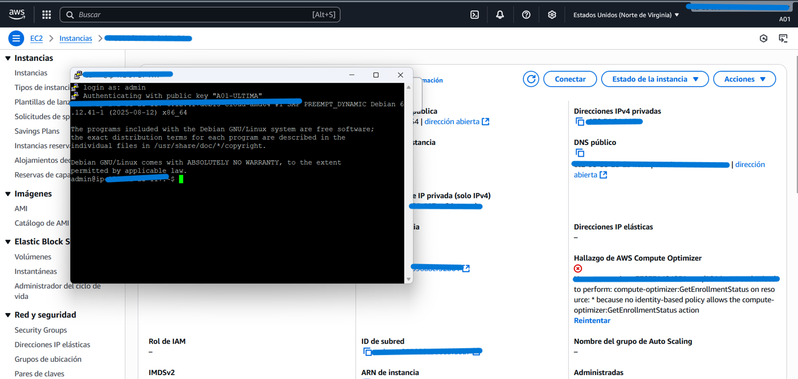

# Indice

- [1. Lanzar instancia EC2 (t3.micro, Debian 13).](#ejercicio-1-lanzar-instancia-ec2)
- [2. Conexión SSH.](#ejercicio-2-conexión-ssh)
- [3. Configurar como servidor web (Apache2).](#ejercicio-3-configurar-como-servidor-web-apache2)
- [4. Configurar Security Group (HTTP, SSH, ICMP).](#ejercicio-4-configuración-del-security-group)
- [5. Crear `index.html` en DocumentRoot.](#ejercicio-5-crear-archivo-indexhtml)
- [6. Verificar los tres tráficos (HTTP, SSH, ICMP).](#ejercicio-6-verificar-los-tres-tráficos-http-ssh-icmp)
- [7. Apagar y encender la instancia → verificar ICMP.](#ejercicio-7-apagar-y-encender-la-instancia-verificar-icmp)
- [8. Reservar y asociar IP Elástica.](#ejercicio-8-reservar-y-asociar-ip-elástica)
- [9. Verificar acceso con IP elástica (y que la IP pública previa no funcione).](#ejercicio-9-verificar-acceso-con-ip-elástica-y-que-la-ip-pública-previa-no-funcione)
- [10. Hacer ping a la IP elástica.](#ejercicio-10-hacer-ping-a-la-ip-elástica)
- [11. Lanzar nueva instancia (t3.micro, Debian 13).](#ejercicio-11-lanzar-nueva-instancia-t3micro-debian-13)
- [12. Configurarla con TAG `INSTANCIA-2`.](#ejercicio-12-configurarla-con-tag-instancia-2)
- [13. Crear `index.html` con la leyenda correspondiente.](#ejercicio-13-crear-archivo-indexhtml-con-la-leyenda-correspondiente)
- [14. Re-asociar la IP Elástica.](#ejercicio-14-re-asociar-la-ip-elástica)
- [15. Verificar ping sin pérdida de paquetes.](#ejercicio-15-verificar-ping-sin-pérdida-de-paquetes)
- [16. Verificar acceso web.](#ejercicio-16-verificar-acceso-web)
- [17. Apagar la instancia y chequear ICMP.](#ejercicio-17-apagar-la-instancia-y-chequear-icmp)
- [18. Encenderla y verificar ICMP.](#ejercicio-18-encenderla-y-verificar-icmp)
- [19. Cambiar puerto de Apache de 80 → 8080.](#ejercicio-19-cambiar-puerto-de-apache-de-80-→-8080)
- [20. Verificar acceso web en el puerto 8080.](#ejercicio-20-verificar-acceso-web-en-el-puerto-8080)
- [21. Liberar IP Elástica y terminar instancias.](#ejercicio-21-liberar-ip-elástica-y-terminar-instancias)

---

## Ejercicio 1: Lanzar instancia EC2

**1) Lanzar una instancia en AWS EC2, de tipo “t3.micro” con AMI “Debian 13”.**


Para comenzar con la práctica, se procedió a **crear una nueva instancia EC2** en la consola de Amazon Web Services (AWS).

1. Se asignó el nombre **A01** a la instancia, lo que permite identificarla fácilmente dentro del entorno.
2. Se seleccionó la **Imagen de máquina de Amazon (AMI)** correspondiente a **Debian 13 (20250814-2204)**, que provee el sistema operativo base para la máquina virtual.
3. Como tipo de instancia, se utilizó **t3.micro**, que pertenece a la capa gratuita de AWS y es suficiente para realizar pruebas de laboratorio.
4. El sistema asignó por defecto un **volumen de almacenamiento de 8 GiB**, suficiente para esta práctica.
5. Se creó un **nuevo grupo de seguridad** que más adelante será configurado para permitir los accesos requeridos.

Una vez revisada la configuración en el **resumen de la derecha**, se hizo clic en **“Lanzar instancia”** para desplegar el recurso en la nube.


Durante el lanzamiento de la instancia, AWS solicita la creación de un **par de claves (Key Pair)** para garantizar el acceso seguro vía **SSH**.

1. Se asignó el nombre **A01-1** al par de claves.
2. Se seleccionó el **tipo de clave RSA**, ampliamente utilizado para conexiones seguras mediante cifrado asimétrico.
3. Como formato de archivo se eligió **.ppk** utilizado en sistemas Windows.
4. AWS generó el archivo privado automáticamente y lo descargó al equipo. Este archivo debe guardarse en un lugar seguro, ya que **será imprescindible para conectarse a la instancia** más adelante.


Para controlar el acceso a la instancia desde la red, se creó un **grupo de seguridad** denominado **A01-SG1**.

1. Se seleccionó la opción **Crear grupo de seguridad**, lo que permite establecer reglas de tráfico personalizadas para esta instancia.
2. Se asignó el nombre **A01-SG1** y se generó automáticamente una descripción por defecto.
3. En las **reglas de entrada**, se dejo por defecto, lo que permite entradas ssh desde cualquier lugar del mundo. Esto sera modificado en una paso siguiente de esta actividad. 


Una vez configurados los parámetros principales (nombre, AMI, tipo de instancia, par de claves y grupo de seguridad), se procedió a iniciar el lanzamiento.


---

## Ejercicio 2: Conexión SSH

**2) Realizar la conexión a la instancia vía SSH.**

Una vez lanzada la instancia EC2, se procedió a establecer la conexión remota utilizando el protocolo **SSH**, que permite la administración segura del servidor.

1. Desde la consola de AWS, se identificó la **dirección IP pública asignada** a la instancia (en este caso, oculta en las capturas por seguridad).
2. Se utilizó la herramienta **PuTTY**, donde se configuraron los siguientes parámetros:

   * En la pestaña *Session*, se ingresó la dirección IP pública en el campo **Host Name (or IP address)** y el puerto **22**, correspondiente a SSH.
   


   * En la sección *SSH → Auth*, se cargó el archivo de clave privada previamente generado.

   


3. Al abrir la sesión, se utilizó el usuario **admin**, correspondiente a la AMI Debian 13 seleccionada.
4. Tras la autenticación con la clave privada, se obtuvo acceso exitoso a la terminal de la instancia, quedando lista para su administración y configuración como servidor web.



---

## Ejercicio 3: Configurar como servidor web (Apache2)

**3) Configurar la instancia como servidor WEB (TAG: “AXX-INSTANCIA-1”): utilizar la herramienta “apt-get” para instalar “Apache2”.**

> NOTA: Recuerde realizar el upgrade del repositorio

Una vez establecida la conexión vía SSH, se procedió a configurar la instancia para que funcione como servidor web. Para esto, se utilizó **Apache2**, un servidor HTTP de código abierto muy utilizado en entornos Linux.

1. **Actualizar repositorios del sistema**
   Se ejecutó el siguiente comando para asegurarse de que la lista de paquetes y sus versiones estén actualizadas:

   ```bash
   sudo apt-get update
   ```

   Esto permite descargar la información más reciente de los repositorios de Debian antes de instalar nuevos paquetes.

2. **Instalar Apache2**
   Posteriormente, se instaló el servidor web con el comando:

   ```bash
   sudo apt-get install apache2
   ```

   Esto descargó e instaló todos los paquetes necesarios para el correcto funcionamiento del servidor HTTP Apache.

Con estos pasos, la instancia quedó preparada para servir contenido web a través del protocolo HTTP (puerto 80).


---

## Ejercicio 4: Configuración del Security Group

**4) Configurar el grupo de seguridad (Security Group) de la instancia para permitir:**
a. Tráfico Port TCP 80 (HTTP), disponible desde 0.0.0.0/0.
b. Tráfico Port TCP 22 (SSH), disponible desde la red o dirección IP de su LAN.
c. Tráfico ICMP, disponible desde 0.0.0.0/0.

> NOTA: Se deben realizar las pruebas correspondientes de funcionamiento a los protocolos citados (tanto antes de configurar el grupo de seguridad como posterior a la configuración de cada regla); las pruebas deben formar parte de la documentación a entregar.


Para que la instancia EC2 pueda recibir y responder correctamente distintos tipos de tráfico, se configuraron las **reglas de entrada del grupo de seguridad (Security Group)** asociado a la misma.

1. **Regla HTTP (puerto 80/TCP):**
   Se permitió el tráfico HTTP desde cualquier dirección (0.0.0.0/0). Esto permite acceder al servidor web Apache desde cualquier navegador en Internet.

2. **Regla SSH (puerto 22/TCP):**
   Se habilitó el acceso SSH, restringido a la IP de la red local. Esto mejora la seguridad al limitar el acceso administrativo a direcciones específicas. Para saber cual es la IP de la red local se utilizo un servicio web encontrado al buscar en internet "Cual es mi IP?".
   


3. **Regla ICMP (Ping):**
   Se permitió el tráfico ICMP desde cualquier origen (0.0.0.0/0), lo que habilita realizar pruebas de conectividad hacia la instancia mediante el comando `ping`.


**Verificación de conectividad**

1. **Prueba ICMP (Ping):**
   Inicialmente, al ejecutar un ping hacia la IP pública de la instancia, no se obtenían respuestas debido a que aún no estaban configuradas las reglas de seguridad.
   Tras habilitar ICMP en el Security Group, se comprobó la correcta respuesta a los paquetes, confirmando que la instancia era accesible desde Internet.
    | Antes | Despues |
    |-----------|--------|
    |       |      |


2. **Prueba HTTP:**
   Una vez habilitado el tráfico en el puerto 80, se accedió desde un navegador a la IP pública de la instancia, mostrando la **página por defecto de Apache2 en Debian**, lo que confirma que el servidor web estaba en ejecución y accesible.

   
   


3. **Prueba SSH:**
   Se validó también que la conexión SSH seguía funcionando correctamente, tanto antes como después de ajustar las reglas del grupo de seguridad.
   
   

---


## Ejercicio 5: Crear archivo index.html

**5) Crear en el “DocumentRoot” de Apache, el archivo index.html, que contengan el nombre de la instancia “AXX-INSTANCIA-1 - AÑO 2025 - PRÁCTICA 1”**

Una vez instalado Apache2 y verificado su funcionamiento, se procedió a personalizar la página principal del servidor web agregando la identificación de la instancia.

1. **Acceso al directorio DocumentRoot de Apache**
   El contenido web por defecto se almacena en la ruta:

   ```bash
   cd /var/www/html/
   ```

2. **Edición del archivo `index.html`**
   Se utilizó el editor de texto `nano` con privilegios de superusuario para modificar el archivo principal:

   ```bash
   sudo nano index.html
   ```

3. **Inserción de la leyenda solicitada**
   Dentro del archivo se reemplazó el contenido por el texto requerido:

   ```
   A01-INSTANCIA-1 – AÑO 2025 – PRÁCTICA 1
   ```
   

4. **Guardado y verificación**
   Una vez guardados los cambios, se accedió a la dirección IP pública de la instancia mediante un navegador web.
   El servidor respondió mostrando la nueva página personalizada, confirmando que Apache estaba sirviendo correctamente el archivo modificado.
    


---

## Ejercicio 7: Apagar y encender la instancia → verificar ICMP

**7) Apagar la instancia. Volver a encenderla, y luego, volver a verificar el tráfico ICMP. (Tenga en cuenta de describir en la monografía de la práctica la situación encontrada).**


En este ejercicio se buscó comprobar cómo afecta el ciclo de apagado/encendido de una instancia EC2 a su conectividad de red.

1. **Prueba inicial de ICMP (Ping):**
   Antes de detener la instancia, se ejecutó un ping hacia la IP pública de la misma. Durante la prueba se observó que las solicitudes no recibían respuesta, quedando en *“Tiempo de espera agotado”*.

   

2. **Apagado de la instancia:**
   Desde la consola de AWS, se seleccionó la instancia **A01** y se eligió la opción **Detener instancia**.
   AWS mostró una advertencia indicando que no se generarían más cargos de uso ni transferencia de datos, aunque los volúmenes asociados y las IP elásticas seguirían facturando mientras la instancia estuviera detenida.

       

3. **Encendido de la instancia:**
   Una vez detenida, se volvió a encender la instancia mediante la opción **Iniciar instancia** en la consola de AWS. El estado cambió a **En ejecución**, lo que habilitó nuevamente los servicios de red y acceso remoto.

4. **Verificación ICMP tras el encendido:**
   Se repitió la prueba de ping hacia la IP pública asignada. En este caso, las solicitudes recibieron respuesta con valores de latencia, confirmando que la instancia recuperó la conectividad tras ser encendida nuevamente.

---

## Ejercicio 8: Reservar IP Elástica

**8) Reservar una IP Elástica y asociarla a la instancia “AXX-INSTANCIA-1”**

Con el fin de asegurar que la instancia mantenga siempre la misma dirección pública, incluso después de apagarse y volver a encenderse, se procedió a reservar y asociar una **IP Elástica** en AWS.

1. **Reserva de IP Elástica:**
   Desde la consola de AWS, en la sección **Direcciones IP elásticas**, se solicitó una nueva dirección. El sistema asignó la IP **54.157.104.45** y se le agregó la etiqueta **A01-elastica** para identificarla fácilmente.
   

2. **Asociación de la IP a la instancia:**
   A continuación, se seleccionó la opción **Asociar dirección IP elástica**.

   * Se eligió como recurso la instancia **A01-INSTANCIA-1**, que estaba en estado *running*.
   * Se mantuvo la configuración predeterminada de asociarla a la dirección privada principal de la instancia.

3. **Confirmación de asociación:**
   AWS mostró el mensaje de confirmación indicando que la dirección IP **54.157.104.45** había sido asociada correctamente a la instancia.
   
4. **Verificación de acceso vía navegador:**
   Finalmente, se accedió a la dirección **[http://54.157.104.45/](http://54.157.104.45/)** desde un navegador web, comprobando que respondía el servidor Apache con el contenido personalizado de la práctica.
   

---

## Ejercicio 9: Verificar acceso con IP elástica (y que la IP pública previa no funcione)

**Verificar el acceso vía un navegador WEB, por medio de la IP Elástica y que la misma YA NO ES accesible por la IP pública asignada previa la asociación de la IP Elástica.**

Una vez asociada la **IP Elástica** a la instancia **A01-INSTANCIA-1**, se procedió a verificar el acceso desde distintos puntos de red.

1. **Prueba con la IP Elástica (54.157.104.45):**

   * Se realizó un **ping** a la dirección elástica, obteniendo respuestas estables con tiempos de entre 170 y 190 ms.
   * Desde un navegador web, se accedió a `http://54.157.104.45/`, comprobando que el servidor Apache devolvía la página personalizada de la práctica.
    
    

2. **Prueba con la IP pública previa:**
   La instancia también tenía asignada una dirección IP pública temporal (54.234.245.179).

   * Al intentar acceder a esta IP, **no se obtuvo respuesta ni por ping ni por navegador web**, confirmando que la asociación de la IP Elástica reemplaza la accesibilidad de la IP pública asignada automáticamente.

---

## Ejercicio 10: Hacer ping a la IP elástica

**10) Abrir una consola y ejecutar el comando “ping” a la IP Elástica, verificando la NO pérdida de paquetes.**


Con la IP Elástica ya asociada a la instancia **A01-INSTANCIA-1**, se realizó una prueba de conectividad desde una terminal local:

1. **Ejecución del comando ping:**
   Se utilizó la siguiente instrucción en consola:

   ```bash
   ping 54.157.104.45 -t
   ```

   La prueba mostró respuestas constantes desde la dirección IP, con valores de latencia estables entre **166 ms y 187 ms**, sin pérdida de paquetes.
   

2. **Confirmación de disponibilidad continua:**
   Esta prueba confirma que la IP Elástica mantiene la conectividad con la instancia, incluso si ésta se reinicia o cambia de IP pública temporal.

---

## Ejercicio 11, 12 y 13: Nueva instancia, TAG, index.html

**11) Lanzar una nueva instancia en AWS EC2, de tipo “t3.micro” con AMI “Debian 13”.**
**12) Configurar la nueva instancia con TAG “AXX-INSTANCIA-2”.**
**13) Crear en el “DocumentRoot” el archivo index.html, que contengan la leyenda siguiente: “AXX-INSTANCIA-2 – AÑO 2025 – PRÁCTICA 1”.**

**Respuesta**

> El procemiento fue similar al de la primera instancia, con las siguientes diferencias:
1. Se asignó el nombre **A01** a la nueva instancia.
2. Se creó un nuevo par de claves denominado **A01-1**.
3. Se creó un nuevo grupo de seguridad llamado **A01-SG1**, con las mismas reglas que el anterior (HTTP, SSH, ICMP).
4. Se etiquetó la instancia con el TAG **A01-INSTANCIA-2**.


14) Re-asociar la IP Elástica a la instancia “AXX-INSTANCIA-2”.
15) Verificar por consola, la NO pérdida de paquetes.
16) Verificar el acceso vía un navegador WEB, por medio de la IP Elástica, que responda el “AXX-INSTANCIA-2”.
17) Apagar la instancia “AXX-INSTANCIA-2”. Verificar el tráfico ICMP.
18) Volver a encender la instancia y verificar que el tráfico ICMP retoma la respuesta al
encendido de la misma.
19) Cambiar el puerto del servidor WEB de la instancia “AXX-INSTANCIA-2” del TCP 80 al
TCP 8080.
20) Verificar el acceso WEB desde una navegador.
21) Liberar la IP Elástica y “terminar” ambas instancias.
