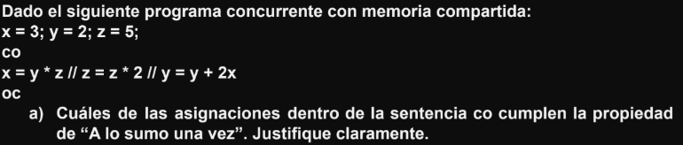
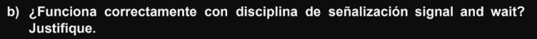

<div align="center">


</div>

---

# Posibles Preguntas


<details><summary>👀 Respuesta</summary>

Si el algoritmo se ejecuta secuencialmente se tienen:

**Asignaciones**

- 128^3 + 128^2
- 2097152 + 16384
- 2113536

¿Por qué 128^3 y 128^2?


**Sumas**

- 128^3
- 2097152


**Productos**
- 128^3
- 2097152


</details>

<br>


<details><summary>👀 Respuesta</summary>

Si tenemos 8 procesos cada uno con un strip de 16 (128/8) los cálculos de tiempo quedarían para cada proceso como:

- La matriz de `C` es de tamaño `128x128`
- La estrategia paralela divide las **filas** de `C` entre **8 procesos**
- Y como hay `128` filas y `P=8`, cada proceso trabaja sobre `128/8` = `16 filas`

**Asignaciones con 8 procesos**

Anteriormente calculabamos las asignaciones de esta forma `128^3 + 128^2`, ahora vamos a hacer exactamente los mismo pero lo dividimos por la cantidad de procesos que tenemos

- Con `P=1` -> `128^3` + `128^2`
- Con `P=8` -> `(128^3)/8` + `(128^2)/8`

`(128^3)/8` + `(128^2)/8` <=> `128^2 * 16` + `128 * 16`

Podes usar la cuenta que quieras, son equivalentes, el resultado final te tendria que dar lo siguiente

- 262144 + 2048
- 264192

**Sumas**

- `(128^3)/8` <=> `128^2 * 16`
- 262144

**Productos**

- `(128^3)/8` <=> `128^2 * 16`
- 262144

</details>

<br>


<details><summary>👀 Respuesta</summary>

**Problema Inicial: Distribución equitativa pero ineficiente**

Inicialmente, cada procesador **P1** a **P8** procesa la misma cantidad de filas de la matriz. Dado que la matriz es de tamaño **128×128**, se divide en **8 partes iguales**, lo que significa que cada procesador maneja **16 filas**.

> P1 a P8 tienen igual número de operaciones.
> Es como tener 8 autos y a uno le faltan dos ruedas

- **Asignaciones** -> `264192`
- **Sumas** -> `262144`
- **Producto** -> `262144`

Los tiempos de ejecución para **P1** a **P7** son:

- T(P1-P7)
- (`264192` x 1) + (`262144` x 2) + (`262144` x 3)
- `264192` + `524288` + `786432` = 1574912

Sin embargo, P8 es 4 veces más lento, por lo que su tiempo total de ejecución es

- T(P8)
- 1574912 x 4
- `6299648`

Como el tiempo de ejecución total en paralelo está determinado por el procesador más lento, el tiempo total de ejecución es:

Cálculo del speedup inicial:

T(Secuencial) = 1574912 * 8  -> 12.599.296

- Speedup
- T(secuencial)/ T(paralelo)
- (1574912 * 8) / (1574912 x 4)
- 2

> 🔴 Problema:
> Aunque tenemos 8 procesadores, el speedup es solo 2, lo cual es muy bajo. Esto ocurre porque P8, al ser más lento, arruina la eficiencia del paralelismo.

**Objetivo del Balance de Carga**

La solución al problema es redistribuir la carga de trabajo para que `P8` tenga menos filas, y así termine aproximadamente en el mismo tiempo que `P1-P7`.

Queremos encontrar cuántas filas `𝑓` debe procesar `P8` para que su tiempo total sea igual al tiempo de ejecución de `P1-P7`.

Sabemos que el tiempo de ejecución de un procesador depende del número de filas que procesa.

Como `P8` es `4` veces más lento, su tiempo de ejecución será:

> Formula original n=128/8  -> 16 Filas


- Calculamos f
- f/16 x 4 = 1
- f x 4 = 16
- f = 16/4
- f = 4

> Por lo tanto, P8 debe procesar solo 4 filas.

**Redistribución de Filas en P1-P7**

Ahora que sabemos que P8 debe procesar 4 filas, debemos redistribuir las filas restantes entre los otros procesadores.

- Total de filas en la matriz: 128
- Filas asignadas a P8: 4
- Filas restantes para los demás procesadores:

128 − 4 = 124

Distribuimos estas filas entre los 7 procesadores restantes (P1-P7):

- `124/7` = 17.71 ≈ 18

Creeeeo que esta bien, aca esta otra respuesta


</details>

---


<details><summary>👀 Respuesta</summary>

```
Co
    X := X - Z
    Z := Z * 2
    Y := Z + 4
Oc
```

**📌 Recordatorio: ¿Qué es ASV?**

Una asignación `x := e` **cumple la propiedad de ASV** si:

- ✅ (1) `e` contiene **a lo sumo una referencia crítica**, **y** la variable `x` (la que se asigna) **no es usada en otros procesos**,  
**o**
- ✅ (2) `e` **no contiene ninguna referencia crítica**.


**🧠 ¿Qué es una *referencia crítica*?**

Es cualquier acceso (lectura o escritura) a una variable **compartida entre procesos concurrentes**.  
Si una variable aparece en más de una instrucción dentro del bloque `Co ... Oc`, entonces es **crítica**.


**`1)`** `X := X - Z`

```
Co
    X := X - Z
    Z := Z * 2
    Y := Z + 4
Oc
```

- `Variables involucradas:`
    - Lee `X` y `Z`
    - Asigna a `X`
- **`¿Referencias críticas?`**
    - `Z` también aparece en otras asignaciones (`Z := Z * 2`, `Y := Z + 4`) → **Sí**, es crítica  
    - `X` **no aparece en ninguna otra instrucción** → **No es crítica**
- **`Evaluación ASV`**:
    - Tiene **una sola referencia crítica** (`Z`)
    - La variable asignada (`X`) **no se usa en otro proceso**

✅ **Cumple ASV**


**`2)`** `Z := Z * 2`

```
Co
    X := X - Z
    Z := Z * 2
    Y := Z + 4
Oc
```

- **`Variables involucradas:`**
    - Lee y escribe `Z`
- **`¿Referencias críticas?`**
    - `Z` aparece también en:
      - `X := X - Z`
      - `Y := Z + 4`
    - **Z es usada en múltiples procesos** → **es crítica**
    - Además, se está modificando en esta instrucción → escritura
- **`Evaluación ASV`**
    - Tiene **una referencia crítica** (`Z`)
    - La variable asignada (`Z`) **sí se usa en otros procesos**

❌ **No cumple ASV**

**`3)`** `Y := Z + 4`

 Variables involucradas:
- Lee `Z`
- Asigna a `Y`

 ¿Referencias críticas?
- `Z` es crítica (como ya dijimos)
- `Y` **no aparece en ningún otro proceso**

 Evaluación ASV:
- Tiene **una sola referencia crítica** (`Z`)
- La variable asignada (`Y`) **no se usa en otros procesos**

✅ **Cumple ASV**

| Instrucción      | ¿Cumple ASV? | Justificación                                                                 |
|------------------|--------------|--------------------------------------------------------------------------------|
| `X := X - Z`     | ✅ Sí         | Tiene una única referencia crítica (`Z`), y `X` no es usada en otros procesos |
| `Z := Z * 2`     | ❌ No         | Tiene referencia crítica (`Z`), y `Z` es usada en otros procesos              |
| `Y := Z + 4`     | ✅ Sí         | Tiene una única referencia crítica (`Z`), y `Y` no es usada en otros procesos |

> A chequear

</details>

<br>


<details><summary>👀 Respuesta</summary>

```
x = 3; y = 2; z = 5;
Co
    X := X - Z
    Z := Z * 2
    Y := Z + 4
Oc
```

| Orden de ejecución | Operaciones realizadas (con valores) | Resultado final `(X, Z, Y)` |
|--------------------|---------------------------------------|------------------------------|
| **T1 → T2 → T3**   | `X = 4 - 3 = 1`<br>`Z = 3 * 2 = 6`<br>`Y = 6 + 4 = 10` | **(1, 6, 10)** |
| **T1 → T3 → T2**   | `X = 4 - 3 = 1`<br>`Y = 3 + 4 = 7`<br>`Z = 3 * 2 = 6` | **(1, 6, 7)** |
| **T2 → T1 → T3**   | `Z = 3 * 2 = 6`<br>`X = 4 - 6 = -2`<br>`Y = 6 + 4 = 10` | **(-2, 6, 10)** |
| **T2 → T3 → T1**   | `Z = 3 * 2 = 6`<br>`Y = 6 + 4 = 10`<br>`X = 4 - 6 = -2` | **(-2, 6, 10)** |
| **T3 → T1 → T2**   | `Y = 3 + 4 = 7`<br>`X = 4 - 3 = 1`<br>`Z = 3 * 2 = 6` | **(1, 6, 7)** |
| **T3 → T2 → T1**   | `Y = 3 + 4 = 7`<br>`Z = 3 * 2 = 6`<br>`X = 4 - 6 = -2` | **(-2, 6, 7)** |


- `X := 4 - Z` → depende del valor de `Z` al momento de ejecutar T1
- `Y := Z + 4` → depende del valor de `Z` al momento de ejecutar T3
- `Z := Z * 2` → siempre lleva `Z` de 3 a 6

El valor de Z es siempre el mismo ya que no posee ninguna referencia crítica. Los valores de X e Y se ven afectados por la ejecución de T2 ya que sus resultados dependen de la referencia que hacen a la variable Z que es modificada. Entonces, si T1 y T3 se ejecutan antes que T2 ambas usarán el valor inicial de Z que es 3 obteniendo los resultados X=1 e Y=7; ahora si T2 se ejecuta antes que las demás los resultados serán X=-2 e Y=10 y por último, tenemos los casos en que T2 se ejecuta en medio con T1 antes y T3 después o con T3 antes y T1 después.

- Nota 1: las instrucciones NO SON atómicas.
- Nota 2: no es necesario que liste TODOS los resultados.

> Se podria consultar esto

</details>

---



<details><summary>👀 Respuesta</summary>

Siendo:
```
A: x = y * z  Tiene 2 referencias críticas (a y, a z), por lo tanto no cumple ASV. (además x es leída en en C.)
B: z = z * 2 No tiene referencia crítica y es leída por otro (en A se lee z), por lo tanto cumple ASV.
C: y = y + 2x Tiene 1 referencia crítica (a x) y además es leída por otro proceso (en A se lee y), por lo tanto no cumple ASV.
```

> A chequear
</details>

<br>


<details><summary>👀 Respuesta</summary>

| **#** | **Orden de ejecución**             | **Operaciones realizadas**                                                                                                                                         | **Resultado final**            |
|------:|------------------------------------|--------------------------------------------------------------------------------------------------------------------------------------------------------------------|-------------------------------|
| 1     | A → B → C                          | `x = 2*5 = 10`<br>`z = 5*2 = 10`<br>`y = 2 + 2*10 = 22`                                                                                                             | `x = 10`, `z = 10`, `y = 22`  |
| 2     | A → C → B                          | `x = 2*5 = 10`<br>`y = 2 + 2*10 = 22`<br>`z = 5*2 = 10`                                                                                                             | `x = 10`, `z = 10`, `y = 22`  |
| 3     | C → B → A                          | `y = 2 + 2*3 = 8`<br>`z = 5*2 = 10`<br>`x = 2*10 = 20`                                                                                                              | `x = 20`, `z = 10`, `y = 8`   |
| 4     | B → C → A                          | `z = 5*2 = 10`<br>`y = 2 + 2*3 = 8`<br>`x = 2*10 = 20`                                                                                                              | `x = 20`, `z = 10`, `y = 8`   |
| 5     | C → A → B                          | `y = 2 + 2*3 = 8`<br>`x = 2*5 = 10`<br>`z = 5*2 = 10`                                                                                                               | `x = 10`, `z = 10`, `y = 8`   |
| 6     | B → A → C                          | `z = 5*2 = 10`<br>`x = 2*10 = 20`<br>`y = 2 + 2*20 = 42`                                                                                                            | `x = 20`, `z = 10`, `y = 42`  |
| 7     | A lee `y=2`, C lee `x=3`, luego A termina, luego B | `A empieza: y=2`<br>`C: y = 2 + 2*3 = 8`<br>`A termina: x = 2*5 = 10`<br>`B: z = 5*2 = 10`                                 | `x = 10`, `z = 10`, `y = 8`   |
| 8     | A lee `y=2`, C lee `x=3`, luego B, luego A termina | `A empieza: y=2`<br>`C: y = 2 + 2*3 = 8`<br>`B: z = 5*2 = 10`<br>`A termina: x = 2*10 = 20`                                 | `x = 20`, `z = 10`, `y = 8`   |

</details>

---


**Sea la siguiente solución propuesta al problema de alocación SJN (Short Job Next):**

```nginx
Monitor SJN {
    Bool libre = true;
    Cond turno;

    Procedure request {
        If (not libre) wait (turno, tiempo);
        Libre = false;
    }

    Procedure release {
        Libre = true;
        Signal (turno);
    }
}
```

**a) ¿Funciona correctamente con disciplina de señalización Signal and continue? Justifique.**

<details><summary>👀 Respuesta</summary>


No, la solución no funciona correctamente con la disciplina de señalización **Signal and Continue (S&C)**.

Bajo esta disciplina, cuando un proceso realiza un `signal`, **continúa ejecutando dentro del monitor**, y el proceso que fue despertado es enviado a la **cola de listos (ready queue)** del sistema operativo. Esto implica que su reingreso al monitor depende de la **política de planificación del sistema**, y no se garantiza que sea el próximo en ejecutarse.

En consecuencia, un proceso con menor tiempo (según la política **Shortest Job Next**) podría quedar **retrasado** si otro proceso ingresa antes al monitor. Por lo tanto, el orden de ejecución no refleja necesariamente la prioridad establecida por el parámetro `tiempo`, y **no se cumple el objetivo del SJN**.

**Respuesta de un random**

> Con S&C un proceso que es despertado para poder seguir ejecutando es pasado a la cola
> de ready en cuyo caso su orden de ejecución depende de la política que se utilice para
> ordenar los procesos en dicha cola. Puede ser que sea retrasado en esa cola permitiendo
> que otro proceso ejecute en el monitor antes que el por lo que podría no cumplirse el
> objetivo del SJN.


</details>

<br>



<details><summary>👀 Respuesta</summary>


Sí, **la solución funciona correctamente** con la disciplina de señalización **Signal and Wait (S&W)**.

En esta disciplina, cuando un proceso ejecuta un `signal`, **cede inmediatamente el control del monitor** al proceso que fue despertado, el cual **continúa su ejecución justo después del `wait`**. El proceso que hizo el `signal` pasa a la cola de listos y debe esperar su turno para volver a ingresar al monitor.

Esto garantiza que el proceso con menor tiempo (según la política Shortest Job Next) —que estaba esperando con prioridad— **será efectivamente el próximo en acceder al recurso**, evitando que otro proceso pueda adelantarse y violar el orden deseado.

Por lo tanto, **la política SJN se respeta correctamente bajo Signal and Wait**, ya que se mantiene el control sobre el orden de ejecución de los procesos en espera.


📘 **Definiciones complementarias:**

- **Signal and Continue:** El proceso que ejecuta el `signal` **continúa usando el monitor**, mientras que el proceso despertado **debe competir** por reingresar al monitor.
- **Signal and Wait:** El proceso que ejecuta el `signal` **cede el monitor** al proceso despertado, que continúa su ejecución **justo después del `wait`**.


</details>

<br>

<details><summary>📊 Comparación entre <strong>Signal and Continue</strong> vs <strong>Signal and Wait en SJN</strong></summary>

## 

| **Aspecto**                         | **Signal and Continue (S&C)**                                                                 | **Signal and Wait (S&W)**                                                                   |
|-------------------------------------|-----------------------------------------------------------------------------------------------|----------------------------------------------------------------------------------------------|
| **¿Quién sigue ejecutando en el monitor después del `signal`?** | El proceso que hizo el `signal` continúa.                                                     | El proceso que fue despertado entra inmediatamente al monitor.                              |
| **Estado del proceso despertado**   | Pasa a la **cola de listos** y debe competir por reingresar al monitor.                       | **Continúa inmediatamente** dentro del monitor (no compite por el acceso).                  |
| **Riesgo de pérdida de prioridad (SJN)** | **Alto**: otro proceso puede ingresar antes que el de menor tiempo.                          | **Nulo**: se garantiza que el proceso con menor tiempo accede primero.                      |
| **¿Se respeta la política SJN?**    | ❌ **No**: puede no ejecutarse el proceso con menor tiempo debido a la competencia externa.   | ✅ **Sí**: el proceso con menor tiempo es el próximo en continuar.                          |
| **Uso recomendado en SJN**          | No recomendado, ya que puede romper la prioridad por tiempo.                                  | Recomendado, ya que respeta el orden de espera basado en el tiempo.                         |
| **Control de acceso**               | Depende del planificador del sistema operativo.                                               | Controlado directamente por el monitor y su lógica de sincronización.                      |

</details>

---

**Utilice la técnica de “passing the condition” para implementar un semáforo fair usando monitores.**

<details><summary>Codigo</summary>

```cpp
monitor Semaforo {
    int s = 1, espera = 0;
    cond pos;

    procedure P() {
        if (s == 0) {
            espera++;
            wait(pos);
        } else {
            s = s - 1;
        }
    };

    procedure V() {
        if (espera == 0) {
            s = s + 1;
        } else {
            espera--;
            signal(pos);
        }
    };
};
```
</details>

---


<details><summary>Codigo</summary>

```cpp
monitor Controlador_ListaEnlazada {
    int numSearchers = 0, numInserters = 0, numDeleters = 0;
    cond searchers, inserters, deleters;

    procedure pedir_Deleter() {
        while (numSearchers > 0 OR numInserters > 0 OR numDeleters > 0) {
            wait(deleters);
        }
        numDeleters = numDeleters + 1;
    }

    procedure liberar_Deleter() {
        numDeleters = numDeleters - 1;
        signal(inserters);
        signal(deleters);
        signal_all(searchers);
    }

    procedure pedir_Searcher() {
        while (numDeleters > 0) {
            wait(searchers);
        }
        numSearchers = numSearchers + 1;
    }

    procedure liberar_Searcher() {
        numSearchers = numSearchers - 1;
        if (numSearchers == 0 AND numInserters == 0) {
            signal(deleters);
        }
    }

    procedure pedir_Inserter() {
        while (numDeleters > 0 OR numInserters > 0) {
            wait(inserters);
        }
        numInserters = numInserters + 1;
    }

    procedure liberar_Inserter() {
        numInserters = numInserters - 1;
        signal(inserters);
        if (numSearchers == 0) {
            signal(deleters);
        }
    }
}
```

🧵 Procesos:

```cpp
process Searchers[i = 1..S] {
    Controlador_ListaEnlazada.pedir_Searcher();
    <Realiza búsqueda en la lista>
    Controlador_ListaEnlazada.liberar_Searcher();
}

process Inserters[j = 1..I] {
    Controlador_ListaEnlazada.pedir_Inserter();
    <Inserta en la lista>
    Controlador_ListaEnlazada.liberar_Inserter();
}

process Deleters[k = 1..D] {
    Controlador_ListaEnlazada.pedir_Deleter();
    <Borra en la lista>
    Controlador_ListaEnlazada.liberar_Deleter();
}
```

🧠 **Resumen: Monitor `Controlador_ListaEnlazada`**

👥 Tipos de procesos:
- **Searchers**: pueden acceder **concurrentemente**, salvo que haya un **Deleter**.
- **Inserters**: acceden **de a uno**, pero **pueden convivir con Searchers**.
- **Deleters**: requieren **exclusión total** (no pueden ejecutarse junto a ningún otro proceso).


🔒 Comportamiento de sincronización:
- `Searchers` esperan si hay un `Deleter`.
- `Inserters` esperan si hay otro `Inserter` o un `Deleter`.
- `Deleters` esperan si hay cualquier otro proceso activo (Searcher o Inserter).
- Al liberar, se despiertan procesos bloqueados según condiciones.

✅ ¿Funciona correctamente?
Sí, **el monitor implementa correctamente las restricciones** de sincronización para los tres tipos de procesos.  
Asegura exclusión mutua, convivencia segura y respeta la lógica de prioridades.


</details>