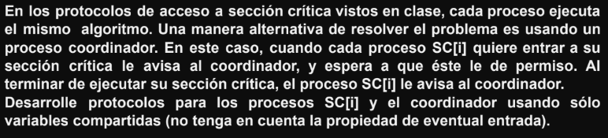

<div align="center">


</div>

> Hay que soportar los golpes sin dejar de avanzar. Así es como se gana

---

# Ejercicios Practicos

## Ejercicio 1 Calculos


<details><summary>👀 Respuesta</summary>

Si el algoritmo se ejecuta secuencialmente se tienen:

**Asignaciones**

- 128^3 + 128^2
- 2097152 + 16384
- 2113536

¿Por qué 128^3 y 128^2?


**Sumas**

- 128^3
- 2097152


**Productos**
- 128^3
- 2097152


</details>

<br>


<details><summary>👀 Respuesta</summary>

Si tenemos 8 procesos cada uno con un strip de 16 (128/8) los cálculos de tiempo quedarían para cada proceso como:

- La matriz de `C` es de tamaño `128x128`
- La estrategia paralela divide las **filas** de `C` entre **8 procesos**
- Y como hay `128` filas y `P=8`, cada proceso trabaja sobre `128/8` = `16 filas`

**Asignaciones con 8 procesos**

Anteriormente calculabamos las asignaciones de esta forma `128^3 + 128^2`, ahora vamos a hacer exactamente los mismo pero lo dividimos por la cantidad de procesos que tenemos

- Con `P=1` -> `128^3` + `128^2`
- Con `P=8` -> `(128^3)/8` + `(128^2)/8`

`(128^3)/8` + `(128^2)/8` <=> `128^2 * 16` + `128 * 16`

Podes usar la cuenta que quieras, son equivalentes, el resultado final te tendria que dar lo siguiente

- 262144 + 2048
- 264192

**Sumas**

- `(128^3)/8` <=> `128^2 * 16`
- 262144

**Productos**

- `(128^3)/8` <=> `128^2 * 16`
- 262144

</details>

<br>


<details><summary>👀 Respuesta</summary>

**Problema Inicial: Distribución equitativa pero ineficiente**

Inicialmente, cada procesador **P1** a **P8** procesa la misma cantidad de filas de la matriz. Dado que la matriz es de tamaño **128×128**, se divide en **8 partes iguales**, lo que significa que cada procesador maneja **16 filas**.

> P1 a P8 tienen igual número de operaciones.
> Es como tener 8 autos y a uno le faltan dos ruedas

- **Asignaciones** -> `264192`
- **Sumas** -> `262144`
- **Producto** -> `262144`

Los tiempos de ejecución para **P1** a **P7** son:

- T(P1-P7)
- (`264192` x 1) + (`262144` x 2) + (`262144` x 3)
- `264192` + `524288` + `786432` = 1574912

Sin embargo, P8 es 4 veces más lento, por lo que su tiempo total de ejecución es

- T(P8)
- 1574912 x 4
- `6299648`

Como el tiempo de ejecución total en paralelo está determinado por el procesador más lento, el tiempo total de ejecución es:

Cálculo del speedup inicial:

T(Secuencial) = 1574912 * 8  -> 12.599.296

- Speedup
- T(secuencial)/ T(paralelo)
- (1574912 * 8) / (1574912 x 4)
- 2

> 🔴 Problema:
> Aunque tenemos 8 procesadores, el speedup es solo 2, lo cual es muy bajo. Esto ocurre porque P8, al ser más lento, arruina la eficiencia del paralelismo.

**Objetivo del Balance de Carga**

La solución al problema es redistribuir la carga de trabajo para que `P8` tenga menos filas, y así termine aproximadamente en el mismo tiempo que `P1-P7`.

Queremos encontrar cuántas filas `𝑓` debe procesar `P8` para que su tiempo total sea igual al tiempo de ejecución de `P1-P7`.

Sabemos que el tiempo de ejecución de un procesador depende del número de filas que procesa.

Como `P8` es `4` veces más lento, su tiempo de ejecución será:

> Formula original n=128/8  -> 16 Filas


- Calculamos f
- f/16 x 4 = 1
- f x 4 = 16
- f = 16/4
- f = 4

> Por lo tanto, P8 debe procesar solo 4 filas.

**Redistribución de Filas en P1-P7**

Ahora que sabemos que P8 debe procesar 4 filas, debemos redistribuir las filas restantes entre los otros procesadores.

- Total de filas en la matriz: 128
- Filas asignadas a P8: 4
- Filas restantes para los demás procesadores:

128 − 4 = 124

Distribuimos estas filas entre los 7 procesadores restantes (P1-P7):

- `124/7` = 17.71 ≈ 18

Creeeeo que esta bien, aca esta otra respuesta


</details>

---

## Ejercicio 2 Dado un Programa Concurrente


<details><summary>👀 Respuesta</summary>

```
Co
    X := X - Z
    Z := Z * 2
    Y := Z + 4
Oc
```

**📌 Recordatorio: ¿Qué es ASV?**

Una asignación `x := e` **cumple la propiedad de ASV** si:

- ✅ (1) `e` contiene **a lo sumo una referencia crítica**, **y** la variable `x` (la que se asigna) **no es usada en otros procesos**,  
**o**
- ✅ (2) `e` **no contiene ninguna referencia crítica**.


**🧠 ¿Qué es una *referencia crítica*?**

Es cualquier acceso (lectura o escritura) a una variable **compartida entre procesos concurrentes**.  
Si una variable aparece en más de una instrucción dentro del bloque `Co ... Oc`, entonces es **crítica**.


**`1)`** `X := X - Z`

```
Co
    X := X - Z
    Z := Z * 2
    Y := Z + 4
Oc
```

- `Variables involucradas:`
    - Lee `X` y `Z`
    - Asigna a `X`
- **`¿Referencias críticas?`**
    - `Z` también aparece en otras asignaciones (`Z := Z * 2`, `Y := Z + 4`) → **Sí**, es crítica  
    - `X` **no aparece en ninguna otra instrucción** → **No es crítica**
- **`Evaluación ASV`**:
    - Tiene **una sola referencia crítica** (`Z`)
    - La variable asignada (`X`) **no se usa en otro proceso**

✅ **Cumple ASV**


**`2)`** `Z := Z * 2`

```
Co
    X := X - Z
    Z := Z * 2
    Y := Z + 4
Oc
```

- **`Variables involucradas:`**
    - Lee y escribe `Z`
- **`¿Referencias críticas?`**
    - `Z` aparece también en:
      - `X := X - Z`
      - `Y := Z + 4`
    - **Z es usada en múltiples procesos** → **es crítica**
    - Además, se está modificando en esta instrucción → escritura
- **`Evaluación ASV`**
    - Tiene **una referencia crítica** (`Z`)
    - La variable asignada (`Z`) **sí se usa en otros procesos**

❌ **No cumple ASV**

**`3)`** `Y := Z + 4`

 Variables involucradas:
- Lee `Z`
- Asigna a `Y`

 ¿Referencias críticas?
- `Z` es crítica (como ya dijimos)
- `Y` **no aparece en ningún otro proceso**

 Evaluación ASV:
- Tiene **una sola referencia crítica** (`Z`)
- La variable asignada (`Y`) **no se usa en otros procesos**

✅ **Cumple ASV**

| Instrucción      | ¿Cumple ASV? | Justificación                                                                 |
|------------------|--------------|--------------------------------------------------------------------------------|
| `X := X - Z`     | ✅ Sí         | Tiene una única referencia crítica (`Z`), y `X` no es usada en otros procesos |
| `Z := Z * 2`     | ❌ No         | Tiene referencia crítica (`Z`), y `Z` es usada en otros procesos              |
| `Y := Z + 4`     | ✅ Sí         | Tiene una única referencia crítica (`Z`), y `Y` no es usada en otros procesos |

> A chequear

</details>

<br>


<details><summary>👀 Respuesta</summary>

```
x = 3; y = 2; z = 5;
Co
    X := X - Z
    Z := Z * 2
    Y := Z + 4
Oc
```

| Orden de ejecución | Operaciones realizadas (con valores) | Resultado final `(X, Z, Y)` |
|--------------------|---------------------------------------|------------------------------|
| **T1 → T2 → T3**   | `X = 4 - 3 = 1`<br>`Z = 3 * 2 = 6`<br>`Y = 6 + 4 = 10` | **(1, 6, 10)** |
| **T1 → T3 → T2**   | `X = 4 - 3 = 1`<br>`Y = 3 + 4 = 7`<br>`Z = 3 * 2 = 6` | **(1, 6, 7)** |
| **T2 → T1 → T3**   | `Z = 3 * 2 = 6`<br>`X = 4 - 6 = -2`<br>`Y = 6 + 4 = 10` | **(-2, 6, 10)** |
| **T2 → T3 → T1**   | `Z = 3 * 2 = 6`<br>`Y = 6 + 4 = 10`<br>`X = 4 - 6 = -2` | **(-2, 6, 10)** |
| **T3 → T1 → T2**   | `Y = 3 + 4 = 7`<br>`X = 4 - 3 = 1`<br>`Z = 3 * 2 = 6` | **(1, 6, 7)** |
| **T3 → T2 → T1**   | `Y = 3 + 4 = 7`<br>`Z = 3 * 2 = 6`<br>`X = 4 - 6 = -2` | **(-2, 6, 7)** |


- `X := 4 - Z` → depende del valor de `Z` al momento de ejecutar T1
- `Y := Z + 4` → depende del valor de `Z` al momento de ejecutar T3
- `Z := Z * 2` → siempre lleva `Z` de 3 a 6

El valor de Z es siempre el mismo ya que no posee ninguna referencia crítica. Los valores de X e Y se ven afectados por la ejecución de T2 ya que sus resultados dependen de la referencia que hacen a la variable Z que es modificada. Entonces, si T1 y T3 se ejecutan antes que T2 ambas usarán el valor inicial de Z que es 3 obteniendo los resultados X=1 e Y=7; ahora si T2 se ejecuta antes que las demás los resultados serán X=-2 e Y=10 y por último, tenemos los casos en que T2 se ejecuta en medio con T1 antes y T3 después o con T3 antes y T1 después.

- Nota 1: las instrucciones NO SON atómicas.
- Nota 2: no es necesario que liste TODOS los resultados.

> Se podria consultar esto

</details>

---

## Ejercicio 3 Dado El Programa Concurrente


<details><summary>👀 Respuesta</summary>

Siendo:
```
A: x = y * z  Tiene 2 referencias críticas (a y, a z), por lo tanto no cumple ASV. (además x es leída en en C.)
B: z = z * 2 No tiene referencia crítica y es leída por otro (en A se lee z), por lo tanto cumple ASV.
C: y = y + 2x Tiene 1 referencia crítica (a x) y además es leída por otro proceso (en A se lee y), por lo tanto no cumple ASV.
```

> A chequear
</details>

<br>


<details><summary>👀 Respuesta</summary>

| **#** | **Orden de ejecución**             | **Operaciones realizadas**                                                                                                                                         | **Resultado final**            |
|------:|------------------------------------|--------------------------------------------------------------------------------------------------------------------------------------------------------------------|-------------------------------|
| 1     | A → B → C                          | `x = 2*5 = 10`<br>`z = 5*2 = 10`<br>`y = 2 + 2*10 = 22`                                                                                                             | `x = 10`, `z = 10`, `y = 22`  |
| 2     | A → C → B                          | `x = 2*5 = 10`<br>`y = 2 + 2*10 = 22`<br>`z = 5*2 = 10`                                                                                                             | `x = 10`, `z = 10`, `y = 22`  |
| 3     | C → B → A                          | `y = 2 + 2*3 = 8`<br>`z = 5*2 = 10`<br>`x = 2*10 = 20`                                                                                                              | `x = 20`, `z = 10`, `y = 8`   |
| 4     | B → C → A                          | `z = 5*2 = 10`<br>`y = 2 + 2*3 = 8`<br>`x = 2*10 = 20`                                                                                                              | `x = 20`, `z = 10`, `y = 8`   |
| 5     | C → A → B                          | `y = 2 + 2*3 = 8`<br>`x = 2*5 = 10`<br>`z = 5*2 = 10`                                                                                                               | `x = 10`, `z = 10`, `y = 8`   |
| 6     | B → A → C                          | `z = 5*2 = 10`<br>`x = 2*10 = 20`<br>`y = 2 + 2*20 = 42`                                                                                                            | `x = 20`, `z = 10`, `y = 42`  |
| 7     | A lee `y=2`, C lee `x=3`, luego A termina, luego B | `A empieza: y=2`<br>`C: y = 2 + 2*3 = 8`<br>`A termina: x = 2*5 = 10`<br>`B: z = 5*2 = 10`                                 | `x = 10`, `z = 10`, `y = 8`   |
| 8     | A lee `y=2`, C lee `x=3`, luego B, luego A termina | `A empieza: y=2`<br>`C: y = 2 + 2*3 = 8`<br>`B: z = 5*2 = 10`<br>`A termina: x = 2*10 = 20`                                 | `x = 20`, `z = 10`, `y = 8`   |

</details>

---

## Ejercicio 4 Alocación SJN

**Sea la siguiente solución propuesta al problema de alocación SJN (Short Job Next):**

```nginx
Monitor SJN {
    Bool libre = true;
    Cond turno;

    Procedure request {
        If (not libre) wait (turno, tiempo);
        Libre = false;
    }

    Procedure release {
        Libre = true;
        Signal (turno);
    }
}
```

**a) ¿Funciona correctamente con disciplina de señalización Signal and continue? Justifique.**

<details><summary>👀 Respuesta</summary>


No, la solución no funciona correctamente con la disciplina de señalización **Signal and Continue (S&C)**.

Bajo esta disciplina, cuando un proceso realiza un `signal`, **continúa ejecutando dentro del monitor**, y el proceso que fue despertado es enviado a la **cola de listos (ready queue)** del sistema operativo. Esto implica que su reingreso al monitor depende de la **política de planificación del sistema**, y no se garantiza que sea el próximo en ejecutarse.

En consecuencia, un proceso con menor tiempo (según la política **Shortest Job Next**) podría quedar **retrasado** si otro proceso ingresa antes al monitor. Por lo tanto, el orden de ejecución no refleja necesariamente la prioridad establecida por el parámetro `tiempo`, y **no se cumple el objetivo del SJN**.

**Respuesta de un random**

> Con S&C un proceso que es despertado para poder seguir ejecutando es pasado a la cola
> de ready en cuyo caso su orden de ejecución depende de la política que se utilice para
> ordenar los procesos en dicha cola. Puede ser que sea retrasado en esa cola permitiendo
> que otro proceso ejecute en el monitor antes que el por lo que podría no cumplirse el
> objetivo del SJN.


</details>

<br>


<details><summary>👀 Respuesta</summary>


Sí, **la solución funciona correctamente** con la disciplina de señalización **Signal and Wait (S&W)**.

En esta disciplina, cuando un proceso ejecuta un `signal`, **cede inmediatamente el control del monitor** al proceso que fue despertado, el cual **continúa su ejecución justo después del `wait`**. El proceso que hizo el `signal` pasa a la cola de listos y debe esperar su turno para volver a ingresar al monitor.

Esto garantiza que el proceso con menor tiempo (según la política Shortest Job Next) —que estaba esperando con prioridad— **será efectivamente el próximo en acceder al recurso**, evitando que otro proceso pueda adelantarse y violar el orden deseado.

Por lo tanto, **la política SJN se respeta correctamente bajo Signal and Wait**, ya que se mantiene el control sobre el orden de ejecución de los procesos en espera.


📘 **Definiciones complementarias:**

- **Signal and Continue:** El proceso que ejecuta el `signal` **continúa usando el monitor**, mientras que el proceso despertado **debe competir** por reingresar al monitor.
- **Signal and Wait:** El proceso que ejecuta el `signal` **cede el monitor** al proceso despertado, que continúa su ejecución **justo después del `wait`**.


</details>

<br>

<details><summary>📊 Comparación entre <strong>Signal and Continue</strong> vs <strong>Signal and Wait en SJN</strong></summary>


| **Aspecto**                         | **Signal and Continue (S&C)**                                                                 | **Signal and Wait (S&W)**                                                                   |
|-------------------------------------|-----------------------------------------------------------------------------------------------|----------------------------------------------------------------------------------------------|
| **¿Quién sigue ejecutando en el monitor después del `signal`?** | El proceso que hizo el `signal` continúa.                                                     | El proceso que fue despertado entra inmediatamente al monitor.                              |
| **Estado del proceso despertado**   | Pasa a la **cola de listos** y debe competir por reingresar al monitor.                       | **Continúa inmediatamente** dentro del monitor (no compite por el acceso).                  |
| **Riesgo de pérdida de prioridad (SJN)** | **Alto**: otro proceso puede ingresar antes que el de menor tiempo.                          | **Nulo**: se garantiza que el proceso con menor tiempo accede primero.                      |
| **¿Se respeta la política SJN?**    | ❌ **No**: puede no ejecutarse el proceso con menor tiempo debido a la competencia externa.   | ✅ **Sí**: el proceso con menor tiempo es el próximo en continuar.                          |
| **Uso recomendado en SJN**          | No recomendado, ya que puede romper la prioridad por tiempo.                                  | Recomendado, ya que respeta el orden de espera basado en el tiempo.                         |
| **Control de acceso**               | Depende del planificador del sistema operativo.                                               | Controlado directamente por el monitor y su lógica de sincronización.                      |

</details>

---

## Ejercicio 5 Passing the Condition


<details><summary>Codigo</summary>

```cpp
monitor Semaforo {
    int s = 1, espera = 0;
    cond pos;

    procedure P() {
        if (s == 0) {
            espera++;
            wait(pos);
        } else {
            s = s - 1;
        }
    };

    procedure V() {
        if (espera == 0) {
            s = s + 1;
        } else {
            espera--;
            signal(pos);
        }
    };
};
```
</details>

---

## Ejercicio 6 Resuelva con monitores


<details><summary>Codigo</summary>

```cpp
monitor Controlador_ListaEnlazada {
    int numSearchers = 0, numInserters = 0, numDeleters = 0;
    cond searchers, inserters, deleters;

    procedure pedir_Deleter() {
        while (numSearchers > 0 OR numInserters > 0 OR numDeleters > 0) {
            wait(deleters);
        }
        numDeleters = numDeleters + 1;
    }

    procedure liberar_Deleter() {
        numDeleters = numDeleters - 1;
        signal(inserters);
        signal(deleters);
        signal_all(searchers);
    }

    procedure pedir_Searcher() {
        while (numDeleters > 0) {
            wait(searchers);
        }
        numSearchers = numSearchers + 1;
    }

    procedure liberar_Searcher() {
        numSearchers = numSearchers - 1;
        if (numSearchers == 0 AND numInserters == 0) {
            signal(deleters);
        }
    }

    procedure pedir_Inserter() {
        while (numDeleters > 0 OR numInserters > 0) {
            wait(inserters);
        }
        numInserters = numInserters + 1;
    }

    procedure liberar_Inserter() {
        numInserters = numInserters - 1;
        signal(inserters);
        if (numSearchers == 0) {
            signal(deleters);
        }
    }
}
```

🧵 Procesos:

```cpp
process Searchers[i = 1..S] {
    Controlador_ListaEnlazada.pedir_Searcher();
    <Realiza búsqueda en la lista>
    Controlador_ListaEnlazada.liberar_Searcher();
}

process Inserters[j = 1..I] {
    Controlador_ListaEnlazada.pedir_Inserter();
    <Inserta en la lista>
    Controlador_ListaEnlazada.liberar_Inserter();
}

process Deleters[k = 1..D] {
    Controlador_ListaEnlazada.pedir_Deleter();
    <Borra en la lista>
    Controlador_ListaEnlazada.liberar_Deleter();
}
```

🧠 **Resumen: Monitor `Controlador_ListaEnlazada`**

👥 Tipos de procesos:
- **Searchers**: pueden acceder **concurrentemente**, salvo que haya un **Deleter**.
- **Inserters**: acceden **de a uno**, pero **pueden convivir con Searchers**.
- **Deleters**: requieren **exclusión total** (no pueden ejecutarse junto a ningún otro proceso).


🔒 Comportamiento de sincronización:
- `Searchers` esperan si hay un `Deleter`.
- `Inserters` esperan si hay otro `Inserter` o un `Deleter`.
- `Deleters` esperan si hay cualquier otro proceso activo (Searcher o Inserter).
- Al liberar, se despiertan procesos bloqueados según condiciones.

✅ ¿Funciona correctamente?
Sí, **el monitor implementa correctamente las restricciones** de sincronización para los tres tipos de procesos.   Asegura exclusión mutua, convivencia segura y respeta la lógica de prioridades.

</details>

---

## Ejercicio 7 Protocolos de Acceso a la SC



<details><summary>Respuesta</summary>

```cpp
int aviso[1:N] = ([N] 0), permiso[1:N] = ([N] 0);
```

<table><td>

```cpp
process SC[i = 1 to N] {
    SNC;

    // Protocolo de entrada
    permiso[i] = 1;
    while (aviso[i] == 0) skip;

    // Sección crítica
    SC;

    // Protocolo de salida
    aviso[i] = 0;
    SNC;
}
```
</td><td>

```cpp
process Coordinador {
    int i = 1;
    while (true) {
        // Espera que algún proceso solicite permiso
        while (permiso[i] == 0)
            i = i mod N + 1;

        // Otorga permiso al proceso i
        permiso[i] = 0;
        aviso[i] = 1;

        // Espera a que el proceso libere la SC
        while (aviso[i] == 1) skip;
    }
}
```
</td></table>

</details>

---

## Ejercicio 8 Solución a la Criba

> 💀 Dudo mucho que tomen este ejercicio, lo pongo por las dudas

Describa la solución utilizando la criba de Eratóstenes al problema de hallar los primos entre 2 y n. **¿Cómo termina el algoritmo? ¿Qué modificaría para que no termine de esa manera?**

<details><summary>Codigo</summary>

La criba de Eratóstenes es un algoritmo clásico para determinar cuáles números en un rango son primos. Supongamos que queremos generar todos los primos entre **2** y **n**. Primero, escribimos una lista con todos los números:

```
2 3 4 5 6 7 ... n
```

Comenzando con el primer número no tachado en la lista, 2, recorremos la lista y borramos los múltiplos de ese número. Si n es impar, obtenemos la lista:

```
2 3 5 7 ... n
```

En este momento, los números borrados no son primos; los números que quedan todavía son candidatos a ser primos. Pasamos al próximo número, **3**, y repetimos el anterior proceso borrando los **múltiplos de 3**. Si seguimos este proceso hasta que todo número fue considerado, los números que quedan en la lista final serán todos los primos entre **2** y **n**.

Para solucionar este problema de forma paralela podemos emplear un pipeline de procesos filtro.

- Cada filtro recibe una serie de números de su predecesor y envía una serie de números a su sucesor.
- El primer número que recibe un filtro es el próximo primo más grande;
- Le pasa a su sucesor todos los números que no son múltiplos del primero.

El siguiente es el algoritmo pipeline para la generación de números primos.

Por cada canal, el primer número es primo y todos los otros números no son múltiplo de ningún primo menor que el primer número:

```cpp
Process Criba[1]
{
    int p = 2;

    for [i = 3 to n by 2] 
        Criba[2] ! (i);
}

Process Criba[i = 2 to L]
{
    int p, proximo;

    Criba[i-1] ? p;
    do Criba[i-1] ? (proximo) →
        if ((proximo MOD p) <> 0) →
            Criba[i+1] ! (proximo);
        fi
    od
}
```

- El primer proceso, **Criba[1]**, envía todos los números impares desde `3 a n` a **Criba[2]**.
- Cada uno de los otros procesos recibe una serie de números de su predecesor.
- El primer número **`p`** que recibe el proceso **`Criba[i]`** es el **i-ésimo** primo.
- Cada Criba[i] subsecuentemente pasa todos los otros números que recibe que no son múltiplos de su primo **`p`**.
- El número total **`L`** de procesos Cribe debe ser lo suficientemente grande para garantizar que todos los primos hasta **`n`** son generados. Por ejemplo, hay 25 primos menores que 100;
- el porcentaje decrece para valores crecientes de **`n`**.

El programa anterior termina en deadlock, ya que no hay forma de saber cuál es el último número de la secuencia y cada proceso queda esperando un próximo número que no llega.

Podemos fácilmente modificarlo para que termine normalmente usando centinelas, es decir que al final de los streams de entrada son marcados por un centinela

```cpp
# EOS: End Of Stream (-1 indica fin del flujo)

Process Criba[1] {
    int p = 2;

    # Enviar todos los números impares desde 3 hasta n a Criba[2]
    for [i = 3 to n by 2]
        Criba[2] ! i;

    # Enviar fin de flujo
    Criba[2] ! -1;
}

Process Criba[i = 2 to L] {
    int p, proximo;
    boolean seguir = true;

    # Recibe el primer número (primo)
    Criba[i-1] ? p;

    do (seguir);
        # Recibe siguiente candidato
        Criba[i-1] ? proximo ->

        if (proximo = -1) {
            seguir = false;
            Criba[i+1] ! -1;   # Propaga EOS al siguiente proceso
        }
        else if ((proximo MOD p) <> 0) {
            Criba[i+1] ! proximo;  # Si no es múltiplo, lo pasa
        }
    od
}
```

</details>

---

## Ejercicio 9 Suponga los siguientes programas concurrentes

**Suponga los siguientes programas concurrentes. Asuma que “función” existe, y que los procesos son iniciados desde el programa principal.**

<table>
<tr><td>P1</td><td>P2</td></tr>
<tr><td>

```cpp
chan canal (double);

process grano1 {
    int veces, i;
    double sum;

    for (veces = 1 to 10) {
        for (i = 1 to 10000)
            sum = sum + funcion(i);
        send canal(sum);
    }
}

process grano2 {
    int veces;
    double sum;

    for (veces = 1 to 10) {
        receive canal(sum);
        printf(sum);
    }
}
```
</td><td>

```cpp
chan canal (double);

process grano1 {
    int veces, i;
    double sum;

    for (veces = 1 to 10000) {
        for (i = 1 to 10)
            sum = sum + i;
        send canal(sum);
    }
}

process grano2 {
    int veces;
    double sum;

    for (veces = 1 to 10000) {
        receive canal(sum);
        printf(sum);
    }
}
```
</td></tr>
</table>

**a) Analice desde el punto de vista del número de mensajes.**

<details><summary>Respuesta</summary>

En ambos programas, el canal `canal` se utiliza para **comunicar el resultado parcial `sum`** desde `grano1` hacia `grano2`, mediante un mensaje por cada iteración externa del bucle principal en `grano1`.

- **En P1**, el proceso `grano1` ejecuta un bucle externo de **10 iteraciones**, y en cada una de ellas calcula la suma de `funcion(i)` para `i = 1 a 10000`, y luego envía un solo mensaje con ese resultado a `grano2`.  
  🔸 Por lo tanto, **se envían 10 mensajes** en total.

- **En P2**, el proceso `grano1` ejecuta un bucle externo de **10000 iteraciones**, y en cada una de ellas suma los números del 1 al 10 y luego **envía un mensaje por iteración** a `grano2`.  
  🔸 En este caso, **se envían 10000 mensajes** en total.

🔍 **Conclusión:**  
Desde el punto de vista de la cantidad de mensajes transmitidos:
- **P1 es más eficiente**, ya que comunica sólo 10 veces.
- **P2 genera una sobrecarga mucho mayor**, con 10000 envíos de mensajes.


</details>

**b) Analice desde el punto de vista de la granularidad de los procesos.**

<details><summary>Respuesta</summary>

En **P1**, el envío de los mensajes se realiza después de largos períodos de ejecución ya que entre cada **send** se ejecuta una iteración de **10000** unidades de tiempo, esto nos asegura que la comunicación entre los dos procesos es poco frecuente.

Dadas dichas características podemos decir, que desde el punto de vista de la **granularidad**, **P1** es de **granularidad gruesa** ya que la comunicación ente los procesos **no es de manera reiterada**.

Al tener mayor granularidad disminuye la concurrencia y la sobrecarga de bloqueos.

En **P2**, el envío de mensajes se realiza en intervalos cortos de tiempo (entre la ejecución de cada send sólo se ejecuta un **for de 1 a 10**), aumentando considerablemente la comunicación respecto de **P1**.

Por lo tanto, podemos decir que **P2** es de **granularidad fina**, ya que en cada iteración el volumen de comunicación aumenta, por lo tanto la relación cómputo / comunicación disminuye. Al disminuir la **granularidad** aumenta la **concurrencia** pero también aumenta la **sobrecarga de bloqueos**.
</details>

<details><summary>Prioridad y Granularidad</summary>


</details>

> Tengo la duda de cual es la diferencia entre el **grano fino** y el **grano grueso**

**c) Cuál de los programas le parece más adecuado para ejecutar sobre una arquitectura de tipo cluster de PCs? Justifique.**

<details><summary>Respuesta</summary>

La implementación más adecuada para este tipo de arquitecturas es **P1**, por ser de **granularidad gruesa**. Al tratarse de una arquitectura con memoria distribuida la comunicación entre los procesos es más costosa ya que cada proceso puede ejecutarse
en computadores diferentes, por lo tanto sería más eficiente que la sobrecarga de
comunicación sea lo más baja posible, y dicha característica la brinda la **granularidad gruesa**.

</details>

---

## Ejercicio 10 Suponga los siguientes programas concurrentes

Suponga los siguientes programas concurrentes. Asuma que **EOS** es un valor especial que indica el **fin de la secuencia de mensajes**, y que los procesos son iniciados desde el programa principal.

<table>
<tr><td>P1</td><td>P2</td></tr>
<tr><td>

```cpp
chan canal (double);

process Genera {
    int fila, col;
    double sum;

    for (fila = 1 to 10000) {
        for (col = 1 to 10000)
            send canal(a(fila, col));
    }

    send canal(EOS);  // End of Stream
}

process Acumula {
    double valor, sumT;
    sumT = 0;

    receive canal(valor);
    while (valor <> EOS) {
        sumT = sumT + valor;
        receive canal(valor);
    }

    printf(sumT);
}
```
</td><td>

```cpp
chan canal (double);

process Genera {
    int fila, col;
    double sum;

    for (fila = 1 to 10000) {
        sum = 0;
        for (col = 1 to 10000)
            sum = sum + a(fila, col);
        send canal(sum);
    }
    send canal(EOS);  // End of Stream
}

process Acumula {
    double valor, sumT;
    sumT = 0;
    receive canal(valor);
    while (valor <> EOS) {
        sumT = sumT + valor;
        receive canal(valor);
    }

    printf(sumT);
}

```
</td></tr>
</table>

**a) ¿Qué hacen los programas?**

<details><summary>Respuesta</summary>

Ambos programas tienen como objetivo calcular la **suma total de todos los elementos de una matriz** de tamaño 10000×10000. La diferencia principal radica en **dónde se realiza la mayor parte del trabajo de acumulación**.

- En **P1**, el proceso `Genera` envía **cada elemento individual** de la matriz (es decir, 10000 × 10000 = 100 millones de mensajes) al proceso `Acumula`, el cual es el encargado de realizar la suma total.  
  👉 En este caso, la carga de cómputo recae completamente en `Acumula`.

- En **P2**, el proceso `Genera` **suma localmente cada fila** de la matriz y luego envía **solo un valor por fila** (la suma de esa fila) al proceso `Acumula`. Como hay 10000 filas, `Genera` envía **solo 10000 mensajes**.  
  👉 Aquí, `Genera` hace parte del trabajo de acumulación, y `Acumula` solo se encarga de sumar 10000 valores (uno por fila).

🔍 **Conclusión**: Ambos programas calculan la suma total de la matriz, pero **P2 es más eficiente** en cuanto a **comunicación y carga de trabajo**, ya que reduce drásticamente el número de mensajes enviados por el canal.

</details>

**b) Analice desde el punto de vista del número de mensajes.**

<details><summary>Respuesta</summary>

Desde el punto de vista del número de mensajes enviados por el proceso `Genera` al proceso `Acumula`:

- En **P1**, se envía **un mensaje por cada elemento** de la matriz de 10000 × 10000, lo que da un total de **100 millones de mensajes**.  
  👉 Esto representa una alta carga de comunicación.

- En **P2**, se realiza **un solo mensaje por fila**, ya que `Genera` acumula localmente la suma de cada fila y luego envía ese resultado. Por lo tanto, se envían únicamente **10000 mensajes**.  
  👉 Esto reduce considerablemente la cantidad de mensajes en comparación con P1.

🔍 **Conclusión**: **P2 es mucho más eficiente en términos de comunicación**, ya que reduce el número de mensajes de 100 millones a solo 10000.

</details>

**c) Analice desde el punto de vista de la granularidad de los procesos.**

<details><summary>Respuesta</summary>

Desde el punto de vista de la granularidad, el programa **P2** presenta una **granularidad más gruesa** que **P1**. Esto se debe a que en P2 el proceso `Genera` realiza una mayor cantidad de cómputo local (acumula la suma de cada fila) antes de comunicarse con el proceso `Acumula`.

En cambio, en **P1**, `Genera` realiza un procesamiento mínimo y se limita a enviar cada valor individual al acumulador, generando así una gran cantidad de comunicaciones.

🔍 **Conclusión**:  
Al realizar más procesamiento local y reducir la frecuencia de comunicación, **P2 tiene un grano más grueso**, lo cual generalmente implica **mejor eficiencia y menor sobrecarga de comunicación** en sistemas concurrentes.

</details>

<details><summary>🧩 ¿Qué es la granularidad?</summary>

La **granularidad** de una aplicación concurrente o paralela se refiere a la **relación entre el tiempo dedicado al cómputo y el tiempo dedicado a la comunicación** entre procesos o hilos.

- Si una aplicación realiza **mucho cómputo local** antes de necesitar comunicarse, se dice que tiene **grano grueso**.
- Si, por el contrario, realiza **frecuentes comunicaciones** con poco cómputo entre medio, se dice que tiene **grano fino**.

Esta característica es clave para el **diseño y rendimiento** de programas paralelos, ya que:
- **Grano grueso** suele ser más eficiente en arquitecturas donde la comunicación es costosa.
- **Grano fino** puede aprovechar mejor arquitecturas con alta velocidad de comunicación o memoria compartida eficiente.

🔧 **Resumen**:  
> La granularidad es la proporción entre el cómputo y la comunicación en una aplicación. Afecta cómo se adapta el programa a una arquitectura paralela, diferenciándose entre **grano fino** (más comunicación) y **grano grueso** (más procesamiento local).

</details>

**d) ¿Cuál de los programas le parece más adecuado para ejecutar sobre una arquitectura de tipo cluster de PCs? Justifique.**

<details><summary>Respuesta</summary>

Las arquitecturas tipo **cluster de PCs** se caracterizan por estar compuestas por múltiples nodos con alta capacidad de cómputo, pero con **canales de comunicación relativamente lentos** y costosos en comparación con arquitecturas compartidas.

Por esta razón, se consideran arquitecturas de **grano grueso**, ya que se adaptan mejor a programas que realizan **mucho procesamiento local** y **reducen al mínimo la comunicación entre procesos**.

En este contexto, el programa **P2** resulta más adecuado para ejecutarse en un cluster, ya que `Genera` acumula localmente la suma de cada fila y envía solo **un valor por fila**, reduciendo significativamente la cantidad de mensajes enviados (de 100 millones a 10.000).

🔍 **Conclusión**:  
> **P2 es más apropiado para ejecutarse sobre arquitecturas tipo cluster**, ya que aprovecha mejor el cómputo local y minimiza la necesidad de comunicación, alineándose con las características de este tipo de sistema.

</details>

---

## Ejercicio 11 Dada la siguiente solución con monitores


**Dada la siguiente solución con monitores al problema de alocación de un recurso con múltiples unidades, transforme la misma en una solución utilizando mensajes asincrónicos.**

```cpp
Monitor Alocador_Recurso {
    INT disponible = MAXUNIDADES;
    SET unidades = valores iniciales;
    COND libre;   // TRUE cuando hay recursos

    procedure adquirir(INT id) {
        if (disponible == 0)
            wait(libre);
        else {
            disponible = disponible - 1;
            remove(unidades, id);
        }
    }

    procedure liberar(INT id) {
        insert(unidades, id);
        if (empty(libre))
            disponible := disponible + 1;
        else
            signal(libre);
    }
}
```

<details><summary>Respuesta</summary>

```cpp
type clase_op = enum(adquirir, liberar);
chan request(int idCliente, claseOp oper, int idUnidad);
chan respuesta[n](int id_unidad);

Process Administrador_Recurso {
    int disponible = MAXUNIDADES;
    set unidades = valor inicial disponible;
    queue pendientes;

    while (true) {
        receive request(idCliente, oper, id_unidad);

        if (oper == adquirir) {
            if (disponible > 0) {
                disponible = disponible - 1;
                remove(unidades, id_unidad);
                send respuesta[idCliente](id_unidad);
            } else {
                insert(pendientes, idCliente);
            }
        } else {
            if (empty(pendientes)) {
                disponible = disponible + 1;
                insert(unidades, id_unidad);
            } else {
                remove(pendientes, idCliente);
                send respuesta[idCliente](id_unidad);
            }
        }
    }
}
// Fin del proceso Administrador_Recurso

Process Cliente[i = 1 to n] {
    int id_unidad;

    send request(i, adquirir, 0);
    receive respuesta[i](id_unidad);

    // Usa la unidad

    send request(i, liberar, id_unidad);
}
```

***🧠 1. **Modelo de comunicación*****

- **Monitores** utilizan una **comunicación directa** entre procesos a través de **procedimientos compartidos**. El proceso cliente **entra al monitor**, ejecuta `adquirir()` o `liberar()`, y **bloquea su ejecución** si no puede continuar (por ejemplo, si no hay recursos).
  
- **Mensajes asincrónicos**, en cambio, se basan en **comunicación por paso de mensajes**. El cliente **envía un mensaje** al administrador (`request`) y luego **espera la respuesta** por otro canal (`respuesta[i]`). No hay acceso directo a las variables compartidas; todo se coordina mediante mensajes.

**🔁 2. **Sincronización y control de acceso****

- En el **monitor**, la sincronización es **implícita**: si `disponible == 0`, el proceso ejecuta `wait(libre)` y queda **suspendido automáticamente** hasta que otro proceso haga `signal(libre)` al liberar un recurso.

- En la versión **con mensajes**, no hay suspensión automática. El administrador debe **mantener una cola de espera (`pendientes`)** y decidir manualmente a quién responder y cuándo. Si alguien libera una unidad y hay clientes esperando, el administrador **desencola** y **responde explícitamente**.

**🔐 3. **Visibilidad y consistencia del estado****

- En el monitor, los procesos tienen **acceso directo a las variables** `disponible`, `unidades`, etc., pero solo **uno a la vez**, garantizando exclusión mutua.

- Con mensajes asincrónicos, **solo el administrador** conoce y modifica el estado global. Los clientes **no ven directamente cuántos recursos quedan**; solo saben si obtuvieron uno o no, cuando reciben la respuesta.

**🧩 4. **Modelo de espera****

- En monitores, la espera se maneja con `wait` y `signal`, que pueden funcionar según dos disciplinas:  
  - **Signal and Wait** (el proceso que señala cede el monitor al despertado)  
  - **Signal and Continue** (el proceso que señala continúa)

- En mensajes, **la espera es activa y manual**: el cliente **se bloquea esperando una respuesta**, y el administrador debe tener lógica para enviarle esa respuesta **cuando le toque**.

**⚙️ 5. **Aplicabilidad según arquitectura****

- Los **monitores** son más adecuados para sistemas **centralizados o con memoria compartida**, ya que dependen de sincronización interna y acceso directo a variables.

- Los **mensajes asincrónicos** son ideales en **sistemas distribuidos o clusters**, donde no existe memoria compartida y cada proceso corre en su propio nodo. Permiten **separar cómputo y comunicación** y escalar fácilmente.

**💬 Ejemplo concreto**

Supongamos que hay 3 unidades disponibles, y 5 procesos piden recursos.

- En el **monitor**, los 3 primeros entran y adquieren recursos; los otros 2 quedan bloqueados con `wait(libre)` hasta que alguien libere. Luego, `liberar()` hace `signal()` y despierta a uno.

- En la **versión con mensajes**, los 3 primeros reciben respuesta del administrador inmediatamente. Los otros 2 son **enviados a la cola `pendientes`**, y recién serán atendidos cuando un recurso sea liberado y el administrador procese esa cola.

**✅ Conclusión**

- El uso de **monitores** es más directo y automatizado, pero menos flexible fuera de sistemas con memoria compartida.
- El enfoque de **mensajes asincrónicos** permite mayor **control y distribución**, pero requiere manejar manualmente colas, lógica de respuesta y sincronización, lo cual lo hace más complejo pero también más escalable.


</details>

---

## Ejercicio 12 Dado los siguientes segmentos de codigo

Dados los siguientes dos segmentos de codigo, indicar para cada uno de los ítems si son equivalentes o no. Justificar cada caso (de ser necesario dar ejemplos).

<table><td>

```cpp
...
int cant = 1000;

DO 
  (cant < -10); datos?(cant) → Sentencias1
▭ (cant > 10);  datos?(cant) → Sentencias2
▭ (INCOGNITA);  datos?(cant) → Sentencias3
END DO
...
```
</td><td>

```cpp
...
int cant = 1000;

While (true) {
  IF (cant < -10); datos?(cant) → Sentencias1
  ▭  (cant > 10);  datos?(cant) → Sentencias2
  ▭  (INCOGNITA); datos?(cant) → Sentencias3
END IF}
...
```
</td></table>

<details><summary>Respuesta</summary>

En ambos segmentos, inicialmente la variable `cant` tiene el valor 1000. Por lo tanto, la ejecución comienza evaluando la guarda `(cant > 10)`, que es verdadera, y se ejecutan las acciones asociadas a esa rama (por ejemplo, `Sentencias2`).

Sin embargo, si durante la ejecución de esa rama el valor de `cant` cambia (ya sea por una asignación directa o por un valor recibido por el canal), entonces **las guardas deben estar definidas de manera que contemplen todos los posibles valores que `cant` pueda tomar**, para asegurar que el comportamiento de ambos segmentos sea equivalente.

De lo contrario, puede suceder que en **el Segmento 1** todas las guardas resulten falsas y, en ese caso, el `DO` se termina y la ejecución del programa continúa normalmente. En cambio, en **el Segmento 2**, como se trata de un bucle infinito (`while (true)`), si ninguna guarda es verdadera, el programa queda bloqueado esperando indefinidamente, a menos que `cant` sea modificada por otro proceso o evento externo.

🔍 **Conclusión**:  
Para que ambos segmentos sean equivalentes, es fundamental que las guardas consideren **todos los posibles valores** que puede tomar `cant`, incluyendo un caso **por defecto (catch-all)** como la **INCOGNITA**, que permita garantizar siempre una rama ejecutable.

</details>

**a) INCOGNITA equivale a: (cant = 0)**

<details><summary>Respuesta</summary>

Los segmentos **no son equivalentes**. En el **Segmento 1**, el uso de la estructura `DO` implica que si **ninguna de las guardas** se cumple (por ejemplo, si `cant` toma valores entre -10 y 10 excluyendo el 0), entonces el bloque termina y la ejecución del programa continúa.

En cambio, en el **Segmento 2**, el bucle es un `while (true)`, por lo que **aunque ninguna guarda sea verdadera**, el ciclo continuará intentando evaluarlas en cada iteración. Esto provoca una diferencia clave en el comportamiento:  
- El **Segmento 1** puede **finalizar naturalmente** si no hay guardas habilitadas.  
- El **Segmento 2** puede **quedar bloqueado indefinidamente**, esperando que alguna condición se cumpla, a menos que `cant` se modifique desde otro proceso.

🔍 **Conclusión:**  
Para que ambos segmentos sean equivalentes, es necesario que las guardas cubran **todos los posibles valores de `cant`**, y en ese sentido, usar `(cant = 0)` como **INCOGNITA** ayuda a completar el conjunto de condiciones evaluables.

</details>

<details><summary>🛡️ ¿Qué es una guarda?</summary>

Una **guarda** es una **condición lógica** que se asocia a una acción (como el envío o recepción de un mensaje, o la ejecución de una sentencia) y que **debe cumplirse para que esa acción se realice**.

En programación concurrente y modelos como **Comunicación por Paso de Mensajes (CSP), Guarded Commands (Dijkstra), ADA**, etc., las guardas permiten controlar **cuándo** se puede ejecutar una determinada rama del código.

🔍 **Ejemplo clásico:**

```cpp
DO
  (x > 0) → acción1;
▭ (y == 3) → acción2;
OD
```

En este caso:
- `(x > 0)` y `(y == 3)` son **guardas**.
- Solo se ejecutan las acciones **cuyas guardas sean verdaderas**.
- Si más de una guarda se cumple, el sistema puede elegir **nondeterminísticamente** cuál ejecutar.
- Si **ninguna guarda se cumple**, el proceso queda bloqueado o (dependiendo del lenguaje) termina.

✅ **En resumen:**

> Una **guarda** es una condición que **habilita o bloquea** la ejecución de una acción. Se utiliza para expresar **comportamientos condicionales** en sistemas concurrentes o reactivos, y es clave para controlar la sincronización y el flujo de ejecución.

</details>

**b) INCOGNITA equivale a: (cant > -100)**

<details><summary>Respuesta</summary>

Con esta condición, ambos segmentos se vuelven **equivalentes** en términos de comportamiento.

Esto se debe a que la guarda `(cant > -100)` **cubre todos los casos restantes** no contemplados por las otras guardas `(cant < -10)` y `(cant > 10)`. Por lo tanto, **siempre habrá al menos una guarda habilitada**, sin importar el valor de `cant`.

Como consecuencia:
- En el **Segmento 1**, el bucle `DO` **nunca finaliza**, ya que nunca se da una situación donde todas las guardas sean falsas.
- En el **Segmento 2**, el bucle `while (true)` tampoco se detiene, y siempre ejecutará una de las ramas del `IF`.

🔍 **Conclusión:**  
Ambos segmentos ejecutan indefinidamente y responden de forma equivalente a los distintos valores de `cant`, ya que las guardas **cubren todos los casos posibles**.

</details>

**c) INCOGNITA equivale a: ((cant > 0) or (cant < 0))**

<details><summary>Respuesta</summary>

Con esta condición, los segmentos **no son equivalentes**.

La razón es que cuando `cant = 0`, **ninguna de las tres guardas** se cumple:
- `(cant < -10)` → **falsa**
- `(cant > 10)` → **falsa**
- `((cant > 0) OR (cant < 0))` → **falsa**, ya que `cant = 0`

Entonces:
- En el **Segmento 1**, si todas las guardas son falsas (como ocurre con `cant = 0`), el bucle `DO` finaliza, y la ejecución continúa con el resto del programa.
- En el **Segmento 2**, el bucle `while (true)` permanece activo, pero al no cumplirse ninguna guarda, el programa queda bloqueado esperando que `cant` cambie, lo que puede requerir la intervención de otro proceso.

🔍 **Conclusión:**  
> Dado que el comportamiento ante `cant = 0` **no es el mismo en ambos segmentos**, se concluye que **no son equivalentes**.

</details>

**d) INCOGNITA equivale a: ((cant > -10) or (cant < 10))**

<details><summary>Respuesta</summary>

Con esta condición, los segmentos **no son equivalentes**.

Esto se debe a que, cuando `cant = 10` o `cant = -10`, **ninguna de las guardas se cumple**:

- `(cant < -10)` → **falsa**
- `(cant > 10)` → **falsa**
- `((cant > -10) OR (cant < 10))` → **falsa**  
  > Porque `cant = 10` y `cant = -10` no satisfacen **ni** `cant > -10` (en el caso de -10) **ni** `cant < 10` (en el caso de 10) al mismo tiempo, y la expresión en realidad se evalúa como ambigua o mal definida según cómo se interprete.  
  Aunque matemáticamente parece abarcar todo, **en este contexto**, deja afuera justo los valores límite.

Como consecuencia:
- En el **Segmento 1**, si ninguna guarda es verdadera (por ejemplo, para `cant = 10` o `cant = -10`), el bucle `DO` termina.
- En el **Segmento 2**, el bucle `while (true)` continúa ejecutándose, pero al no cumplirse ninguna condición, queda bloqueado hasta que `cant` cambie.

🔍 **Conclusión:**  
> Dado que para ciertos valores (`cant = 10` o `cant = -10`) el `DO` termina en el Segmento 1 pero el `while` no en el Segmento 2, los segmentos **no son equivalentes**.

</details>

**e) INCOGNITA equivale a: ((cant >= -10) or (cant <= 10))**

<details><summary>Respuesta</summary>

Con esta condición, los segmentos se vuelven **equivalentes**.

Esto se debe a que la nueva guarda cubre **todos los valores posibles de `cant`** que no están contemplados por las otras dos guardas:

- `(cant < -10)`
- `(cant > 10)`

Con `INCOGNITA = ((cant >= -10) OR (cant <= 10))`, se incluyen justamente los valores **`cant = -10` y `cant = 10`**, que en el caso anterior (ítem d) quedaban fuera, provocando que todas las guardas fueran falsas y el `DO` terminara.

Ahora, al asegurarse que **siempre al menos una guarda es verdadera**, el `DO` del **Segmento 1** nunca finaliza, lo que hace que el comportamiento sea **equivalente al `while(true)` del Segmento 2**, donde la ejecución es continua mientras alguna condición sea válida.

🔍 **Conclusión:**  
> Con esta guarda, los segmentos **son equivalentes**, ya que **se garantiza que siempre al menos una rama es ejecutable**, y por lo tanto, el ciclo no se interrumpe inesperadamente.

</details>

---

## Ejercicio 13 Problema de Concurrencia

Sea **“ocupados”** una variable entera inicializada en **N** que representa la cantidad de **slots** ocupados de un **buffer**, y sean **P1** y **P2** dos programas que se ejecutan de manera concurrente, donde cada una de las instrucciones que los componen son
atómicas.

<table><tr><td>P1</td><td>P2</td></tr><tr><td>

```cpp
if (ocupados < N) then
begin
    buffer := elemento_a_agregar;
    ocupados := ocupados + 1;
end;
```
</td><td>

```cpp
if (ocupados > 0) then
begin
    ocupados := ocupados - 1;
    elemento_a_sacar := buffer;
end;
```
</td></tr></table>

¿El programa funciona correctamente para asegurar el manejo del buffer? Si su respuesta
es afirmativa justifique. Sino, encuentre una secuencia de ejecución que lo verifique y
escríbala, y además modifique la solución para que funcione correctamente (Suponga
buffer, elemento_a_agregar y elemento_a_sacar variables declaradas).

<details><summary>Respuesta</summary>

**No, el programa no funciona correctamente en un entorno concurrente.**

🔍 Justificación con secuencia de ejecución:

Supongamos que el buffer está **lleno** (`ocupados = N`). En ese momento:

1. El proceso **P2** evalúa `if (ocupados > 0)`, lo cual es **verdadero**.
2. Luego, **P2 ejecuta `ocupados := ocupados - 1`**, pero **aún no ha leído el dato del buffer**.
3. Justo después, el proceso **P1** evalúa su condición `if (ocupados < N)`, que **ahora también es verdadera**, ya que P2 lo acaba de decrementar.
4. Entonces, **P1 escribe en el buffer un nuevo valor**, sobrescribiendo el dato que **P2 todavía no alcanzó a leer**.

⚠️ Como resultado, **P2 pierde el dato original** y lee un valor nuevo que **no era el que debía consumir**. Esto genera una **condición de carrera** (race condition) y un **error de sincronización**.


✅ Solución propuesta:

Para evitar este problema, es necesario **postergar el decremento de `ocupados` en P2 hasta después de leer el valor del buffer**, asegurando que el dato se consuma correctamente antes de liberar el espacio.

✔️ Código corregido de P2

```pascal
if (ocupados > 0) then
begin
    elemento_a_sacar := buffer;
    ocupados := ocupados - 1;
end;
```

Con esta corrección, **P1 no podrá ingresar** hasta que **P2 haya terminado de leer** el valor, manteniendo la coherencia del estado del buffer.


🧠 Nota adicional:

Este tipo de errores son comunes cuando no se usa un mecanismo de sincronización explícito, como **semáforos, monitores o exclusión mutua**. En un sistema real, lo ideal sería proteger el acceso al buffer con algún tipo de **región crítica** o control de concurrencia.

</details>

---

## Ejercicio 14 Problema de Concurrencia

Sea **“cantidad”** una variable entera inicializada en 0 que representa la cantidad de
elementos de un **buffer**, y sean **P1** y **P2** dos programas que se ejecutan de manera concurrente, donde cada una de las instrucciones que los componen son atómicas.

<table><tr><td>P1</td><td>P2</td></tr><tr><td>

```cpp
if (cantidad = 0) then
begin
    cantidad := cantidad + 1;
    buffer := elemento_a_agregar;
end;
```
</td><td>

```cpp
if (cantidad > 0) then
begin
    elemento_a_sacar := buffer;
    cantidad := cantidad - 1;
end;
```
</td></tr></table>


Además existen dos alumnos de concurrente que analizan el programa y opinan lo siguiente:

- **“Pepe**: este programa funciona correctamente ya que las instrucciones son atómicas”.
- “**José**: no Pepe estás equivocado, hay por lo menos una secuencia de ejecución en
la cual funciona erróneamente”

¿Con cuál de los dos alumnos está de acuerdo? Si está de acuerdo con Pepe justifique su respuesta.
Si está de acuerdo con José encuentre una secuencia de ejecución que verifique lo que José opina y escríbala, y modifique la solución para que funcione correctamente (Suponga buffer y elemento variables declaradas). (22-04-2009)

<details><summary>Resultado</summary>


✅ **Estoy de acuerdo con José.**

Aunque las instrucciones sean atómicas, el programa **no es seguro concurrentemente**, ya que existen **interleavings (intercalaciones de ejecución)** posibles que generan un comportamiento incorrecto.

🔍 **Ejemplo de secuencia de ejecución errónea:**

1. El proceso **P1** evalúa la condición `if (cantidad = 0)` → **verdadera**, y entra al `begin`.
2. **P1 ejecuta la instrucción `cantidad := cantidad + 1`**, pero **aún no ha escrito en el buffer**.
3. En ese momento, el proceso **P1 se interrumpe**, y **P2 toma el control**.
4. **P2 evalúa `if (cantidad > 0)`** → **verdadera** (porque `cantidad` ahora vale 1).
5. **P2 ejecuta `elemento_a_sacar := buffer`**, pero **el buffer aún no fue actualizado por P1**.
6. Como resultado, **P2 lee un valor inválido o desactualizado** del buffer.


⚠️ **Problema identificado:**

> El hecho de que las instrucciones sean atómicas **no garantiza la atomicidad de toda la sección crítica** compuesta por múltiples instrucciones relacionadas entre sí.


✅ **Modificación para que funcione correctamente:**

Una forma de corregirlo es **reordenar las instrucciones de P1**, asegurando que el valor se escriba en el buffer **antes de habilitar su lectura** (es decir, antes de incrementar `cantidad`):

```pascal
// P1 corregido:
if (cantidad = 0) then
begin
    buffer := elemento_a_agregar;
    cantidad := cantidad + 1;
end;
```

De este modo, si **P2 observa que `cantidad > 0`**, entonces es seguro asumir que el buffer **ya contiene un valor válido** para ser consumido.

**🧠 Conclusión:**

Estoy de acuerdo con **José**, porque:
- El código original permite que **P2 lea un valor inválido** si se interrumpe a P1 en el momento inadecuado.
- La solución requiere **ajustar el orden de operaciones** para garantizar consistencia en el acceso al buffer, incluso si cada instrucción individual es atómica.

</details>

---

## Ejercicio 15 Dado el siguiente bloque de codigo


**4.** Dado el siguiente bloque de código, indique para cada inciso qué valor queda en `aux`, o si el código queda bloqueado. Justifique sus respuestas.

```pascal
aux := -1;
...
if (A == 0); P2?(aux) → aux = aux + 2;
▭ (A == 1); P3?(aux) → aux = aux + 5;
▭ (B == 0); P3?(aux) → aux = aux + 7;
end if;
```


<details><summary><strong>i. Si el valor de A = 1 y B = 2 antes del if, y solo P2 envia el valor 6.</strong></summary>

🔍 **Análisis:**

- Las guardas evaluadas son:
  - `(A == 0)` → **falsa**
  - `(A == 1)` → **verdadera**
  - `(B == 0)` → **falsa**

- Solo **una guarda es verdadera**: `(A == 1)`, que corresponde a la rama `P3?(aux) → aux = aux + 5`.

- Sin embargo, **P3 no ha enviado ningún valor**, por lo tanto, el proceso **queda bloqueado esperando** que `P3` envíe un valor.

✅ **Conclusión:**
> El código queda **bloqueado** en la única rama habilitada, porque **P3 no se ejecutó**.

</details>


<details><summary><strong>ii. Si el valor de A = 0 y B = 2 antes del if, y solo P2 envia el valor 8.</strong></summary>

🔍 **Análisis:**

- Guardas evaluadas:
  - `(A == 0)` → **verdadera**
  - `(A == 1)` → falsa
  - `(B == 0)` → falsa

- Solo la **primera guarda** es válida: `(A == 0); P2?(aux) → aux = aux + 2`.
- Como **P2 envía el valor 8**, el proceso puede recibirlo y ejecuta `aux = 8 + 2`.

✅ **Resultado:**
> El valor final de `aux` será **10**, y el código **no queda bloqueado**.

</details>

<details><summary><strong>iii. Si el valor de A = 2 y B = 0 antes del if, y solo P3 envia el valor 6.</strong></summary>

🔍 **Análisis:**

- Guardas evaluadas:
  - `(A == 0)` → falsa
  - `(A == 1)` → falsa
  - `(B == 0)` → **verdadera**

- Solo la **tercera guarda** es válida: `(B == 0); P3?(aux) → aux = aux + 7`.

- Como **P3 envía el valor 6**, el proceso lo recibe y ejecuta `aux = 6 + 7`.

✅ **Resultado:**
> El valor final de `aux` será **13**, y el código **no queda bloqueado**.

</details>

<details><summary><strong>iv. Si el valor de A = 2 y B = 1 antes del if, y solo P3 envia el valor 9.</strong></summary>

🔍 **Análisis:**

- Guardas evaluadas:
  - `(A == 0)` → falsa
  - `(A == 1)` → falsa
  - `(B == 0)` → falsa

- Ninguna de las guardas es verdadera, por lo tanto, **el bloque `if` no se ejecuta**.

✅ **Resultado:**
> El código **no se bloquea**, pero **no ejecuta ninguna acción**. El valor de `aux` **se mantiene en -1**.

</details>

<details><summary><strong>v. Si el valor de A = 1 y B = 0 antes del if, y solo P3 envia el valor 14.</strong></summary>

🔍 **Análisis:**

- Guardas evaluadas:
  - `(A == 0)` → falsa  
  - `(A == 1)` → **verdadera** → `P3?(aux) → aux = aux + 5`
  - `(B == 0)` → **verdadera** → `P3?(aux) → aux = aux + 7`

- Hay **dos guardas verdaderas**, y ambas comparten el **mismo canal `P3?(aux)`**, por lo tanto, se produce una **elección no determinista** entre ambas ramas.

- Como **P3 envía el valor 14**, cualquiera de las dos ramas puede ejecutarse:

  - Si se elige la rama `(A == 1)`, entonces `aux = 14 + 5 = 19`.
  - Si se elige la rama `(B == 0)`, entonces `aux = 14 + 7 = 21`.

✅ **Resultado:**
> El código **no se bloquea**, y el valor de `aux` puede ser **19 o 21**, dependiendo de **cuál rama se elija** de forma no determinista.

</details>


<details><summary><strong>vi. Si el valor de A = 0 y B = 0 antes del if, P3 envia el valor 9 y P2 el valor 5.</strong></summary>

🔍 **Análisis:**

- Guardas evaluadas:
  - `(A == 0)` → **verdadera** → `P2?(aux) → aux = aux + 2`
  - `(A == 1)` → falsa
  - `(B == 0)` → **verdadera** → `P3?(aux) → aux = aux + 7`

- Hay **dos guardas verdaderas**, cada una con un canal distinto (`P2` y `P3`), y **ambos procesos han enviado un valor**, por lo tanto **no hay bloqueo**.

- Como hay dos ramas habilitadas, se produce una **elección no determinista** entre:
  - Recibir `5` de **P2** y hacer `aux = 5 + 2 = 7`
  - Recibir `9` de **P3** y hacer `aux = 9 + 7 = 16`

✅ **Resultado:**
> El código **no queda bloqueado**, y el valor de `aux` puede ser **7 o 16**, dependiendo de cuál rama se elija de forma no determinista.

</details>

<details><summary><strong>Resumen de todo</strong></summary>

| Inciso | Valores Iniciales (`A`, `B`) | Canales Activos         | Guardas Verdaderas                 | ¿Bloqueo? | Valor final de `aux`      | Observación                                 |
|--------|-------------------------------|--------------------------|-------------------------------------|-----------|----------------------------|----------------------------------------------|
| a      | A = 1, B = 2                  | Solo `P2` envía valor 6 | `(A == 1)`                          | ✅ Sí     | —                          | Única guarda verdadera requiere `P3`, que no envió |
| b      | A = 0, B = 2                  | Solo `P2` envía valor 8 | `(A == 0)`                          | ❌ No     | 10 (8 + 2)                 | Ejecuta rama de `P2`, suma 2 a valor recibido     |
| c      | A = 2, B = 0                  | Solo `P3` envía valor 6 | `(B == 0)`                          | ❌ No     | 13 (6 + 7)                 | Ejecuta rama de `P3`, suma 7 al valor recibido    |
| d      | A = 2, B = 1                  | Solo `P3` envía valor 9 | —                                   | ❌ No     | -1                         | Ninguna guarda se cumple, `aux` no se modifica   |
| e      | A = 1, B = 0                  | Solo `P3` envía valor 14| `(A == 1)` y `(B == 0)`             | ❌ No     | 19 o 21                   | No determinismo entre 2 ramas (`+5` o `+7`)       |
| f      | A = 0, B = 0                  | `P2` envía 5, `P3` 9    | `(A == 0)` y `(B == 0)`             | ❌ No     | 7 o 16                    | No determinismo entre `P2` (`+2`) y `P3` (`+7`)   |


</details>

---

## Ejercicio 16 Dado el siguiente programa concurrente

Dado el siguiente programa concurrente con memoria compartida, y suponiendo que todas las variables están inicializadas en 0 al empezar el programa y las instrucciones NO son atómicas. Para cada una de las opciones indique verdadero o falso. En caso de ser verdadero indique el camino de ejecución para llegar a ese valor, y en caso de ser falso justifique claramente su respuesta.

<table><tr><td>P1</td><td>P2</td><td>P3</td></tr>
<tr><td>

```cpp
if (x = 0) then
    y := 4 * x + 2;
    x := y + 2 + x;
```
</td><td>

```cpp
if (x ≥ 0) then
    x := x + 1;
```
</td><td>

```cpp
x := x * 8 + x * 2 + 1;
```
</td></tr></table>


<details><summary>Detalles</summary>

```pascal
// Variables iniciales
x := 0;        // Valor inicial compartido por todos los procesos
y := 0;        // Solo P1 modifica y
```

Proceso P1 (con comentarios)

```pascal
if (x = 0) then        // P1 solo entra si x sigue valiendo 0
    y := 4 * x + 2;    // y se actualiza según el valor actual de x
    x := y + 2 + x;    // x se actualiza según el valor de y y el x que haya en ese momento
```

🔍 **P1 puede producir estos valores de `x`:**
- Si `x = 0`:  
  → `y = 4 * 0 + 2 = 2`  
  → `x = 2 + 2 + 0 = 4`

📌 **P1 solo puede dejar `x = 4`** como máximo si ejecuta completo y nadie interfiere.

🔷 Proceso P2

```pascal
if (x ≥ 0) then        // Siempre entra, porque x ≥ 0 al inicio
    x := x + 1;        // Suma 1 al valor actual de x
```

🔍 Si P2 se ejecuta después de P1:
- `x = 4 + 1 = 5`

🔶 Proceso P3

```pascal
x := x * 8 + x * 2 + 1;    // Esto equivale a x := 10 * x + 1
```

🔍 El valor de `x` que deja P3 depende directamente del valor que tenía x antes:
- Si `x = 1` → `x = 10 * 1 + 1 = 11`
- Si `x = 2` → `x = 10 * 2 + 1 = 21`
- Si `x = 5` → `x = 10 * 5 + 1 = 51`
- Si `x = 0` → `x = 1`

</details>


<details><summary><strong>a) El valor de x al terminar el programa es 9.</strong></summary>


🔎 Probamos combinaciones buscando `x = 9`

❌ Caso 1: P1 completo → P2 → P3

```pascal
// P1 ejecuta completo:
x = 0 → entra al if
y = 4*0 + 2 = 2
x = y + 2 + x = 2 + 2 + 0 = 4

// P2 ejecuta:
x = 4 + 1 = 5

// P3 ejecuta:
x = 10 * 5 + 1 = 51 → ❌ no es 9
```


❌ Caso 2: P2 → P3

```pascal
// P2 ejecuta:
x = 0 + 1 = 1

// P3 ejecuta:
x = 10 * 1 + 1 = 11 → ❌
```

❌ Caso 3: P3 → P2

```pascal
// P3 ejecuta:
x = 10 * 0 + 1 = 1

// P2 ejecuta:
x = 1 + 1 = 2 → ❌
```

❌ Caso 4: P3 con x = 2

```pascal
// Supongamos que x llega a 2 por P2 → P2
x = 0 + 1 = 1
x = 1 + 1 = 2

// P3 ejecuta:
x = 10 * 2 + 1 = 21 → ❌
```

❌ Conclusión del inciso **a)**

> ✅ **x = 9 no se puede alcanzar**, porque:
- P1 produce como mucho x = 4
- P2 suma 1 cada vez
- P3 hace `x = 10 * x + 1`, lo cual **siempre da un número impar mayor** (nunca 9)

---

✅ **Respuesta final del inciso a)**:  
**FALSO** – No existe ninguna secuencia de ejecución posible que lleve a `x = 9`.

</details>

<details><summary><strong>b) El valor de x al terminar el programa es 6.</strong></summary>

✔️ **Verdadero**

Una posible traza:

1. P1 ejecuta parcialmente: `y := 4 * 0 + 2 = 2`
2. P3 ejecuta: `x := 0 * 8 + 0 * 2 + 1 = 1`
3. P2 ejecuta: `x := 1 + 1 = 2`
4. P1 finaliza: `x := y + 2 + x = 2 + 2 + 2 = 6`

> Por lo tanto, **es posible** llegar a `x = 6`.

</details>

<details><summary><strong>c) El valor de x al terminar el programa es 11.</strong></summary>

✔️ **Verdadero**

Una traza simple:

1. P2 ejecuta: `x := 1`
2. P3 ejecuta: `x := 10 * 1 + 1 = 11`

> P1 no entra porque `x ≠ 0`.  
> Resultado final: `x = 11` → **válido**.
</details>

<details><summary><strong>d) Y siempre termina con alguno de los siguientes valores: 10, 6, 2, 0.</strong></summary>

✔️ **Verdadero**

Análisis por casos:

- `y = 0`: si **P1 no ejecuta el cuerpo del `if`** (porque `x ≠ 0` al momento de evaluarlo)
- `y = 2`: si P1 ejecuta el `if` con `x = 0`, y aún no ha sido modificado
- `y = 6`: si `x = 1` al momento de ejecutar `y := 4 * x + 2`
- `y = 10`: si `x = 2` cuando se evalúa la asignación

> Como la asignación de `y` depende directamente del valor de `x`, que puede ser modificado por otros procesos antes de ejecutarla, **solo esos cuatro valores** son posibles.
</details>

---

## Ejercicio 17 Ordenar Arreglo

Sea el problema de ordenar de menor a mayor un arreglo de A[1..n]

**Escriba un programa donde dos procesos (cada uno con n/2 valores) realicen la operación en paralelo mediante una serie de intercambios.**

<details><summary>Respuesta</summary>

<table><td>

```cpp
Process P1
{
    int nuevo, a1[1:n/2];
    const mayor = n/2;

    // ordenar a1 en orden no decreciente
    P2 ! (a1[mayor]);
    P2 ? (nuevo);

    do a1[mayor] > nuevo →
        // poner nuevo en el lugar correcto
        // en a1, descartando 
        // el viejo a1[mayor]
        P2 ! (a1[mayor]);
        P2 ? (nuevo);
    od
}
```
</td><td>

```cpp
Process P2
{
    int nuevo, a2[1:n/2];
    const menor = 1;

    // ordenar a2 en orden no decreciente
    P1 ? (nuevo);
    P1 ! (a2[menor]);

    do a2[menor] < nuevo →
        // poner nuevo en el lugar correcto
        // en a2, descartando
        // el viejo a2[menor]
        P1 ? (nuevo);
        P1 ! (a2[menor]);
    od
}
```

</td></table></details>

**2. ¿Cuántos mensajes intercambian en el mejor de los casos? ¿Y en el peor de los casos?**

---

Suponga que una imagen se encuentra representada por una matriz a **(n×n)**, y que el valor de cada pixel es un número **entero** que es mantenido por un proceso distinto (es decir, el valor del píxel **I**,**J** está en el proceso **P(I,J)**). Cada proceso puede comunicarse solo con sus vecinos izquierdo, derecho, arriba y abajo. (Los procesos de las esquinas tienen solo 2 vecinos, y los otros bordes de la grilla tienen 3 vecinos).

**a)** Escriba un algoritmo **Herbeat** que calcule el **máximo** y el **mínimo** valor de los píxeles de la imagen. Al terminar el programa, cada proceso debe conocer ambos valores.

<details><summary>Respuesta</summary>

```nginx
chan topologia[1:n](emisor : int; listo : bool; top : [1:n,1:n] bool; max : int; min : int);

process nodo[p = 1..n] {
    bool vecinos[1:n];              # inicialmente vecinos[q] true si q es vecino de p
    bool activo[1:n] = vecinos;     # vecinos aún activos
    bool top[1:n,1:n] = ([n*n]false);  # vecinos conocidos (matriz de adyacencia)
    bool nuevatop[1:n,1:n];
    int r = 0;
    bool listo = false;
    int emisor;
    bool qlisto;
    int miValor, max, min;
    
    top[p,1..n] = vecinos;          # llena la fila para los vecinos
    max := miValor; 
    min := miValor;                # miValor inicializado con el valor del píxel

    while (not listo) {            # envía conocimiento local de la topología a sus vecinos
        for (q = 1 to n st activo[q]) {
            send topologia[q](p, false, top, max, min);
        }

        for (q = 1 to n st activo[q]) {
            receive topologia[p](emisor, qlisto, nuevatop, nuevoMax, nuevoMin);
            top = top or nuevatop;                  # hace OR con su top juntando la información
            if (nuevoMax > max) max := nuevoMax;    # actualiza los máximos y mínimos
            if (nuevoMin < min) min := nuevoMin;
            if (qlisto) activo[emisor] = false;
        }

        if (todas las filas de top tienen 1 entry true) listo = true;
        r := r + 1;
    }

    # envía topología completa a todos sus vecinos aún activos
    for (q = 1 to n st activo[q]) {
        send topologia[q](p, listo, top, max, min);
    }

    # recibe un mensaje de cada uno para limpiar el canal
    for (q = 1 to n st activo[q]) {
        receive topologia[p](emisor, d, nuevatop, nuevoMax, nuevoMin);
    }
}
```
</details>

