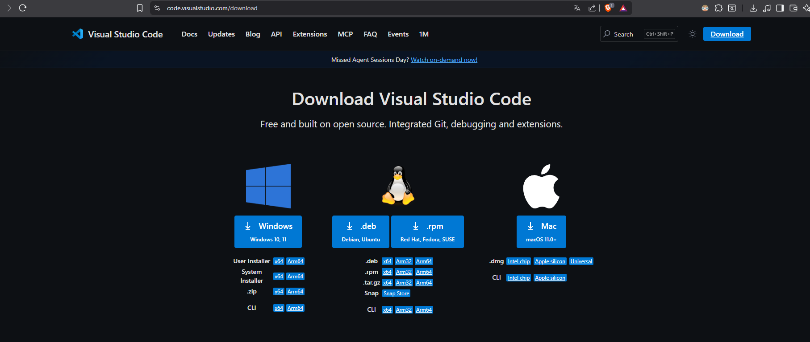
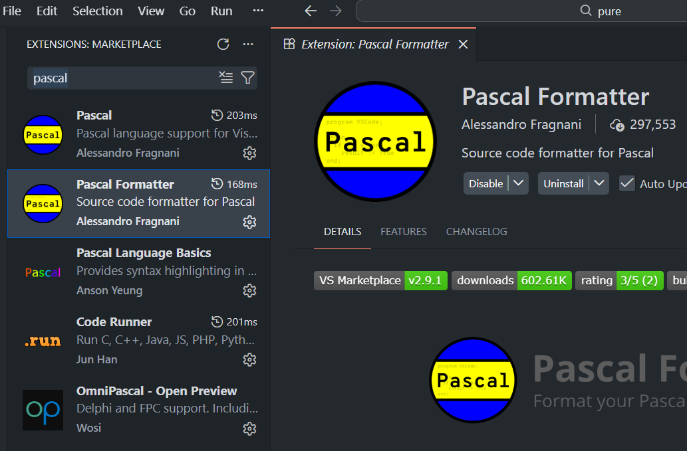
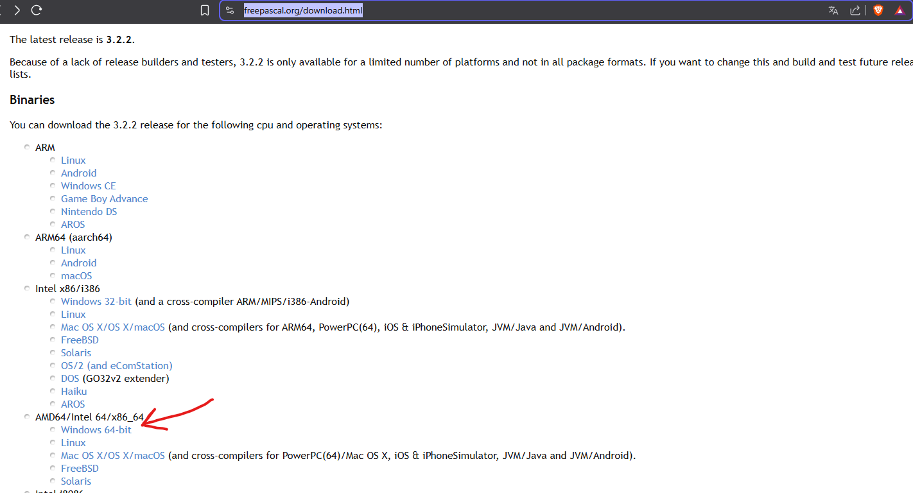
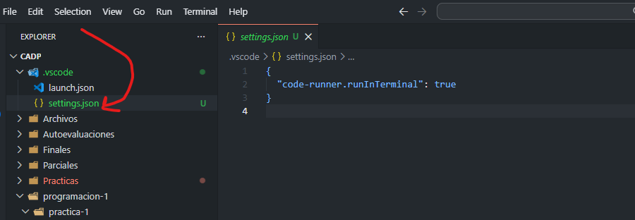
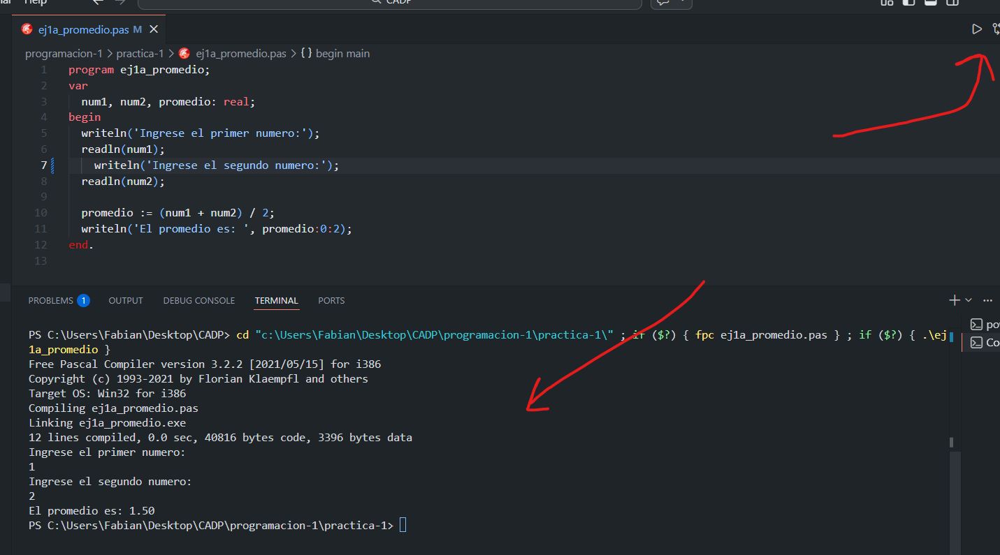
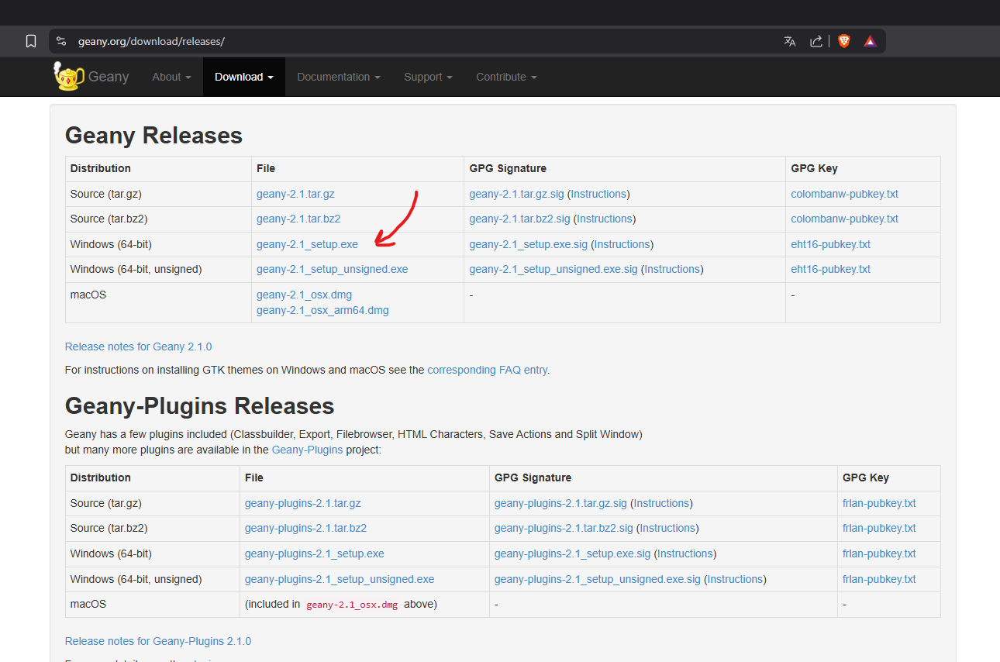
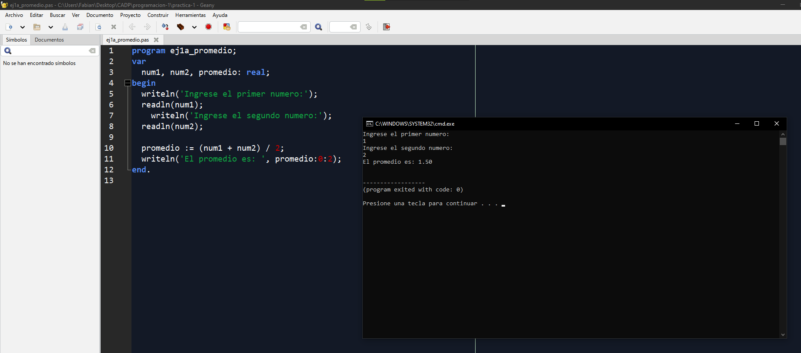
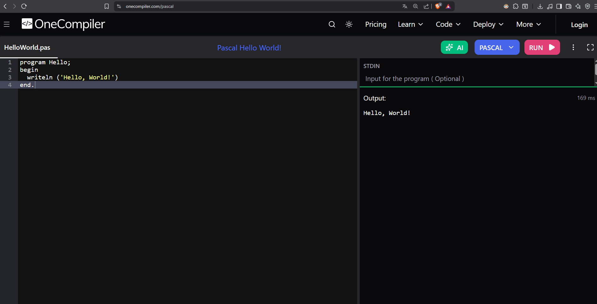

# Preparando entorno para Pascal

## PC Decente

https://code.visualstudio.com/download



Buscamos estas extenciones en el vscode



Descargamos pascal de la pagina oficial

https://www.freepascal.org/download.html



Se descargan este

https://sourceforge.net/projects/freepascal/

> Le dan a todo siguiente

Una vez que estan, se pueden crear un archivo *ejemplo.pas* y pegan lo siguiente


```pascal
program ej1a_promedio;
var
  num1, num2, promedio: real;
begin
  writeln('Ingrese el primer numero:');
  readln(num1);
  writeln('Ingrese el segundo numero:');
  readln(num2);

  promedio := (num1 + num2) / 2;
  writeln('El promedio es: ', promedio:0:2);
end.
```



Ya estaria todo!!



## PC Sobreviviente

Descargamos Geany

https://www.geany.org/



Lo instale normal, todo siguiente y me anduvo



## Solo google xd

https://onecompiler.com/pascal



