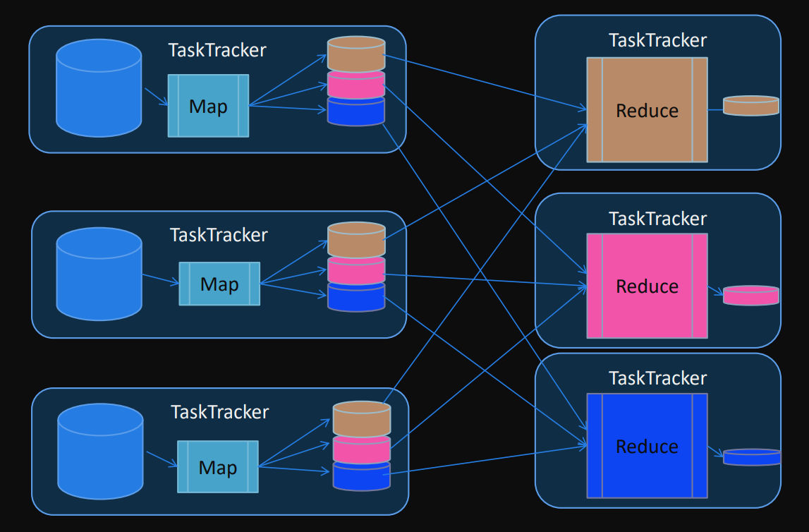

# MapReduce

Es un framework para distribuir tareas en múltiples nodos

El espíritu de MapReduce es "escriba una vez y lea muchas"

**Ventajas**
- Paralelización y distribución de tareas automática
- Escalable
- Tolerante a fallos
- Monitoreo y capacidad de seguridad
- Flexibilidad de programación (Java, Python, C#, Ruby, C++)
- Abstracción al programador

Es, a su vez, un paradigma de programación. Hay que pensar como resolver un problema sin tener acceso a todos los datos

Ejemplo (cálculo del promedio):

```python
acum = 0
for d in datos:
    acum = acum + d
prom = acum / len(datos)
```

> ¿Cómo calculo el promedio de una lista de números si se que no tengo acceso a TODOS los valores?

El problema del cálculo del promedio se debe "repensar". Pedirle a cada nodo que sume y cuente sus datos

```python
acum = 0; n = 0
for nodo in cluster:
    acum = acum + nodo.acum     # Esto se ejecuta en paralelo
    n = n + nodo.n
promedio = acum / n
```

Se pensó en un proceso genérico que permita resolver cualquier problema
- Paradigma MapReduce

Toda tarea MapReduce se divide en dos fases:
- **Fase map**: en la que los datos de entrada son procesados, uno a uno,
y transformados en un conjunto intermedio de datos.
- **Fase reduce**: se reúnen los resultados intermedios y se reducen a un conjunto de datos resumidos, que es el resultado final de la tarea.

En el ejemplo del promedio:

**Map**

Pedirle a cada nodo que sume y cuente sus datos

**Reduce**

```python
acum = 0; n = 0
for nodo in cluster:
    acum = acum + nodo.acum
    n = n + nodo.n
promedio = acum / n
```

La unidad de trabajo de MapReduce es un Job
- Un Job se divide en una tarea map y una tarea reduce.
- Los Jobs de MapReduce son controlados por un daemon conocido como JobTracker, el cual reside en el "nodo master"
- Los clientes envían Jobs MapReduce al JobTracker y este distribuye la tarea usando otros nodos del cluster
- Esos nodos se conocen como TaskTracker y son responsables de la ejecución de la tarea asignada y reportar el progreso al JobTracker


Un job MapReduce es un proceso que se divide en cuatro fases:
- Map → Shuffle → Sort → Reduce

Map y reduce son las tareas que se deben programar para la aplicación.
Cada TaskTracker ejecuta la tarea encomendada (map o reduce) Shuffle y sort son internas en la ejecución del job.


Las tareas de map y reduce trabajan con el concepto de
``<clave, valor>``.


## Entrada de datos

MapReduce se "alimenta" de uno o mas archivos:
- En el caso de archivos de texto plano, cada línea del archivo es un dato a procesar.
- La clave de los archivos de texto plano es el offset de la línea dentro del archivo.

El o los archivos de entrada son divididos en "splits" y cada TaskTracker trabaja sobre un "split".

---

## Tarea Map

Se ejecutan múltiples instancias de la tarea map sobre diferentes porciones del dataset.

Se intenta que cada map se ejecute sobre una copia local del dataset para minimizar el tráfico de datos. Una tarea map solo ve una porción del dataset de entrada.

La tarea map lee los datos en forma de pares `<k1, v1>` y produce una lista de cero, uno o más pares `<k2, v2>`.
- `<k1, v1>` ➔ list(`<k2, v2>`) donde `k2` es un identificador definido para el problema utilizado para agrupar los datos.

Una tarea map debería analizar una tupla en forma independiente del resto de las tuplas.

---

### Ejemplo del Promedio

> Suponemos que los valores llegan todos juntos, en formato string, separados por algún carácter que permite hacer la operación de split.

**Paso 1 Map**

Por lo general la clave de entrada (`k1`) no se usa, aunque depende del problema. En este ejemplo no lo estamos usando. Para el `map`, la clave de salida es un valor arbitrario (Ya veremos porqué) y como valor de salida devolvemos la tupla `(acum, n)`

**Paso 4 Reduce**

Finalizadas las tareas intermedias shuffle y sort se ejecuta la tarea reduce.

La tarea reduce lee los datos en forma de pares `<k2, list(v2)>` y produce una lista de cero o más pares `<k3, v3>`.
- `<k2, list(v2)>` ➔ `list(<k3, v3>)`

La tarea reduce tiene todos los elementos para poder realizar cualquier operación de "resumen".

**K2** es nuestro valor arbitrario `"1"`, que no lo usamos en este ejemplo. En `v2` tenemos TODAS las tuplas `(acum, n)` devueltas por cada `taskTracker` que ejecutó la tarea `map`

- SIEMPRE tendremos que recorrer el iterable `v2` usando un for
- La salida del job será la tupla formada por una clave arbitraria (no importa en este ejemplo) y el cálculo del promedio

<table style="width:100%; table-layout: fixed;">
  <tr>
    <th>Función <code>map(k1, v1)</code></th>
    <th>Función <code>reduce(k2, v2)</code></th>
  </tr>
  <tr>
    <td>

```python
def map(k1, v1):
    values = v1.split()
    acum = 0
    for v in values:
        acum = acum + float(v)
    return (1, (acum, len(values)))
```

</td>
<td>

```python
def reduce(k2, v2):
    acum = 0; n = 0
    for v in v2:
        acum = acum + v[0]
        n = n + v[1]
    return (k2, acum / n)
```
</td>
  </tr>
</table>

---

### Otro ejemplo

Se posee un dataset con resultados de eventos. De cada evento se conoce su resultado ("POSITIVO", "NEUTRO", "NEGATIVO").

Se desea saber cuantos eventos positivos, neutrales y negativos hay en todo el dataset.

El dataset es uno o más archivos de texto donde en cada línea está el resultado del evento.

```
POSITIVO
POSITIVO
NEGATIVO
NEUTRO
POSITIVO
NEUTRO
NEGATIVO
NEGATIVO
NEUTRO
POSITIVO
NEGATIVO
```

Tarea map: nuestra intención es contar la ocurrencia de cada tipo de evento.

`V1` es el tipo de evento "POSITIVO", "NEUTRO", "NEGATIVO"

Aca tenemos un problema ya que no importa la informacion que estemos trayendo, siempre vamos a estar trabajando con un reduce. (No estamos distribuyendo bien la carga)

```python
def map(k1, v1):
    return (1, v1)
```

**¿Qué sucede si usamos una única clave intermedia?**

El valor lo usamos como clave intermedia. En este ejemplo el valor intermedio `v2`, no lo usamos, por eso le ponemos un valor arbitrario

Al hacer esto, tenemos 3 claves intermedias (3 taskTrackers)
```python
def map(k1, v1):
    return (v1, 1)
```


Los positivos negativos y neutros estan coloreados. Cuantas veces vamos a ejecutar la tarea map?? ESO NO LO SABEMOS, LO DECIDE EL JOBTRACKER. Pero lo que si podemos hacer, que con esto que tenemos tres claves distintas, es asegurarnos, en el mejor de los casos, se ejecuten tres taskTrackers y cada uno va a hacer la tarea de reduce de cada una de esas tres claves.



En la fase reduce podemos lograr la paralización de tareas por claves y que se va a ejecutar la función reduce, tantas veces, como claves intermedias distintas generen los maps. En el mejor de los casos en caso de tener nodos suficientes cada nodo ejecutara un reduce para cada clave, logrando una paralelización completa. En el peor de los casos, tendremos un unico nodo, un unico TaskTracker procesando las tres claves de manera secuencial. (Nosotros no nos tenemos que preocupar en esa parte).

> Tanto la fase reduce como la map, se va a paralelizar tanto como se pueda.

- Cada TaskTracker que ejecuta la tarea de reduce recibe todas las tuplas del tipo "POSITIVO", "NEUTRO" o "NEGATIVO".
- Solo hay que contar cuantas ocurrencias existen.
- Tendremos una salida por cada tipo de evento.

Solo hay que contar ocurrencias

<table style="width:100%; table-layout: fixed;">
  <tr>
    <th>Función <code>map(k1, v1)</code></th>
    <th>Función <code>reduce(k2, v2)</code></th>
  </tr>
  <tr>
    <td>

```python
def map(k1, v1):
    return (v1, 1)
```

</td>
<td>

```python
def reduce(k2, v2):
    n = 0
    for v in v2:
        n = n + 1
    return ( k2 , n)
```
</td>
  </tr>
</table>


En este ejemplo se ejecutan tres reducers. Cada uno hace la contabilidad de las tuplas que se generaron para cada una de las tres claves ("POSITIVO", "NEUTRO", "NEGATIVO")


---

## Practica 1

Dado el siguiente dataset

| Split 1 |     | Split 2 |     | Split 3 |     | Split 4 |     |
|---------|-----|---------|-----|---------|-----|---------|-----|
| **Key** | **Value** | **Key** | **Value** | **Key** | **Value** | **Key** | **Value** |
| 34      | 21  | 23      | 45  | 3       | 21  | 30      | 91  |
| 21      | 34  | 12      | 12  | 15      | 10  | 31      | 32  |
| 10      | 18  | 36      | 18  | 14      | 18  | 32      | 53  |
| 32      | 45  | 4       | 97  | 3       | 15  | 19      | 35  |


Responda para cada job:
- ¿Cuántas veces (invocaciones) se ejecuta la función map?
- ¿Cuántas veces (invocaciones) se ejecuta la función reduce?
- ¿Cuántos mappers se ejecutan?
- ¿Cuántos reducers se ejecutan?
- ¿Qué datos recibe cada función reduce?
- ¿Cuál es la salida de cada job?

#### a) Job A

- **`¿Cuántas veces se ejecuta la función map?`** 16 (Una por cada linea)
- **`¿Cuántas veces se ejecuta la función reduce?`** 4 (Una por cada split)
- **`¿Cuántos mappers se ejecutan?`** Se ejecutan 4 mappers (uno por cada nodo en el mejor de los casos)
- **`¿Cuántos reducers se ejecutan?`** Se ejecuta 1 reducer ya que al escribir (1, v1) se agrupan todos los valores en una sola clave (por lo que no permite la concurrencia)
- **`¿Qué datos recibe cada función reduce?`** Recibe una lista de values

<table style="width:100%; table-layout: fixed;">
  <tr>
    <th>Función <code>map(k1, v1)</code></th>
    <th>Función <code>reduce(k2, v2)</code></th>
  </tr>
  <tr>
    <td>

```python
# Genera un solo archivo con todos los valores
# por ejemplo
# (1, "21")
# (1, "34")
# (1, "18")
def map(k1, v1, context):
    context.write(1, v1)
```

</td>
<td>

```python
# Recibe una lista con todos los valores
# Y cuenta los valores simplemente
# Retorna k2 que es 1 y n que seria la cantidad
# de valores en este caso 16
def reduce(k2, v2, context):
    n = 0
    for v in v2:
        n = n + 1
    context.write(k2, n)
```
</td>
  </tr>
</table>


| Split 1 |     | Split 2 |     | Split 3 |     | Split 4 |     |
|---------|-----|---------|-----|---------|-----|---------|-----|
| **Key** | **Value** | **Key** | **Value** | **Key** | **Value** | **Key** | **Value** |
| 34      | 21  | 23      | 45  | 3       | 21  | 30      | 91  |
| 21      | 34  | 12      | 12  | 15      | 10  | 31      | 32  |
| 10      | 18  | 36      | 18  | 14      | 18  | 32      | 53  |
| 32      | 45  | 4       | 97  | 3       | 15  | 19      | 35  |

**`¿Cuál es la salida de cada job?`** La salida de cada Job es (1, 16)

---

### b) Job B

- **`¿Cuántas veces se ejecuta la función map?`** 16 (Una por cada key diferente)
- **`¿Cuántas veces se ejecuta la función reduce?`** 4 (Una por cada split)
- **`¿Cuántos mappers se ejecutan?`** Se ejecutan 4 mappers (uno por cada nodo en el mejor de los casos)
- **`¿Cuántos reducers se ejecutan?`** Se ejecuta 1 reducer ya que al escribir (1, v1) se agrupan todos los valores en una sola clave (por lo que no permite la concurrencia)
- **`¿Qué datos recibe cada función reduce?`** Recibe una lista de values

<table style="width:100%; table-layout: fixed;">
  <tr>
    <th>Función <code>map(k1, v1)</code></th>
    <th>Función <code>reduce(k2, v2)</code></th>
  </tr>
  <tr>
    <td>

```python
# Genera un solo archivo con todos los valores
# por ejemplo
# (1, "21")
# (1, "34")
# (1, "18")
def map(k1, v1, context):
    context.write(1, v1)
```

</td>
<td>

```python
# Recibe una lista con todos los valores
# Y suma los valores simplemente
def reduce(k2, v2, context):
    n = 0
    for v in v2:
        n = n + v
    context.write(k2, n)
```
</td>
  </tr>
</table>

| Split 1 |     | Split 2 |     | Split 3 |     | Split 4 |     |
|---------|-----|---------|-----|---------|-----|---------|-----|
| **Key** | **Value** | **Key** | **Value** | **Key** | **Value** | **Key** | **Value** |
| 34      | 21  | 23      | 45  | 3       | 21  | 30      | 91  |
| 21      | 34  | 12      | 12  | 15      | 10  | 31      | 32  |
| 10      | 18  | 36      | 18  | 14      | 18  | 32      | 53  |
| 32      | 45  | 4       | 97  | 3       | 15  | 19      | 35  |

**`¿Cuál es la salida de cada job?`** La salida de cada Job es (1, 565)
- **Split 1** -> 21 + 34 + 18 + 45 = 118
- **Split 2** -> 45 + 12 + 18 + 97 = 172
- **Split 3** -> 21 + 10 + 18 + 15 = 64
- **Split 4** -> 91 + 32 + 53 + 35 = 211
- Total -> 118 + 172 + 64 + 211 = 565

---

### c) Job C

- **`¿Cuántas veces se ejecuta la función map?`** 16 (Una por cada linea)
- **`¿Cuántas veces se ejecuta la función reduce?`** 8 (Dos por cada split)
- **`¿Cuántos mappers se ejecutan?`** 4 mappers
- **`¿Cuántos reducers se ejecutan?`** 2 reducers (Uno para cada clave intermedia)
- **`¿Qué datos recibe cada función reduce?`** * Recibe una lista de keys

<table style="width:100%; table-layout: fixed;">
  <tr>
    <th>Función <code>map(k1, v1)</code></th>
    <th>Función <code>reduce(k2, v2)</code></th>
  </tr>
  <tr>
    <td>

```python
# Si la key valor es mayor a 30 lo guarda con la key y la guarda con 1
# En caso contrario lo guarda la key y le pone el valor 2
def map(k1, v1, context):
    if (v1 < 30):
        context.write(1, k1)
    else:
        context.write(2, k1)


```

</td>
<td>

```python
# Se ejecuta dos veces, uno con las keys con los valores menores a 30
# Y otra con los mayores a 30
def reduce(k2, v2, context):
    max = -1
    for v in v2:
        if(v > max):
            max = v
    context.write(k2, max)
```
</td>
  </tr>
</table>

| Split 1 |     | Split 2 |     | Split 3 |     | Split 4 |     |
|---------|-----|---------|-----|---------|-----|---------|-----|
| **Key** | **Value** | **Key** | **Value** | **Key** | **Value** | **Key** | **Value** |
| 34      | 21  | 23      | 45  | 3       | 21  | 30      | 91  |
| 21      | 34  | 12      | 12  | 15      | 10  | 31      | 32  |
| 10      | 18  | 36      | 18  | 14      | 18  | 32      | 53  |
| 32      | 45  | 4       | 97  | 3       | 15  | 19      | 35  |

Primero se filtra por los valores menores a 30 y guarda las keys

**`¿Cuál es la salida de cada job?`**

```
(1, [34, 10, 12, 36, 3, 15, 14, 3]) -> De este se queda el mayor 36
(2, [21, 32, 23, 4, 30, 31, 32, 19]) -> De este se queda el mayor 32
```

El resultado es (1, 36) (2, 32)

### d) Job D

- **`¿Cuántas veces se ejecuta la función map?`** 16 veces
- **`¿Cuántas veces se ejecuta la función reduce?`** Se ejecuta reduce() 14 veces (una por cada clave única).
- **`¿Cuántos mappers se ejecutan?`**  4 mappers
- **`¿Cuántos reducers se ejecutan?`**  14 reducers (unique keys)
- **`¿Qué datos recibe cada función reduce?`**  Cada reducer recibe una lista de Value elementos, todos iguales, generados por el map.


<table style="width:100%; table-layout: fixed;">
  <tr>
    <th>Función <code>map(k1, v1)</code></th>
    <th>Función <code>reduce(k2, v2)</code></th>
  </tr>
  <tr>
    <td>

```python
def map(k1, v1, context):
    for v in range(v1):
        context.write(k1, v1)
```

</td>
<td>

```python
def reduce(k2, v2, context):
    n = 0
    for v in v2:
        n = n + 1
    context.write(k2, n)
```
</td>
  </tr>
</table>

| Split 1 |     | Split 2 |     | Split 3 |     | Split 4 |     |
|---------|-----|---------|-----|---------|-----|---------|-----|
| **Key** | **Value** | **Key** | **Value** | **Key** | **Value** | **Key** | **Value** |
| 34      | 21  | 23      | 45  | 3       | 21  | 30      | 91  |
| 21      | 34  | 12      | 12  | 15      | 10  | 31      | 32  |
| 10      | 18  | 36      | 18  | 14      | 18  | 32      | 53  |
| 32      | 45  | 4       | 97  | 3       | 15  | 19      | 35  |

**`¿Cuál es la salida de cada job?`**

```
(34, 21), (34, 21), ... (21 veces)
(21, 34), (21, 34), ... (34 veces)
...
(19, 35), (19, 35), ... (35 veces)
```

Las salidas del job son `(Key, cantidad)` donde `cantidad` es el número de repeticiones, equivalente a `Value`.


### e) Job E

- **`¿Cuántas veces se ejecuta la función map?`** unas 16 veces
- **`¿Cuántas veces se ejecuta la función reduce?`** unas 16 veces
- **`¿Cuántos mappers se ejecutan?`** 4 mappers
- **`¿Cuántos reducers se ejecutan?`** 13 reducers (unique values)
- **`¿Qué datos recibe cada función reduce?`** 

<table style="width:100%; table-layout: fixed;">
  <tr>
    <th>Función <code>map(k1, v1)</code></th>
    <th>Función <code>reduce(k2, v2)</code></th>
  </tr>
  <tr>
    <td>

```python
def map(k1, v1, context):
    context.write(v1, k1)
```

</td>
<td>

```python
def reduce(k2, v2, context):
    n = 0
    for v in v2:
        n = n + 1
    context.write(v, n)
```
</td>
  </tr>
</table>

**`¿Cuál es la salida de cada job?`** ey, numero entre 1 y veces que aparece su value

---

### 3) ¿Cómo haría para obtener el top 20 de las palabras más usadas?

Como reduce no tiene acceso al orden de aparición ni a líneas específicas, y una palabra puede aparecer en distintas líneas, no es posible agrupar las ocurrencias por línea. Por eso, las apariciones totales se muestran desordenadas y requieren procesamiento adicional externo (por ejemplo, en Excel) si se desea un orden o agrupación específica.

---

### 5) Indique si utilizando el dataset Libros es posible resolver los siguientes problemas:

**a. Obtener los títulos de todos los libros**

Si, ya que el offset del titulo es 0 en todos los archivos.

**b. Obtener la cantidad de palabras promedio por párrafo**

Si, la función map pasa la cantidad de palabras del párrafo que procesó, y la reduce calcula el promedio sumando las cantidades de palabras pasadas, y la cantidad de párrafos se obtiene a partir de la cantidad de VALORES recibidos.

**c. Obtener la cantidad de párrafos promedio por libro**

No, porque la clave no contiene info del archivo origen?

**d. Obtener la cantidad de caracteres del párrafo más extenso**

Se puede obtener la cantidad de caracteres de cada párrafo (ordenado de menor a mayor ya que el valor es único por dato/linea), el máximo estará al final de alguna salida...


**e. Cantidad total de párrafos con diálogos (se entiende por párrafo con diálogo aquel que empieza con un  guión)**

Si, ya que siguen un mismo "prefijo" y se pueden contabilizar todos bajo una única clave, de modo de obtener un solo resultado

**f. El diálogo más largo (se entiende por diálogo a una secuencia de párrafos con diálogo que aparecen de  manera consecutiva)**

No, porque no se conoce información del dato anterior.

**g. El top 20 de las palabras más usadas por cada libro**

No, desconozco el archivo origen

---

### 6) Ejercicio 

Una empresa proveedora de internet realizó una encuesta para conocer el grado de satisfacción de sus clientes, en un formulario web los clientes debían completar un campo con los textos "**Muy satisfecho**", "**Algo satisfecho**", "**Poco satisfecho**", “**Disconforme**” o "**Muy disconforme**". Utilice el dataset Encuesta para saber cuántos clientes están en cada una de las cinco categorías.

**Respuesta**

La función `map` enviará cada respuesta como clave, asignándole el valor 1. De esta forma, todas las respuestas iguales se agruparán bajo una misma clave. Luego, la función `reduce` sumará la cantidad de apariciones de cada clave para obtener el total por categoría.

Sin embargo, observamos que **el formato no siempre se respeta**: existen muchas variantes con errores tipográficos como `"muy satisfecho"`, `"muys atisfecho"` o `"disconfrome"`, que dificultan el conteo correcto.

Por ello, para obtener resultados confiables, es necesario aplicar una **etapa de normalización previa o durante el `map`**, que agrupe variantes similares en alguna de las cinco categorías válidas:
`"Muy satisfecho"`, `"Algo satisfecho"`, `"Poco satisfecho"`, `"Disconforme"` y `"Muy disconforme"`.

Esto puede lograrse usando comparaciones por similitud (por ejemplo, con `difflib.get_close_matches` en  Python), o validaciones exactas contra una lista predefinida de opciones válidas. Una vez agrupadas correctamente, el `reduce` podrá contabilizar cuántos clientes están en cada categoría con mayor precisión.

---

### 7) Ejercicio 
El dataset Inversionistas posee los nombres, dni, fecha de nacimiento (día, mes y año como campos separados) e importe invertido por diferentes personas en la apertura de un nuevo negocio en la ciudad. Se desea saber:

- **a)** El nombre del inversionista más joven
- **b)** El total del importe invertido por todos los inversionistas
- **c)** El promedio de edad

Implemente una solución en MapReduce. ¿Se puede resolver los tres problemas en un único job?

**Respuesta**

No, no se pueden resolver los tres puntos con un solo Job, ya que:

- a) requiere obtener el máximo de una fecha
- b) requiere la suma de importe
- c) requiere el promedio de edades, lo cual implica contar e ingresar las edades explícitamente

Cada una tiene requerimientos distintos y estructuras de datos diferentes.

---

### Ejercicio 8)

Si contáramos con un cluster donde podemos configurar 100 nodos para la tarea de
reduce ¿De qué manera se podrían usar esos 100 nodos en el ejemplo de los eventos
POSITIVO, NEGATIVO y NEUTRO visto en la teoría?

Producir en los mappers unas tuplas con clave "POSITIVO" + random(33)
Esto permite forzar la paralelización