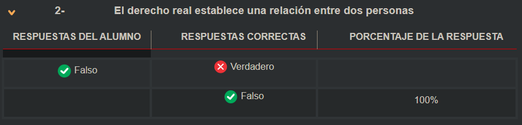

# Evaluaciones

## Bancos de Datos

**1- ¿Cuál de los siguientes datos NO se encuentra dentro del ámbito de aplicación de la ley de Bancos de Datos?**

- [ ] Los datos médicos  
- [ ] Los datos de identidad mínimos de una persona  
- [ ] Los datos estadísticos  

Respuesta

✅ **Los datos estadísticos**

Según lo establecido en la Ley 25.326:

> Los **datos disociados**, como los **estadísticos**, **no permiten identificar al titular**, ya que fueron tratados para hacer imposible su vinculación con una persona determinada. Por ello, **no se consideran datos personales** y **están excluidos del ámbito de aplicación** de la ley.

En cambio:

* Los **datos médicos** son **datos sensibles** y están expresamente regulados por la ley.
* Los **datos de identidad mínimos** (nombre, domicilio, DNI, etc.) son **datos personales de acceso público**, también incluidos en la ley.

---

**2- La obligación de recabar los datos personales previa autorización de su titular, está vinculada a qué principio**

- [ ] La licitud y buena fe  
- [ ] La Confidencialidad  
- [ ] La calidad de los datos  

Respuesta

✅ **La licitud y buena fe**

De acuerdo con la Ley 25.326 y el **art. 4.2** establece el:

> **"principio de licitud y lealtad en el tratamiento de datos personales"**, indicando que la recolección **no puede hacerse por medios desleales o sin consentimiento expreso e informado** del titular.

Este principio exige que **el tratamiento de los datos sea legal y transparente**, y que **el consentimiento informado** sea **condición necesaria para la recolección** de datos personales.

Las otras opciones:

* **Confidencialidad** → se refiere a la obligación de **guardar secreto** sobre los datos recolectados (art. 10).
* **Calidad de los datos** → se refiere a que los datos deben ser **veraces, actualizados y pertinentes** (art. 4.4).

---

**3- ¿Cuál es el sistema de la ley de bancos de datos respecto a la responsabilidad administrativa?**

- [ ] No dice nada  
- [ ] Establece cuáles son las sanciones y delega en la autoridad de aplicación definir cuáles son las conductas prohibidas  
- [ ] Establece las conductas prohibidas y sus respectivas sanciones  

Respuesta

❌ ESTA NO **Establece las conductas prohibidas y sus respectivas sanciones**

La Ley 25.326 **no se limita solo a sancionar**, sino que **define claramente las conductas prohibidas** (como la recolección de datos sensibles sin consentimiento, uso indebido, falta de inscripción del banco, cesión sin autorización, etc.) y **establece el régimen sancionatorio correspondiente**.

Además:

* El artículo 32 **modifica el Código Penal**, incorporando el **art. 157 bis**, que **penaliza la revelación indebida de datos** cuando hay obligación de confidencialidad.
* También se detallan **infracciones administrativas** y sus sanciones (multas, clausura, etc.) a través de la **autoridad de aplicación**.

Por lo tanto, **no se delega totalmente** en la autoridad, sino que la ley ya establece un marco normativo claro.

En la autoevaluación estaba mal

✅ **Establece cuáles son las sanciones y delega en la autoridad de aplicación definir cuáles son las conductas prohibidas**

Esto significa que, **aunque la ley establece el régimen sancionatorio**, **las conductas prohibidas no están todas específicamente detalladas en el texto de la ley**, sino que se **delegan parcialmente en la autoridad de aplicación** (la Agencia de Acceso a la Información Pública en Argentina) para su reglamentación o interpretación.

Mi error fue asumir que todas las conductas prohibidas estaban claramente definidas en la ley, cuando en realidad muchas **quedan sujetas a regulación administrativa posterior**.

---

**4- Los datos sensibles**

- [ ] Están fuera del ámbito de aplicación de la ley  
- [ ] Pueden ser tratados siempre que exista un consentimiento informado del titular de los datos  
- [ ] Salvo excepciones no pueden ser recogidos ni tratados  

Respuesta

✅ **Salvo excepciones no pueden ser recogidos ni tratados**

La Ley 25.326 establece en el **artículo 7.2** que:

> "**Queda prohibida la formación de archivos, registros o bancos de datos que almacenen información que revele directa o indirectamente datos sensibles**, salvo en los casos expresamente autorizados por la ley."

**Los datos sensibles** (como salud, vida sexual, origen étnico, religión, opiniones políticas, etc.) solo pueden ser tratados en **casos excepcionales**, como:

* Fines estadísticos y disociados
* Instituciones como iglesias o sindicatos, respecto de sus miembros
* Profesionales de la salud, en el marco de su actividad
* Razones de interés público debidamente justificadas

Por tanto, **su tratamiento está prohibido de forma general** y solo se permite en **supuestos muy específicos**.

---

**5- ¿Cuál de las siguientes hipótesis es una excepción a la obligación de autorización para recabar los datos?**

- [ ] La contratación de un servicio que necesite acceder a estos datos para ser cumplido  
- [ ] La renuncia anticipada del titular de los datos  
- [ ] Que la conducta del titular de los datos permite inferir que autoriza la recolección  

Respuesta

✅ **La contratación de un servicio que necesite acceder a estos datos para ser cumplido**

Según la **Ley 25.326, artículo 5**, existen excepciones a la obligación de contar con consentimiento previo para la recolección de datos. Una de ellas es:

> **“Cuando los datos se recaben en el ejercicio de funciones propias de los poderes del Estado o en virtud de una obligación legal o contractual del titular de los datos.”**

Esto incluye los **casos contractuales**, como cuando alguien **contrata un servicio** y es **necesario acceder a ciertos datos personales** para cumplir con ese contrato (por ejemplo, nombre, dirección para entrega, etc.).

Las otras opciones son incorrectas porque:

* **La renuncia anticipada del titular** no está prevista por la ley y **no suprime sus derechos**.
* **Inferir consentimiento por conducta** está **prohibido**: el consentimiento debe ser **libre, expreso y por escrito**.

---

## Aspectos Generales de la Ciencia Jurídica

Primera Clase: en ella veremos el concepto de derecho, la diferencia entre derecho objetivo y subjetivo, las fuentes del derecho y las distintas divisiones, que desde el punto de vista académico se han intentado 

**1-** La ciencia jurídica comprende el conjunto organizado de normas emanadas por un órgano competente

- [ ] Verdadero  
- [ ] Falso

Respuesta

**✅ Verdadero** ESTO ES MAS FALSO QUE LA MIERDA PERO BUENO

> “el conjunto organizado de normas emanadas de un poder estatal competente, las cuales son percibidas por la población como obligatorias.”

Esa es justamente la definición que adopta la ciencia jurídica para estudiar el derecho objetivo dentro de un sistema legal específico (como el argentino), por lo tanto la afirmación es **verdadera**.

---

**2-** El derecho real establece una relación entre dos personas

- [ ] Verdadero  
- [ ] Falso

Respuesta

**✅ Falso**

El **derecho real** no establece una relación entre dos personas, sino **una relación directa entre una persona y una cosa** (por ejemplo, la propiedad sobre un bien). Es un derecho que se ejerce *erga omnes* (frente a todos), y no entre partes específicas como sucede en los derechos personales u obligaciones.

Esto se diferencia de los **derechos personales**, que **sí implican una relación entre personas**, como un contrato donde una parte exige algo a otra.

---

**3-** El ejercicio de un derecho subjetivo siempre es lícito

- [ ] Verdadero  
- [ ] Falso

Respuesta

> El **derecho subjetivo** es la **facultad que tiene una persona** para exigir algo conforme a la ley. Surge del derecho objetivo y permite hacer valer un interés propio protegido jurídicamente.

**✅ Falso**

El ejercicio de un **derecho subjetivo** **no siempre es lícito**. Aunque el derecho reconoce ciertas facultades, su ejercicio está limitado por el principio de **no abuso del derecho**.
Como vimos en el texto, si una persona ejerce un derecho en forma abusiva, más allá de los fines legítimos para los cuales fue otorgado, puede incurrir en responsabilidad.

➡️ Esta doctrina se consolidó con la idea de que los derechos no se ejercen en abstracto, sino en función de **intereses jurídicamente tutelados**.

> COMO MIERDA ABUSAS DE UN DERECHO QUE MIERDA ESTA PASANDOOOOOOOOOOOOOOOOOOOOOOOOOOOOOOOOOOOOOOOOOOOOO ODIO ESTA MATERIA PROGRE

---

**4-** Cuando analizamos las fuentes del derecho, el decreto reglamentario de la ley de promoción de software es ley en sentido material pero no formal

- [ ] Verdadero  
- [ ] Falso

Respuesta

**✅ Verdadero**

En el marco de las **fuentes del derecho**, una norma tiene **valor de ley en sentido material** cuando **establece reglas generales y obligatorias**, sin importar qué órgano la haya dictado.
El **decreto reglamentario** de la ley de promoción de software es **dictado por el Poder Ejecutivo**, y si bien **no es una ley formal** (porque no proviene del Congreso), **sí lo es en sentido material** ya que tiene contenido normativo obligatorio.

Este concepto está claramente explicado en el material cuando se diferencia entre:

* **Ley formal**: emanada del Congreso.
* **Ley material**: cualquier norma obligatoria dictada por autoridad competente.

---

**5-** El objeto de normas supletorias son obligatorias si las partes guardan silencio al momento del contrato, pero pueden apartarse de lo previsto si así lo desean

- [ ] Verdadero  
- [ ] Falso

Respuesta

> Las **normas supletorias** son reglas legales que **se aplican solo si las partes no acuerdan otra cosa**. Se pueden modificar por voluntad de las partes.

**✅ Verdadero**

Las **normas supletorias** son aquellas que **se aplican automáticamente si las partes no acuerdan otra cosa** en un contrato. Como dice tu material:

> "*El acuerdo de voluntades se compone por lo que las partes expresamente acordaron más lo que la ley marca en caso de silencio.*"

Sin embargo, estas normas **pueden ser dejadas de lado** si las partes lo deciden expresamente, ya que **no son imperativas**. Es decir, **son obligatorias solo si no se pacta lo contrario**, y **pueden ser sustituidas por la voluntad de las partes**.

---

## Estructura Constitucional

En esta unidad repasaremos algunos conceptos de derecho constitucional, en particular, la forma del estado y del gobierno y los límites que el derecho le impone al poder estatal.

**1- El habeas corpus es**

- [ ] Un derecho constitucional contra las detenciones arbitrarias  
- [ ] Una garantía que protege la libertad ambulatoria  
- [ ] Una declaración de derechos humanos

Respuesta

> El **derecho constitucional** es la rama del derecho que regula la estructura y el funcionamiento del Estado, definiendo cómo se organizan y limitan los poderes públicos (Ejecutivo, Legislativo y Judicial) y garantizando los derechos fundamentales de las personas. Su base es la Constitución Nacional, que establece las normas más importantes del país y asegura libertades como la igualdad ante la ley, la libertad de expresión y el derecho a la educación.

✅ **Una garantía que protege la libertad ambulatoria**

Según el texto que me compartiste, el *habeas corpus* es una **garantía constitucional** que **tutela la libertad física o ambulatoria** de una persona frente a detenciones o restricciones arbitrarias. Si bien puede considerarse un derecho constitucional, en sentido técnico y preciso **es una garantía**, es decir, un mecanismo procesal que permite proteger ese derecho.

---

**2- Aparte del preámbulo el texto constitucional se divide en:**

- [ ] Dos partes: Declaraciones derechos y garantías y autoridades de la nación  
- [ ] Tres partes: Declaraciones derechos y garantías, autoridades de la nación y gobiernos provinciales  
- [ ] Cuatro partes: Declaraciones derechos y garantías y tres correspondiendo a cada poder del estado

Respuesta

✅ **Dos partes: Declaraciones derechos y garantías y autoridades de la nación**

Según el desarrollo teórico, el texto constitucional argentino —aparte del preámbulo— se divide en dos grandes secciones:

* **Parte dogmática**: que contiene las declaraciones, derechos y garantías.
* **Parte orgánica**: que regula la organización y funcionamiento de los poderes del Estado (autoridades de la Nación).

---

**3- La monarquía es una forma**

- [ ] De nación  
- [ ] De estado  
- [ ] De gobierno

Respuesta

✅ **De gobierno**

Según el texto que compartiste, **la monarquía** se clasifica dentro de las **formas de gobierno**, ya que se refiere al modo en que se ejerce el poder sobre la población. Se contrapone a la república, y puede ser **constitucional** o **absoluta**, dependiendo del grado de poder del monarca.

---

**4- La existencia del federalismo se relaciona**

- [ ] Con la preexistencia de los gobiernos locales, que retienen para sí las competencias no expresamente delegadas  
- [ ] La mayor descentralización de las facultades del estado en beneficio de los gobiernos locales  
- [ ] La existencia de provincias en un territorio

Respuesta

✅ **Con la preexistencia de los gobiernos locales, que retienen para sí las competencias no expresamente delegadas**

Según el texto, el federalismo argentino se basa en que **las provincias son preexistentes a la Nación** y, por lo tanto, **toda facultad no delegada permanece en ellas**, lo que implica una distribución de competencias en favor de los gobiernos locales. Esto es lo que distingue al federalismo de otras formas de organización estatal.

---

**5-** Un sistema de control constitucional difuso implica

- [ ] Que cualquier juez puede declarar la inconstitucionalidad  
- [ ] Que la declaración se expande a los casos similares  
- [ ] Que tanto el poder ejecutivo como el judicial puede declararla

Respuesta

✅ **Que cualquier juez puede declarar la inconstitucionalidad**

En el sistema de **control constitucional difuso**, como el que rige en Argentina a nivel federal, **todos los jueces** tienen la facultad de declarar la inconstitucionalidad de una norma en un caso concreto. Esto lo diferencia del sistema concentrado, donde solo un tribunal específico tiene esa atribución.

---

## Hechos y Actos Jurídicos

En esta clase analizaremos como el derecho aprehende los fenomenos externos y les da un significado jurídíco, Veremos el concepto de acto humano voluntario tanto ilicito como lícito y dentro de estos últimos, nos detendremos en aquellos que tienen la intención de generar relaciones jurídicas 

**1- La intervención de un oficial público le da carácter a un instrumento cuando**

- [ ] Lo realiza según la normativa y con las formalidades previstas para tal acto  
- [ ] Solo si el oficial público le otorga tal característica  
- [ ] Debe ser certificado por el Estado mediante su presentación ante la autoridad competente

Respuesta

* [x] **Lo realiza según la normativa y con las formalidades previstas para tal acto**

La intervención del oficial público no es por sí sola suficiente para conferir carácter de instrumento público. Es necesario que **se cumplan además las formalidades legales exigidas por el ordenamiento jurídico**, tal como se establece en el desarrollo sobre los instrumentos públicos y el artículo 979 del Código Civil.

---

**2- La fe pública otorgada al instrumento se extiende**

- [ ] A todo el contenido del instrumento  
- [ ] A lo percibido por el oficial público y a las manifestaciones de las partes  
- [ ] A lo percibido por el oficial público

Respuesta

✅ **Respuesta correcta: A lo percibido por el oficial público**

La fe pública del instrumento **no se extiende a todo su contenido**, sino **solo a lo que el oficial público ha visto u oído directamente**. Las **manifestaciones de las partes** hacen fe **hasta prueba en contrario**, mientras que el **hecho de haberlas realizado ante el oficial sí tiene fe pública**. Por lo tanto, **la autenticidad del instrumento se limita a los hechos cumplidos ante el oficial público**, según lo establece el texto.

---

**3- Un hecho se comete con dolo eventual en el caso que el autor**

- [ ] Se represente el resultado de la acción y dirija sus acciones a su producción  
- [ ] Se represente el resultado y le resulte indiferente si se produce o no  
- [ ] No se presente ese resultado por negligencia o falta de cuidado

Respuesta

✅ **Respuesta correcta: Se represente el resultado y le resulte indiferente si se produce o no**

Según el texto, el **dolo eventual** se configura cuando hay **representación del resultado**, pero el autor **no actúa directamente para causarlo**, sino que **le es indiferente si ocurre o no**. Se diferencia del dolo directo (donde se busca el resultado) y de la culpa (donde no se representa el resultado por negligencia o imprudencia).

---

**4- En un acto jurídico accesorio**

- [ ] La desaparición del accesorio implica la desaparición del principal  
- [ ] La desaparición del principal conlleva la del accesorio  
- [ ] Son independientes

Respuesta

✅ **Respuesta correcta: La desaparición del principal conlleva la del accesorio**

En los actos jurídicos, el **accesorio depende del principal** para su validez y existencia. Tal como se menciona en el texto, “la nulidad del contrato principal hace caer la garantía dada por la fianza”, es decir, si desaparece el acto principal, **el accesorio también pierde efecto**.

---

**5- La violencia afecta a qué elemento de la voluntad**

- [ ] La libertad  
- [ ] La intención  
- [ ] El discernimiento

Respuesta

✅ **Respuesta correcta: La libertad**

Según el texto, **la violencia** como vicio de los actos jurídicos “se encuentra directamente relacionada con la **libertad** o por lo menos con su falta”, ya que impide que el autor del acto pueda decidir libremente si lo realiza o no.

---

## Contratos Informaticos

Dentro de los actos jurídicos, los contratos permiten la creación y modificacion de relaciones personales entre las partes. En la presente unidad, veremos en primer término los contratos en general, para luego adentrarnos en la problemática de los contratos sobre sistemas de información.

**1- Un contrato informático es**

- [ ] Un contrato sobre sistemas de información  
- [ ] Un contrato celebrado mediante una red abierta como internet  
- [ ] Un contrato celebrado por un sistema experto  

Respuesta

[x] **Un contrato sobre sistemas de información**

**Justificación:**
Según la definición de Mosset Iturraspe, un contrato informático es aquel mediante el cual se crean, modifican, transmiten o extinguen relaciones obligacionales sobre **bienes y/o servicios informáticos**. Estos bienes se integran generalmente en un **sistema destinado a la gestión organizada de información**.
Por lo tanto, lo que caracteriza a este tipo de contrato es su objeto: **los sistemas de información** y no el medio por el que se celebra (como internet) ni el uso de inteligencia artificial.

---

**2- Un sistema informático se define por**

- [ ] Las especificaciones técnicas  
- [ ] Las necesidades a satisfacer  
- [ ] El hardware entregado  

Respuesta

[x] **Las necesidades a satisfacer**

En los contratos informáticos, el sistema se define como un **conjunto de bienes organizados en función de un objetivo común**, es decir, lo que **define a un sistema informático es la función que debe cumplir según las necesidades del usuario**. No basta con especificaciones técnicas o hardware entregado si no se satisface la necesidad planteada por el cliente.
Esto fue claramente sostenido en el fallo *“Sisteco S.A. c/ Sujoy”*, donde se concluyó que el cumplimiento de la obligación del proveedor no se mide por la entrega física de elementos, sino por la **adecuación del sistema a los fines previstos**.

---

**3- La entrega del sistema se produce**

- [ ] Cuando el mismo cumple con los test de funcionamiento  
- [ ] Con la instalación del equipo  
- [ ] Con la entrega física del material al cliente  

Respuesta

[x] **Cuando el mismo cumple con los test de funcionamiento**

En los contratos informáticos, **la entrega del sistema no se limita a la entrega física del hardware ni a su instalación**, sino que se considera cumplida **cuando el sistema pasa satisfactoriamente el test de aceptación**.
Este test consiste en una verificación funcional previamente acordada que demuestra que el sistema cumple con los requisitos y objetivos definidos. Por lo tanto, **la entrega efectiva se da cuando el sistema funciona conforme a lo pactado**, incluyendo su adecuación a las necesidades del usuario.

---

**4- La obligación de consejo abarca**

- [ ] Los aspectos económicos y técnicos del proyecto  
- [ ] Todos los aspectos del proyecto  
- [ ] Solo los aspectos técnicos  

Respuesta

[x] **Solo los aspectos técnicos**

Según el marco teórico sobre contratos informáticos, **la obligación de consejo del proveedor se limita a los aspectos técnicos** del sistema, como la configuración, compatibilidad, escalabilidad y adecuación a las necesidades funcionales del usuario.
**No abarca aspectos económicos ni decisiones empresariales**, ya que estos exceden el rol técnico del proveedor y son responsabilidad del cliente o de consultores externos. Esto fue confirmado por la jurisprudencia en casos como *“Cajus Face vs IBM”*.

---

**5- ¿Cuál de las siguientes sería una excepción a la obligación de consejo?**

- [ ] Que el cliente sea una empresa líder en su sector  
- [ ] El acuerdo de partes  
- [ ] La contratación de un consultor externo por parte del cliente  

Respuesta

[x] **La contratación de un consultor externo por parte del cliente**

Según el contenido desarrollado sobre contratos informáticos, **cuando el cliente contrata a un consultor especializado para definir el pliego de condiciones**, la responsabilidad de asesoramiento **se traslada** de forma parcial o total al consultor.
En ese caso, **el proveedor ya no tiene el deber de interpretar directamente las necesidades del usuario**, ya que se presume que fueron correctamente traducidas por el profesional contratado por este último.
Esta posición fue sostenida por la jurisprudencia francesa en el caso *"Ste. Sopresur N.C.R. vs Sté Groupe Lebrun"*.

---

## Contratos Parte General

**1) Todo contrato tiene efectos respecto de terceros**
- ( ) Verdadero  
- ( ) Falso

Respuesta

**Respuesta: ( ) Falso**

De acuerdo con el principio general del derecho contractual, **los contratos solo producen efectos entre las partes que los celebran**, no respecto de terceros. Esta regla está expresamente reconocida en el derecho argentino y es coherente con el principio de relatividad de los contratos.

Sin embargo, existen **excepciones** a este principio, como:

* **Contratos con cláusula a favor de terceros**, como los seguros de vida.
* **Contratos que transfieren derechos reales**, los cuales pueden ser oponibles a terceros.

Esto se encuentra desarrollado tanto en la doctrina como en la jurisprudencia y fue señalado en los materiales bajo estudio (como en el análisis sobre los sujetos en los contratos).

---

**2) El contrato se perfecciona con la aceptación de la oferta**
- ( ) Verdadero  
- ( ) Falso

Respuesta

**Respuesta: (✔) Verdadero**

Según el **Código Civil y Comercial argentino (art. 1148 y siguientes)** y el material estudiado, **el contrato se perfecciona cuando la oferta es aceptada en tiempo y forma**. Es decir, cuando hay un **acuerdo de voluntades** entre dos o más partes sobre un objeto lícito, posible y determinado.

Este principio es esencial en la **formación del contrato**:

* La oferta debe contener los elementos esenciales del negocio.
* La aceptación debe ser **lisa y llana**, sin modificar los términos de la oferta.
* El contrato queda perfeccionado **en el momento del envío de la aceptación**, salvo pacto en contrario (art. 1154).

---

**3) Un contrato es un acto jurídico**
- ( ) Verdadero  
- ( ) Falso

Respuesta

**Respuesta: (✔) Verdadero**

Un contrato es, efectivamente, un **acto jurídico** porque cumple con todas las características de este tipo de actos: es un hecho **voluntario, lícito y destinado a crear, modificar o extinguir derechos y obligaciones** entre las partes (art. 944 del Código Civil).

En el marco de los contratos, se trata de un **acto jurídico bilateral o plurilateral**, ya que requiere el acuerdo de dos o más voluntades para su existencia.

---

**4) Solo se pueden celebrar los contratos previstos por la ley**

- ( ) Verdadero  
- ( ) Falso

Respuesta

**Respuesta: (✔) Falso**

No es necesario que un contrato esté expresamente previsto por la ley para que sea válido. Existen **contratos nominados** (regulados por la ley) y **contratos innominados**, que surgen del **principio de la autonomía de la voluntad**.

Mientras no contravengan normas de orden público, la moral o las buenas costumbres, **las partes pueden celebrar contratos atípicos o innominados**, fijando libremente su contenido, según sus intereses y necesidades. Esto está reconocido tanto en la doctrina como en la jurisprudencia argentina.

---

**5 El pacto comisorio resuelve el contrato en caso de incumplimiento**
- ( ) Verdadero  
- ( ) Falso

Respuesta

**Respuesta: (✔) Verdadero**

El **pacto comisorio** es una cláusula que permite **resolver el contrato** cuando una de las partes **incumple** sus obligaciones. Según el artículo 1204 del Código Civil argentino (reformado por la ley 17.711), puede ser:

* **Expreso**, si las partes lo pactan explícitamente (no requiere intimación).
* **Tácito**, si no se pactó expresamente, pero se aplica de todos modos, con la **obligación de intimar** al cumplimiento en un plazo mínimo de 15 días.

Una vez resuelto, el contrato se considera extinguido con **efectos retroactivos**, y puede dar lugar al reclamo de **daños y perjuicios**.

---

**6) El contrato se perfecciona con la firma de las partes**
- ( ) Verdadero  
- ( ) Falso

Respuesta

**Respuesta: (✘) Falso**

El **contrato se perfecciona con el acuerdo de voluntades**, es decir, **cuando hay aceptación de la oferta** (art. 1154 del Código Civil). La **firma** no es un requisito esencial para todos los contratos; es solo una **forma de exteriorizar** ese consentimiento, especialmente en contratos escritos.
En muchos casos, el contrato es válido **aunque no haya sido firmado**, siempre que haya consentimiento entre las partes y no se requiera una forma solemne para su validez.

---

**7) Un contrato unilateral tiene una sola parte**
- ( ) Verdadero  
- ( ) Falso

Respuesta

**Respuesta: (✘) Falso**

Un contrato **unilateral** no implica que haya una sola **parte**, sino que **solo una de las partes asume obligaciones**. Siempre se requiere al menos **dos partes** para que exista un contrato (art. 1137 del Código Civil), pero en el contrato unilateral, **solo una queda obligada**. Ejemplo: una **donación**, donde el donante se obliga a entregar y el donatario no asume obligación alguna.

---

**8) Un contrato de adhesión es una convención con cláusulas predispuestas**
- ( ) Verdadero  
- ( ) Falso

Respuesta

**Respuesta: (✔) Verdadero**

Un **contrato de adhesión** es aquel en el que **las cláusulas están predispuestas por una de las partes** (generalmente la más fuerte económicamente) y la otra parte solo puede **aceptarlas o rechazarlas**, sin posibilidad real de negociación. Este tipo de contratos es típico en servicios masivos como seguros, banca o telefonía.

---

**9) Una aceptación que modifique la oferta implica una contraoferta**
- ( ) Verdadero  
- ( ) Falso

Respuesta

**Respuesta: (✔) Verdadero**

Según el Código Civil argentino (art. 1154), para que el contrato se perfeccione, la aceptación debe ser **lisa y llana**, es decir, no debe introducir modificaciones a la oferta. Si la aceptación **altera alguno de sus términos**, no constituye una aceptación propiamente dicha, sino que **implica una nueva oferta o contraoferta**, que deberá ser aceptada por quien realizó la oferta original.

---

**10) El objeto de un contrato debe ser posible**

- ( ) Verdadero  
- ( ) Falso

Respuesta

**Respuesta: (✔) Verdadero**

Según el artículo 953 del Código Civil argentino, el objeto de los actos jurídicos —y por lo tanto, de los contratos— debe ser **posible**, **lícito**, y **conforme a la moral y las buenas costumbres**. Un objeto imposible (como obligarse a realizar una acción físicamente irrealizable) torna el contrato **nulo**, ya que no puede cumplirse válidamente.

---

## Propiedad intelectual

En esta clase veremos como el derecho recepta el trabajo intelectual y cuales son las formas de reinvidicar como propios los contenidos (software, marcas, etc) generados por el profesional informático

**1) El dominio público implica que los derechos de explotación económica terminan**

- ( ) Verdadero  
- ( ) Falso

Respuesta

**✅ Respuesta: Verdadero**

Según el texto, una vez vencido el plazo de protección (70 años desde la muerte del autor), la obra entra en **dominio público**, lo cual significa que **los derechos patrimoniales** (económicos) del autor **quedan sin efecto**, y su utilización pasa a ser libre para todos sin necesidad de autorización ni pago .

---

**2) El software se protege mediante la ley de patentes de invención**

- ( ) Verdadero  
- ( ) Falso

Respuesta

**❌ Respuesta: Falso**

El software **no se protege** mediante la Ley de Patentes de Invención (Ley 24.481), sino que está expresamente incluido en la **Ley 11.723 de Propiedad Intelectual** como una **obra literaria**. Esta protección fue incorporada luego del fallo “Pellicori” y tiene respaldo en tratados internacionales como el acuerdo TRIPS.

---

**3) Las marcas comerciales deben ser utilizadas en todas las categorías donde se anotan**

- ( ) Verdadero  
- ( ) Falso

Respuesta

**✅ Respuesta: Falso**

La ley **no exige** que las marcas se utilicen en **todas** las categorías donde se anotan. Basta con que se **utilicen en al menos una** de las categorías inscriptas para que puedan ser renovadas. Las marcas inscritas en categorías donde no se pretende usarlas se conocen como **marcas de defensa**, y su objetivo es evitar la dilución de la marca por uso de terceros en rubros distintos.

---

**4) Toda obra registrada debe tener un mínimo de originalidad**

- ( ) Verdadero  
- ( ) Falso

Respuesta

**✅ Respuesta: Verdadero**

La ley exige que para que una obra sea protegida por derechos de autor, debe poseer un **mínimo grado de originalidad**. No se requiere una originalidad absoluta, pero sí debe haber un aporte personal del autor que diferencie la obra de otras preexistentes. Esto es esencial para que la obra pueda considerarse una creación protegible.

---

**5) La protección ofrecida por la ley de derechos de autor es tecnológicamente neutra**

- ( ) Verdadero  
- ( ) Falso

Respuesta

**✅ Respuesta: Verdadero**

La **ley 11.723** de propiedad intelectual, especialmente tras su reforma, establece una protección **amplia y no taxativa** que permite incluir nuevas formas de expresión como el software. Su redacción, en especial en el **artículo 1**, fue diseñada para abarcar toda producción científica, literaria o artística **sin importar el medio o tecnología utilizada**, lo que confirma su **neutralidad tecnológica**.

---

## Primer Parcial Aspectos Legales

**1) Que un sistema de control constitucional sea difuso significa**

- [ ] Que un cualquier juez puede decretar la inconstitucionalidad  
- [ ] Que los efectos de la declaración se extienden a casos similares  
- [ ] Que el planteo se puede producir en cualquier momento del proceso  

Respuesta

[x] **Que un cualquier juez puede decretar la inconstitucionalidad**

Un sistema de control constitucional **difuso** implica que **todos los jueces** del país tienen la facultad de declarar la inconstitucionalidad de una norma en el caso concreto que estén resolviendo, a diferencia de un sistema **concentrado**, donde esa facultad está reservada a un tribunal específico (como una Corte Constitucional). ¿Querés que continúe con la siguiente pregunta?

---

**2) La propiedad intelectual de un software se regula**

- [ ] Por la ley de derechos de autor  
- [ ] Por la ley de patentes de invención  
- [ ] Por una ley especial creada a tal fin  

Respuesta

[x] **Por la ley de derechos de autor**

Según la Ley 11.723 de Propiedad Intelectual (modificada), **el software está protegido como una obra literaria** dentro del régimen de derechos de autor, y **no** por la ley de patentes ni por una ley especial creada a tal fin. ¿Seguimos con la siguiente?

---

**3) Un sistema de información es una universalidad de bienes definida por**

- [ ] Los bienes ofrecidos  
- [ ] Las necesidades a satisfacer  
- [ ] El contenido del contrato  

Respuesta

[x] **Las necesidades a satisfacer**

Un sistema de información se define como una universalidad de bienes **cuya configuración depende de los objetivos y necesidades que debe satisfacer el usuario**, no simplemente por los bienes ofrecidos ni por lo que se establezca en el contrato .

---

**4) Por principio general, los contratos tienen el siguiente efecto respecto de los terceros**

- [ ] Son obligatorios, salvo pacto en contrario  
- [ ] Son obligatorios en los casos que se realizaron por instrumento público  
- [ ] No le son oponibles  

Respuesta

[x] **No le son oponibles**

Por principio general, los contratos **sólo producen efectos entre las partes que los celebran**. Es decir, **no son oponibles a terceros**, salvo en casos excepcionales previstos por la ley.

---

**5) La fe pública de un documento se extiende**

- [ ] A todo el contenido del documento
- [ ] A lo manifestado por las partes
- [ ] A lo percibido por el oficial público

Respuesta

[x] **A lo percibido por el oficial público**

La fe pública **se extiende solo a lo que el oficial público ha percibido por sus sentidos o ha constatado personalmente**, no a lo manifestado por las partes, ya que esas manifestaciones pueden ser falsas o inexactas y no están bajo control directo del oficial.

---

**6) La obligación de consejo se extiende a qué aspectos del proceso**

- [ ] Los técnicos  
- [ ] Los técnicos y financieros  
- [ ] Todos los aspectos del proyecto  

Respuesta

[x] **Los técnicos**

La obligación de consejo del proveedor en contratos informáticos **se limita a los aspectos técnicos**, relacionados con la funcionalidad, compatibilidad y adecuación del sistema a las necesidades del usuario. No abarca aspectos financieros o empresariales.

---

**7) ¿Cuál de las siguientes características NO pertenece a las obligaciones personales?**

- [ ] Se establecen entre dos personas  
- [ ] Implican un hacer, un dar o un omitir  
- [ ] Se crean solo por ley  

Respuesta

[x] **Se crean solo por ley**

Las obligaciones personales **pueden originarse por ley, contrato, cuasicontrato, delito o cuasidelito**, pero **no se crean exclusivamente por ley**, por lo que esta opción **no** pertenece a sus características.

---

**8) Si una persona actúa con indiferencia respecto a la posibilidad de la producción de un resultado, estamos frente a un caso de**

- [ ] Dolo Eventual  
- [ ] Dolo Directo  
- [ ] Culpa con representación  

Respuesta

[x] **Dolo Eventual**

El **dolo eventual** ocurre cuando una persona **se representa la posibilidad del resultado dañoso y, aun así, actúa con indiferencia respecto a su producción**. Es decir, no busca directamente el daño, pero lo acepta como posible consecuencia de su conducta.

---

**9) Un contrato será bilateral cuando**

- [ ] Las partes ocupen en forma simultánea la posición de deudor y acreedor  
- [ ] Las obligaciones se puedan expresar en dinero  
- [ ] Su celebración implica la participación de dos o más partes  

Respuesta

[x] **Las partes ocupen en forma simultánea la posición de deudor y acreedor**

Un **contrato bilateral** es aquel en el que **ambas partes asumen obligaciones recíprocas**, es decir, **cada una es acreedora y deudora al mismo tiempo**. Por ejemplo, en una compraventa, el vendedor debe entregar la cosa y el comprador pagar el precio.

---

**10) Si un sistema de voto electrónico no permite acceder al código fuente ¿cuál de los requisitos estudiados se vería afectado directamente?**

- [ ] La universalidad  
- [ ] La seguridad  
- [ ] La transparencia  

Respuesta

[x] **La transparencia**

Si no se puede acceder al código fuente de un sistema de voto electrónico, **no se puede verificar cómo funciona internamente**, lo que **afecta directamente la transparencia** del proceso electoral. La transparencia exige que tanto los ciudadanos como los especialistas puedan auditar el sistema para garantizar que funcione correctamente y sin manipulaciones.

---

## Recuperatorio

**1) Un elemento definitorio de los derechos reales es**

- [ ] La relación directa entre la cosa y el titular  
- [ ] Se crean solo por ley  
- [ ] Son oponibles a todos los sujetos  
- [ ] Todo lo anterior  

Respuesta

[x] **Todo lo anterior**

Los derechos reales se caracterizan por:

* La **relación directa** entre el titular y la cosa (ej. dominio, usufructo).
* **Se crean solo por ley**, no por la voluntad de las partes.
* Son **oponibles a todos los sujetos** (eficacia "erga omnes").

---

**2) La fuerza física irresistible es un vicio de**

- [ ] La libertad  
- [ ] La intención  
- [ ] El discernimiento  

Respuesta

[x] **La libertad**

**Justificación:**
La **fuerza física irresistible** anula la libertad del sujeto para actuar, ya que lo obliga a ejecutar una acción contra su voluntad. Por eso, se considera un **vicio de la libertad**, no de la intención ni del discernimiento.

---

**3) Los requisitos de un instrumento público son**

- [ ] La firma y la fecha cierta  
- [ ] La firma y el doble ejemplar  
- [ ] La fecha cierta y el doble ejemplar  

Respuesta

[x] **La firma y la fecha cierta**

Un **instrumento público** debe reunir determinados requisitos formales para ser válido, y los esenciales son:

* La **firma** del funcionario autorizado.
* La **fecha cierta**, que le otorga autenticidad y fuerza probatoria frente a terceros.

---

**4) El software se protege por la ley**

- [ ] De derechos de autor  
- [ ] De patentes y diseños industriales  
- [ ] De promoción de la sociedad del conocimiento  

Respuesta

[x] **De derechos de autor**

Según la legislación argentina (Ley 11.723), el software está protegido como una obra intelectual bajo el régimen de **derechos de autor**, y no por el sistema de patentes o diseños industriales. Esta protección fue incorporada expresamente tras el fallo "Autodesk".

---

**5) ¿Cuáles son los requisitos comunes a todos los sistemas de sufragio según los pactos internacionales?**

- [ ] La universalidad, la igualdad y la transparencia  
- [ ] La Universalidad, La Igualdad y La Seguridad  
- [ ] La Universalidad, La Igualdad y el Secreto  

Respuesta

[x] **La Universalidad, La Igualdad y el Secreto**

Los pactos internacionales de derechos humanos, como el **Pacto Internacional de Derechos Civiles y Políticos** (art. 25), establecen que todo ciudadano debe gozar del derecho al voto mediante un sistema **universal**, **igualitario** y mediante **voto secreto**, garantizando la libre expresión de la voluntad del elector.

---

**6) La obligación de consejo se extiende a qué aspectos del proyecto**

- [ ] A todos los aspectos del proyecto  
- [ ] Solo a los aspectos técnicos  
- [ ] A los aspectos técnicos y el posible beneficio económico del proyecto  

Respuesta

[x] **Solo a los aspectos técnicos**

Según el análisis doctrinario y jurisprudencial, la **obligación de consejo** en los contratos informáticos recae exclusivamente sobre los **aspectos técnicos** del sistema contratado. No se extiende a evaluaciones económicas ni decisiones empresariales, ya que esas competencias corresponden al usuario o a sus asesores. Así lo reflejan tanto la jurisprudencia argentina (como en *Sistex c/Oliva*) como la francesa (como en *Cajus Face vs IBM*).

---

**7) Un contrato unilateral tiene**

- [ ] Una parte  
- [ ] Por lo menos dos partes  
- [ ] Dos partes contratantes y un tercero que es el beneficiario de la prestación acordada  

Respuesta

[x] **Por lo menos dos partes**

Un contrato **unilateral** tiene **al menos dos partes**, ya que todo contrato requiere el acuerdo entre dos o más personas. Lo que lo distingue es que **solo una de las partes asume obligaciones**, mientras la otra no tiene carga alguna. No debe confundirse con que haya una sola parte firmante o interviniente: siempre hay dos partes, aunque una no esté obligada.

---

**8) El contrato comienza a existir con**

- [ ] La entrega del doble ejemplar  
- [ ] La firma  
- [ ] La aceptación de la oferta  

Respuesta

[x] **La aceptación de la oferta**

Según el régimen general de los contratos, **el contrato se perfecciona cuando la oferta es aceptada** en tiempo y forma. La firma puede ser una forma de expresar esa aceptación, pero lo que da nacimiento al contrato como vínculo jurídico es el **acuerdo de voluntades**, es decir, la **aceptación de la oferta**.

---

**9) Un contrato innominado es un contrato**

- [ ] Que está prohibido por la legislación vigente  
- [ ] Que no está previsto en la legislación vigente  
- [ ] Que tiene regulación supletoria en la legislación vigente  

Respuesta

[x] **Que no está previsto en la legislación vigente**

Un **contrato innominado** es aquel que **no tiene una regulación específica en la ley**, a diferencia de los contratos **nominados**, que sí están tipificados (como compraventa, locación, etc.). Sin embargo, los contratos innominados **son válidos** si respetan los principios generales del derecho contractual, y su contenido se rige por la voluntad de las partes y por normas supletorias en caso de omisiones.

---

**10) Según el moderno concepto de entrega, ¿cuándo se cumple con la entrega de un sistema informático?**

- [ ] Con la finalización de las pruebas de funcionamiento  
- [ ] Con la puesta en funcionamiento  
- [ ] Con la entrega física de los componentes  

Respuesta

[x] **Con la finalización de las pruebas de funcionamiento**

Según el moderno concepto de entrega en los contratos informáticos, no basta con la entrega física ni con la instalación del sistema. **La entrega se considera cumplida cuando el sistema supera el test de aceptación**, es decir, cuando se verifica que funciona conforme a lo pactado y satisface las necesidades del usuario.

---

## Autoevaluacion - Parcial de prueba

**1) Un sistema de control constitucional difuso implica**

- [ ] Que cualquier juez puede declarar la inconstitucionalidad  
- [ ] Que la declaración se expande a los casos similares  
- [ ] Que tanto el poder ejecutivo como el judicial puede declararla  

Respuesta

[x] **Que cualquier juez puede declarar la inconstitucionalidad**

En un sistema de control constitucional **difuso**, como el que rige en Argentina, **cualquier juez** tiene la facultad de declarar la inconstitucionalidad de una norma al resolver un caso concreto. Este control se da en el marco de un juicio y sus efectos se limitan a las partes (control "inter partes").

---

**2) La existencia del federalismo se relaciona**

- [ ] Con la preexistencia de los gobiernos locales, que retienen para sí las competencias no expresamente delegadas  
- [ ] La mayor descentralización de las facultades del estado en beneficio de los gobiernos locales  
- [ ] La existencia de provincias en un territorio  

Respuesta

[x] **Con la preexistencia de los gobiernos locales, que retienen para sí las competencias no expresamente delegadas**

El **federalismo** implica la existencia de **gobiernos locales preexistentes** (como las provincias en Argentina) que conservan autonomía y **retienen las competencias no delegadas** expresamente al gobierno nacional. Es un principio constitucional clave en sistemas federales.

---

**3) La monarquía es una forma**

- [ ] De nación  
- [ ] De estado  
- [ ] De gobierno

Respuesta

[x] **De gobierno**

La **monarquía** es una forma de **gobierno**, ya que se refiere a cómo se organiza el poder en un Estado. Se contrapone a otras formas como la república. En cambio, "forma de Estado" alude a la organización territorial del poder (unitario, federal), y "forma de nación" no es una categoría jurídica.

---

**4) La entrega del sistema se produce**

- [ ] Cuando el mismo cumple con los test de funcionamiento  
- [ ] Con la instalación del equipo  
- [ ] Con la entrega física del material al cliente  

Respuesta

[x] **Cuando el mismo cumple con los test de funcionamiento**

Según el enfoque moderno sobre la entrega de sistemas informáticos, **la entrega no se considera completada hasta que el sistema haya superado exitosamente las pruebas de funcionamiento**. Esto garantiza que el producto cumple con las especificaciones pactadas y es apto para su uso previsto.

---

**5) ¿Cuál de las siguientes sería una excepción a la obligación de consejo?**

- [ ] Que el cliente sea una empresa líder en su sector  
- [ ] El acuerdo de partes  
- [ ] La contratación de un consultor externo por parte del cliente  

Respuesta

[x] **La contratación de un consultor externo por parte del cliente**

Cuando el cliente contrata a un **consultor especializado**, se entiende que ya cuenta con el conocimiento técnico necesario para evaluar el sistema. Esto **disminuye o elimina la disparidad informativa** entre las partes, lo que a su vez **exime al proveedor de su obligación de consejo**, tal como ha sido reconocido por la jurisprudencia francesa y nacional.

---

**6) En un acto jurídico accesorio**

- [ ] La desaparición del accesorio implica la desaparición del principal  
- [ ] La desaparición del principal conlleva la del accesorio  
- [ ] Son independientes

Respuesta

[x] **La desaparición del principal conlleva la del accesorio**

Un acto jurídico accesorio está subordinado al principal y **carece de autonomía propia**. Si el acto principal desaparece o se extingue, **el accesorio pierde su razón de ser y también se extingue**. Un ejemplo clásico es la fianza, que depende de un contrato principal como el de alquiler.

---

**7) La fe pública otorgada al instrumento se extiende**

- [ ] A todo el contenido del instrumento  
- [ ] A lo percibido por el oficial público y a las manifestaciones de las partes  
- [ ] A lo percibido por el oficial público  

Respuesta

[x] **A lo percibido por el oficial público**

La fe pública que otorga un instrumento público se limita a lo que el oficial público **percibe por sí mismo en el acto** (por ejemplo, la presencia de las partes, sus firmas, fecha y lugar), pero **no abarca las manifestaciones o declaraciones internas de las partes** si no fueron directamente percibidas por él.

---

**8) Un contrato unilateral tiene**

- [ ] Una parte  
- [ ] Por lo menos dos partes  
- [ ] Dos partes contratantes y un tercero que es el beneficiario de la prestación acordada  

Respuesta

[x] **Por lo menos dos partes**

Un contrato unilateral **requiere al menos dos partes para su celebración**, ya que todo contrato implica un acuerdo entre partes. Lo que lo caracteriza como "unilateral" es que **solo una de ellas asume obligaciones**, mientras la otra no contrae ninguna.

---

**9) La fuerza física irresistible es un vicio de**

- [ ] La libertad  
- [ ] La intención  
- [ ] El discernimiento

Respuesta

[x] **La libertad**

La **fuerza física irresistible** afecta la **libertad**, ya que impide que la persona actúe de manera voluntaria. Si alguien es forzado físicamente a realizar un acto, no está ejerciendo libremente su voluntad, lo que vicia el consentimiento.

---

**10) La propiedad intelectual de un software se regula**

- [ ] Por la ley de derechos de autor  
- [ ] Por la ley de patentes de invención  
- [ ] Por una ley especial creada a tal fin  

Respuesta

[x] **Por la ley de derechos de autor**

En Argentina, el software se encuentra protegido bajo la **Ley 11.723 de Propiedad Intelectual**, que fue modificada para incluir expresamente a los **programas de computación fuente y objeto**. Esta protección abarca tanto los derechos patrimoniales como los derechos morales del autor.

---

## Autoevaluacion - Parcial de prueba 2

**1) La monarquía es una forma**

- [ ] De nación  
- [ ] De estado  
- [ ] De gobierno

Respuesta

---

**2) La existencia del federalismo se relaciona**

- [ ] Con la preexistencia de los gobiernos locales, que retienen para sí las competencias no expresamente delegadas  
- [ ] La mayor descentralización de las facultades del estado en beneficio de los gobiernos locales  
- [ ] La existencia de provincias en un territorio

Respuesta

---

**3) Un contrato unilateral tiene**

- [ ] Una parte  
- [ ] Por lo menos dos partes  
- [ ] Dos partes contratantes y un tercero que es el beneficiario de la prestación acordada

Respuesta

---

**4) La fuerza física irresistible es un vicio de**

- [ ] La libertad  
- [ ] La intención  
- [ ] El discernimiento

Respuesta

---

**5) Un sistema informático se define por**

- [ ] Las especificaciones técnicas  
- [ ] Las necesidades a satisfacer  
- [ ] El hardware entregado

Respuesta

---

**6) Según el moderno concepto de entrega, ¿cuándo se cumple con la entrega de un sistema informático?**

- [ ] Con la finalización de las pruebas de funcionamiento  
- [ ] Con la puesta en funcionamiento  
- [ ] Con la entrega física de los componentes

Respuesta

---

**7) El contrato comienza a existir con**

- [ ] La entrega del doble ejemplar  
- [ ] La firma  
- [ ] La aceptación de la oferta

Respuesta

---

**8) ¿Cuál de las siguientes características NO pertenece a las obligaciones personales?**

- [ ] Se establecen entre dos personas  
- [ ] Implican un hacer, un dar o un omitir  
- [ ] Se crean solo por ley

Respuesta

---

**9) Que un sistema de control constitucional sea difuso significa**

- [ ] Que un cualquier juez puede decretar la inconstitucionalidad  
- [ ] Que los efectos de la declaración se extienden a casos similares  
- [ ] Que el planteo se puede producir en cualquier momento del proceso

Respuesta

---

**10) Aparte del preámbulo el texto constitucional se divide en:**

- [ ] Dos partes: Declaraciones derechos y garantías y autoridades de la nación  
- [ ] Tres partes: Declaraciones derechos y garantías, autoridades de la nación y gobiernos provinciales  
- [ ] Cuatro partes: Declaraciones derechos y garantías y tres correspondiendo a cada poder del estado

Respuesta

