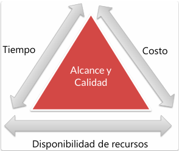
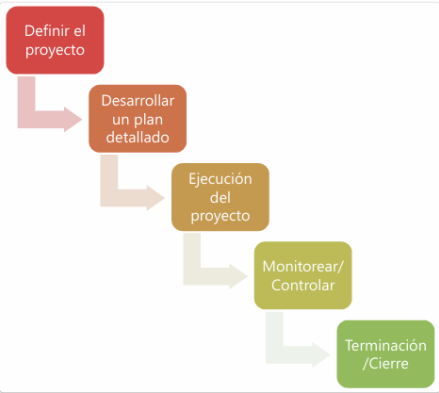
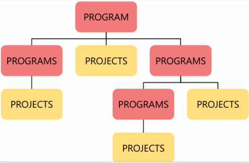
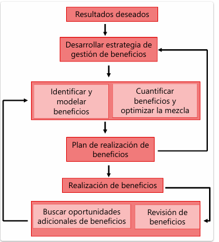
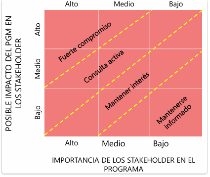
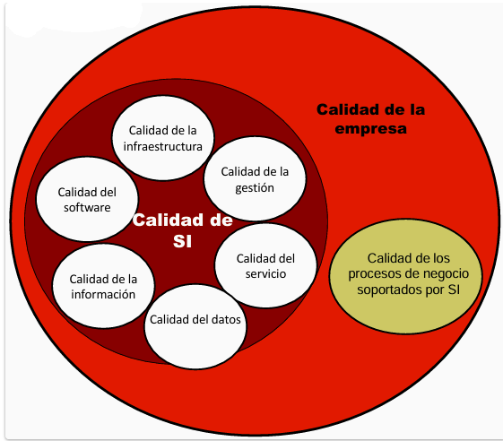
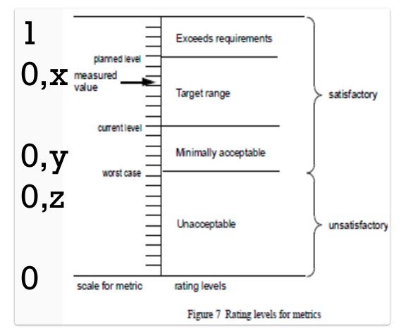
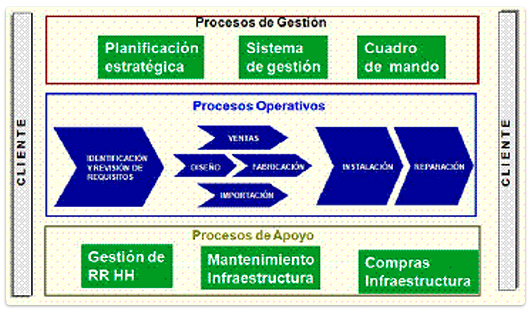
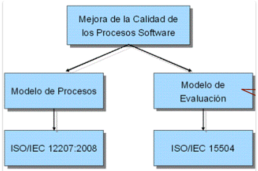

## Resumen Administración de Proyectos

Proyecto Definición

Un proyecto es una secuencia de actividades únicas, complejas y conectadas que tienen un objetivo o propósito específico

Un proyecto tiene un alcance limitado, siempre resulta en un producto u "entregable", y su éxito se mide por el cumplimiento del presupuesto, el tiempo de entrega y las especificaciones del producto.

Proyecto - Líder de Proyecto

Un líder de proyecto es el responsable de detectar las necesidades de los usuarios y gestionar los recursos económicos, materiales y humanos, para obtener los resultados esperados en los plazos previstos y con la calidad necesaria

**Tareas de un Líder de Proyecto**
- Desarrollar el plan del proyecto
- Identificar los requerimientos y el alcance del proyecto
- Comunicar y reportar a los interesados
- Administrar recursos humanos y materiales
- Controlar tiempos
- Identificar y controlar riesgos
- Administrar costos y presupuesto
- Asegurar de la calidad
- Evaluar el desempeño del proyecto

### Parámetros de un Proyect

Parámetros de un Proyecto

Los parámetros de un proyecto son los elementos que definen su alcance y éxito. Los principales son

- **Alcance**: Enunciado que define los límites del proyecto. Establece qué se va a hacer y, de manera implícita, qué no se va a hacer. Es fundamental que sea definido correctamente. Puede cambiar.
- **Calidad**: En el desarrollo de un proyecto, existen dos tipos de calidad a considerar: la calidad del producto final y la calidad del proceso utilizado para crearlo. Asegurar la calidad es una de las tareas del responsable del proyecto.
- **Costo**: El costo se refiere al presupuesto disponible para completar el proyecto.
- **Tiempo**: El tiempo es la ventana temporal dentro de la cual el proyecto debe ser terminado.
- **Recursos**: Los recursos son los activos necesarios para la realización del proyecto, tales como personas, equipos, facilidades físicas o artefactos. Tienen una disponibilidad limitada y su uso debe ser planificado; también pueden ser contratados a terceros. Algunos recursos son fijos y otros variables a largo plazo. Son centrales para la planificación de las actividades del proyecto y para su finalización ordenada, siendo las personas el recurso más importante en proyectos de desarrollo de sistemas.

Triángulo de Alcance

Este concepto destaca que el alcance y la calidad de un proyecto están intrínsecamente ligados al tiempo y al costo disponibles, así como a la disponibilidad de recursos.

La idea principal detrás del "Triángulo de Alcance" es que estos tres aspectos (alcance/calidad, tiempo/costo, y recursos) están en constante interacción y deben mantenerse en equilibrio. Cualquier modificación en uno de estos vértices del triángulo inevitablemente tendrá un impacto en los otros dos.

Clasificación de Proyectos

Se pueden clasificar en:"

- **Duración**: Tiempo estimado que tomará completar el proyecto, desde la planificación hasta la entrega final. A mayor duración, mayor incertidumbre.
- **Riesgo**: Probabilidad de fracaso del proyecto o de que no cumpla con sus objetivos
- **Complejidad**: Es la medida de la dificultad técnica y organizativa del proyecto. Factores clave serían: Tamaño del sistema, Número de módulos, Integraciones con otros sistemas, Lógica de negocio, etc.
- **Valor Comercial**: Representa el impacto económico o estratégico que el proyecto tiene para la organización.
- **Costo**: Es la inversión económica estimada necesaria para completar el proyecto.

Causas de Fracaso de un Proyecto

**No prestar la suficiente atención a…**

- **Caso de negocio**: Si no se comprende claramente por qué se está llevando a cabo el proyecto, o si los beneficios esperados no se definen o validan adecuadamente, el proyecto puede fracasar por no entregar valor a la organización 
- **Calidad**: Ignorar o no priorizar la calidad del producto o del proceso puede llevar a entregables defectuosos, insatisfacción del cliente y, en última instancia, al fracaso del proyecto
- **Definición y medida de los entregables**: Si no se especifica con claridad qué se debe entregar al final del proyecto y cómo se medirá su éxito, puede haber confusión, expectativas no cumplidas y la percepción de que el proyecto no tuvo éxito.

**Inadecuada…**

- **Definición de responsabilidades**: Si los roles y responsabilidades de los miembros del equipo y otros interesados no están claramente definidos, puede haber duplicación de esfuerzos, falta de rendición de cuentas y conflictos que lleven al fracaso.
- **Planificación y coordinación de recursos**: Una planificación deficiente de los recursos (humanos, materiales, financieros, etc.) y una mala coordinación pueden resultar en escasez, cuellos de botella y retrasos que afecten el éxito del proyecto.

**Pobre estimación de…**

- **Duración**: Subestimar el tiempo necesario para completar las actividades del proyecto puede llevar a cronogramas irreales, presión excesiva sobre el equipo y, finalmente, al incumplimiento de los plazos.
- **Costos**: Una estimación inexacta del presupuesto necesario para el proyecto puede resultar en la falta de fondos en etapas críticas, la necesidad de reducir el alcance o la calidad, o la cancelación del proyecto.

**Falta de…**

- **Comunicación con los interesados**: Una comunicación deficiente con los stakeholders del proyecto (clientes, patrocinadores, equipo, etc.) puede generar malentendidos, expectativas no gestionadas, falta de apoyo y, en última instancia, el fracaso del proyecto.
- **Compromiso de los interesados**: Si los interesados clave no están involucrados y comprometidos con el proyecto, pueden surgir obstáculos, falta de apoyo y resistencia al cambio que dificulten el éxito.
- **Control de calidad**: No implementar procesos de control de calidad adecuados puede llevar a la aceptación de entregables defectuosos, lo que requerirá retrabajo y puede afectar el cronograma y el presupuesto, o resultar en un producto final deficiente.
- **Control de avance**: No realizar un seguimiento regular del progreso del proyecto y no tomar acciones correctivas ante las desviaciones puede hacer que los problemas se acumulen y lleven al fracaso.

Ciclo de Vida de un Proyecto

El ciclo de vida de un proyecto es un proceso que va desde la concepción y planificación,
pasando por la ejecución y el control, hasta su cierre formal. 

- **Definir el proyecto/Iniciar:** Establecer claramente los objetivos del proyecto, su alcance y los criterios de éxito.
- **Desarrollar un plan detallado/Planificar:** Se elabora una hoja de ruta exhaustiva para la ejecución del proyecto
- **Ejecución del proyecto:** Se lleva a cabo el trabajo real del proyecto según el plan establecido.
- **Monitorear/Controlar:**  Durante la ejecución, es esencial realizar un seguimiento del progreso del proyecto en relación con el plan
- **Terminación/Cierre:** Esta etapa marca el final formal del proyecto.

### Administración de Proyectos

Administración de Proyectos

La administración de proyectos es la planificación, la delegación, el seguimiento y el control de todos los aspectos del proyecto y la motivación de los participantes para satisfacer los requisitos del proyecto

**Ventajas de una Buena Administración de Proyectos**

- Optimización de Recursos
- Cumplimiento de Plazos y Presupuestos
- Mejora en la Calidad
- Gestión Efectiva de Riesgos
- Satisfacción de los Interesados

**Desafíos de la administración de proyectos**

- Alto nivel de innovación
- Complejidad
- Requerimientos ambiguos
- Falta de competencias necesarias
- Herramientas y técnicas inmaduras
- Cumplir con regulaciones de gobierno
- Cumplir con plazos
- Tratar con proveedores
- Reportar a altas autoridades
- Retener personal calificado
- Administrar personal con diferentes niveles de productividad
- Administrar equipos distribuidos en diferentes ubicaciones
- Administrar entornos multi-culturales y multi-lingua

**Principios de una buena administración**

- Los proyectos siempre necesitan ser gestionados para tener éxito.
- El proyecto es un proceso finito con un comienzo y un final definidos.
- Se requiere un compromiso sincero de todos los interesados.
- Normalmente se requiere entrenamiento.

Programas

Un programa es un grupo de proyectos relacionados que se gestionan de manera coordinada
para obtener beneficios. Se ocupa de los resultados y proporciona un paraguas bajo el cual estos proyectos pueden ser coordinados.

La administración de programas busca integrar los proyectos de modo que se produzca un
resultado mayor que la suma de sus partes. Es complementaria a la Administración de
Proyectos.

Diferencias entre Programas y Proyectos

| **Característica**   | **Programa**                                      | **Proyecto**                                |
| -------------------- | ------------------------------------------------- | ------------------------------------------- |
| *Alcance*            | Amplio y flexible.                                | Limitado y concreto.                        |
| *Cambio*             | Se espera y acepta.                               | Se minimiza.                                |
| *Medición del Éxito* | ROI y beneficios organizacionales.                | Presupuesto, tiempo y especificaciones.     |
| **Liderazgo**        | Enfocado en relaciones y visión estratégica.      | Enfocado en tareas y cumplimiento de metas. |
| **Planificación**    | General y orientativa.                            | Detallada y operativa.                      |
| **Gerentes**         | Coordinan múltiples proyectos para generar valor. | Ejecutan productos bajo restricciones.      |

Relación entre administración de programas y de proyectos

En este contexto, la **administración de proyectos** se enfoca en la gestión de cada proyecto individual dentro del programa, mientras que la **administración de programas** se encarga de supervisar y coordinar estos proyectos relacionados para alcanzar objetivos estratégicos más amplios.

Work Breakdown Structure (WBS)

WBS es una descripción jerárquica (top-down) del trabajo que se debe realizar para completar el proyecto. Es similar a una descomposición funcional.

- Dividimos el **trabajo** en **actividades** y las **actividades** en tareas que son lo más bajo.
- Tiene **forma de árbol**, la raíz es el proyecto o meta a cumplir, los diversos nodos intermedios son las actividades y las hojas las tareas.

Tenemos que buscar que ese árbol esté balanceado o no muy desproporcionado

Objetivos de WBS

1. **Diseñar y planificar el trabajo**: Permite a los integrantes del equipo visualizar cómo puede
definirse y administrarse el proyecto.
2. **Diseñar la arquitectura**: Gráfico del trabajo del proyecto donde se muestra cómo se
relacionan los items a realizar.
3. **Planificar**: Tenemos que estimar esfuerzo, tiempos y recursos para el último nivel.
4. **Informar el estado del proyecto**: Se usa como estructura para mostrar el grado de avance

Atributos que tiene que tener una "actividad de último nivel" para ser considerada Tarea

- **Estado Medible**: En cualquier momento tengo que poder saber el estado de desarrollo de esa tarea.
- **Acotada**: Tiene que poseer una duración acotada.
- **Producir un entregable**: El entregable es el output de la Tarea.
- **Tiempo y costo estimable**: Si no se pueden estimar ni el costo ni el tiempo, entonces no es una Tarea (no es atómico).
- **Duración aceptable**: La duración de una tarea no debe exceder los 15 días (10 laborables), aunque puede haber excepciones.
- **Independiente**: Al iniciar la actividad no se tiene que necesitar de ningún input adicional para arrancar.

Duración y Esfuerzo de Trabajo

La duración de una actividad se define como el tiempo transcurrido en días laborables para finalizar el proyecto, sin considerar feriados, fines de semana, días no laborables.

El esfuerzo de trabajo es la labor requerida para completar una actividad. Esta labor se puede realizar en horas consecutivas o no

Estimación de Duración y Esfuerzo

| **Concepto**            | **Resumen**                                                                                     |
| ----------------------- | ----------------------------------------------------------------------------------------------- |
| **Duración**            | Tiempo total en días laborables desde el inicio al fin, incluyendo inactividad o solapamientos. |
| **Esfuerzo de Trabajo** | Cantidad de trabajo (ej. horas-persona) necesaria, sin importar cuánto tiempo calendario tome.  |

Causas de la variación en la Duración de una actividad

- **Variación en los perfiles**: Las personas pueden tener distintos perfiles para completar la actividad, algunos más adecuados que otros. Una estrategia es estimar la duración basándonos en los perfiles de las personas.
- **Eventos inesperados**.
- **Eficiencia del tiempo de trabajo**: Trabajando de manera focalizada podemos lograr una mayor eficiencia, tenemos que evitar interrupciones y proveer un ambiente que facilite la concentración.
- **Errores e interpretaciones erróneas**

Técnicas para estimar el Esfuerzo de Trabajo

- **Similitud con otras actividades**: Estimar el esfuerzo en base a actividades similares de otro proyectos.
- **Datos históricos**: Estimar en base a las estimaciones de actividades similares de otros
proyectos en base a datos fehacientes y registrados.
- **Juicio experto**: Las estimaciones las realizan consultores externos o expertos en la metodología o tecnología. El Juicio Experto no tiene que venir del Vendedor (esto no es objetivo).
- **Técnica Delphi**: Técnica de grupo que extrae y resume el conocimiento del grupo para arribar una estimación. Cada miembro del grupo hará estimaciones individuales.
    - Se realizan 3 pasadas para llegar a la estimación mediana (el promedio). En cada pasada se toman los extremos, estos extremos debaten y luego se hace la siguiente pasada con nuevos conocimientos.
- **Técnica de 3 puntos**: Se necesitan 3 estimaciones, la optimista, la pesimista y la media.
    - La técnica de la estimación es un promedio pesado **Estimacion** = (**Optimista** + 4***Media** + **Pesimista**) / 6
    - La optimista es la más corta (caso feliz).
    - La pesimista es la más larga (caso triste, todo falla)
    - La media es la normal o usual de la actividad.
- **Técnica Delphi de banda ancha**: Combinación de las 2 anteriores. Se basa en la Delphi pero a cada integrante se le pide que haga las 3 estimaciones de los 3 puntos.

### Estimación de Costos

Las Estimaciones de Costos son predicciones de cuanto tiempo, esfuerzo y perfiles de RRHH (recursos humanos) son requeridos para construir un sistema de software

Técnicas de Estimación

- **Opinión Experta***: Tomamos ventaja de la experiencia de un personal de desarrollo senior.
- **Analogía**: Comparamos el proyecto con presupuestos de proyectos pasados.
- **Descomposición**: Focalizamos el análisis en el producto o en las tareas requeridas para construirlo, descomponemos el productos en componentes, actividades y tareas.
- **Modelos**: Son técnicas que identifican contribuyentes claves al esfuerzo, generando fórmulas matemáticas que relacionan estos ítems al esfuerzo. Hay 2 enfoques:
    - **Bottom-up**: Primero estimamos las partes de menor nivel.
    - **Top-down**: Estimamos el producto entero y luego los componentes se calculan como porciones relativas del todo.

Usos de la Estimación de Costos

- **En planificación**: Se necesita saber cuantos recursos va a insumir.
- **En control**: Se necesita saber cuanto se hizo y cuanto falta

### COCOMO original - Constructive Cost Model

Definicón

Es una colección de tres modelos de estimación de esfuerzo, duración y costo para proyectos, que difieren en la cantidad de información que se tiene sobre el proyecto y el nivel de detalle en la estimación del esfuerzo y el tiempo de desarrollo

**Modelo Básico**

- Es aplicable cuando se conoce muy poco del proyecto.
- Se utiliza en las etapas iniciales, donde la información disponible es limitada.

**Modelo Intermedio**

- Es aplicable luego de la especificación de requerimientos.
- Se utiliza cuando se tiene un poco más de conocimiento sobre el proyecto, como el lenguaje y las herramientas a utilizar.

**Modelo Avanzado (o Detallado)**:

Es aplicable cuando se termina el diseño.

El **modelo Básico** ofrece una estimación rápida y general al inicio del proyecto, el **modelo Intermedio** refina la estimación al considerar los conductores de costos que influyen en el esfuerzo, y el **modelo Avanzado** proporciona una estimación aún más precisa al aplicar el modelo intermedio a los componentes individuales del sistema y considerar las diferentes fases del desarrollo.

Clasificación de Sistemas según COCOMO original

- **Orgánico:** Procesa datos y usa bases de datos. Focalizado en transacciones y recuperación de datos.
- **Semi-embebido:** Intermedio entre orgánico y embebido. Mayor procesamiento de transacciones.
- **Embebido:** Software de tiempo real, parte integral de un sistema mayor basado en hardware.

Cálculo del Esfuerzo Requerido E

En el modelo COCOMO original, el esfuerzo requerido para desarrollar software se estima en base a tres factores principales:

* **Constantes del modelo**: Dependientes del tipo de sistema.
* **Tamaño del software**: Medido en miles de líneas de código entregadas (KSDI).
* **Factor de ajuste**: Modifica el esfuerzo según diferentes características del proyecto.

**Tipos de modelos en COCOMO:**

* En el **modelo básico**, el factor de ajuste es **1** (no se modifica).
* En los modelos **intermedio y avanzado**, este factor se calcula considerando distintos **atributos del proyecto**, agrupados en 4 categorías:

**Categorías de atributos que afectan el esfuerzo:**

1. **Del producto**: Confiabilidad, complejidad, tamaño de base de datos.
2. **Del hardware**: Restricciones técnicas, rendimiento, almacenamiento.
3. **Del personal**: Experiencia, habilidades, conocimiento del lenguaje y herramientas.
4. **Del proyecto**: Calidad del proceso, herramientas utilizadas, planificación.

### Gestión de Beneficios

Enfoque estratégico que tiene como principal objetivo asegurar que los beneficios sean identificados, definidos claramente, vinculados a los resultados estratégicos, y que cumplan con los criterios de ser específicos, medibles, realizables, realistas y limitados en el tiempo.

Enfoque de la Gestión de Beneficios

Su enfoque consiste en un proceso que incluye la identificación, cuantificación, realización revisión de dichos beneficios. Este enfoque se desarrolla a través de las siguientes etapas:

- **Desarrollo de una Estrategia de Gestión de Beneficios**: Define cómo el programa gestionará los beneficios, incluyendo cómo serán cuantificados y medidos, y los sistemas y procesos para hacer seguimiento del progreso y la realización.
- **Identificación y Cuantificación de Beneficios (Perfiles de Beneficios):** Se identifican los beneficios en áreas como calidad de servicio, sociedad, economía, ajuste estratégico y
administración interna.
- **Planificación para la Realización de Beneficios (Plan de Realización de Beneficios):** Se crea un cronograma completo de todos los perfiles de beneficios, definiendo cuándo se realizará cada uno e incluyendo hitos para la revisión y detalles de actividades de traspaso necesarias después del cierre del programa.
- **Realización de Beneficios**: Se entregan los beneficios incrementales a través de la implementación de los productos del proyecto, lo que a menudo requiere cambios estructurales y/o de procesos dentro de las organizaciones.
- **Revisión de Beneficios**: Se valida regularmente el valor de los beneficios esperados y
realizados a los ojos de los stakeholders. Los objetivos clave son evaluar y actualizar los

### **Gestión de los Interesados/Stakeholders**
Es el proceso de identificar y comunicarse efectivamente con aquellas personas o grupos que tienen interés en los resultados de los programas/proyectos. También gestiona las relaciones con las partes interesadas como una forma de lograr influencia y resultados positivos de los programas y proyectos.
Características principales perfiles y el plan de realización, asegurar la alineación con los objetivos del programa, validar el valor para los stakeholders, y evaluar el nivel de logro contra los perfiles previstos.

Características principales

- **Análisis y compromiso efectivo de los interesados a distintos niveles**: Esto implica que los interesados, tanto internos como externos a la organización, deben ser analizados y comprometidos de manera eficaz para lograr los objetivos del programa en términos de apoyo y compromiso.
- **Planificación de las comunicaciones**: La gestión de los interesados incluye la planificación
de las comunicaciones.
- **Uso e identificación efectiva de canales de comunicación**: Se deben utilizar e identificar de manera efectiva los diferentes canales de comunicación para alcanzar los objetivos del programa.
- **Comunicación clara, consistente y enfocada**: A nivel estratégico, la comunicación con los interesados debe ser clara, consistente, enfocada en lo esencial y en un lenguaje comprensible para todos.
- **Proceso continuo**: La gestión de los interesados debe ser vista como un proceso continuo en todas las iniciativas del programa y vinculada al ciclo de vida de la iniciativa y los controles de la institución.

Objetivos y preguntas que responde

**Objetivos de la gestión de los interesados (stakeholders)**:
- Identificar a los interesados.
- Definir claramente los intereses e influencias de los interesados.
- Asegurar que los interesados se comprometan de acuerdo a sus intereses e influencias en el
programa.
Asegurar que los interesados se comprometan, se apropien y apoyen el programa.

**Preguntas que responde**:

- **¿QUIÉN?** (Identificar los interesados)
- **¿QUÉ?** (Crear y analizar los perfiles de los interesados)
- **¿CÓMO?** (Definir estrategia de participación de los interesados)
- **¿CUÁNDO?** (Planificar la participación)
- **¿HACER?** (Participación de los interesados)
- **¿RESULTADOS?** (Medir la efectividad)

### Procesos

La Gestión de los Stakeholders se basa en 5 procesos:

Identificar los stakeholders y sus intereses.

La identificación de los interesados y sus intereses se representa de diversas formas, siendo una
de ellas a través de un mapa de los interesados. Este mapa es una matriz que muestra a los
interesados y sus intereses particulares en el programa

| **STAKEHOLDERS**         | **DIRECCIÓN ESTRATÉGICA** | **FINANCIERA** | **CAMBIOS OPERACIONALES** | **INTERFAZ CON LOS CLIENTES** |
|--------------------------|---------------------------|----------------|----------------------------|-------------------------------|
| Clientes                 | Bajo                      | Medio          | Alto                       | Alto                          |
| Grupos de Proyectos      | Medio                     | Medio          | Alto                       | Medio                         |
| Personal                 | Medio                     | Medio          | Alto                       | Medio                         |
| Organismos Reguladores   | Alto                      | Medio          | Bajo                       | Medio                         |
| …                        | …                         | …              | …                          | …                             |

Analizar los stakeholders

El análisis de los stakeholders comprende entender y analizar su influencia e impacto en el proyecto. Esto es necesario para diseñar canales de comunicación apropiados que respondan a las necesidades e intereses de los stakeholders.

Para analizar usamos una matriz de impacto de los stakeholders donde se incluyen los
siguientes datos:

- En un eje de la matriz se representa el "POSIBLE IMPACTO DEL PGM EN LOS STAKEHOLDERS". Este eje evalúa el nivel de impacto que el programa podría tener en cada uno de los stakeholders, categorizándolo generalmente en niveles como Alto, Medio y Bajo.
- En el otro eje de la matriz se representa la "IMPORTANCIA DE LOS STAKEHOLDERS EN EL PROGRAMA". Este eje evalúa la relevancia o significancia de cada stakeholder para el éxito del programa, también categorizada en niveles como Alto, Medio y Bajo.

Planificación de los stakeholders

Consiste en definir un marco que permita la participación efectiva de los stakeholders. Tenemos a Definir:

- ¿Cómo definimos un objetivo claro para el compromiso?
- ¿Cómo mantenemos el compromiso dentro de los límites?
- ¿Quién debe ser responsable de participar?
- ¿Cuál es el mejor método de compromiso?
- ¿Cómo medimos el éxito?

Comunicación con los stakeholders

La comunicación es un factor crítico de éxito para cualquier proceso de transformación.

Buscamos principalmente concientizar a los stakeholders sobre los beneficios y el impacto, obtener el compromiso del personal de las organizaciones con los cambios a ser introducidos, promover mensajes claves del programa, etc.
Para realizar esta tarea, se confecciona un plan de comunicación que incluye los siguientes datos:

- Qué se comunicará y la autoridad requerida para la comunicación.
- Cómo se comunicará.
- Quién comunicará.
- Cuándo se comunicará.

**Posibles canales de comunicación:**

- Seminarios y workshops: Permiten el contacto directo con los interesados.
- Prensa/Medios: Son canales ideales para públicos externos más amplios.
- Boletines, instrucciones, anuncios, informes: Pueden utilizarse para comunicar información general y específica relacionada con interesados particulares.

Gestionar los stakeholders

Es necesario para mantener el impulso y el programa en marcha.

Esta gestión asegura que:

- Existe un entendimiento compartido sobre lo que se entiende por “stakeholder”.
- Existe un conjunto detallado de grupos de stakeholders orientados a la práctica.
- Existen metas establecidas para cada grupo o conjunto de grupos de stakeholders.
- Existe un plan de comunicaciones claro para alcanzar estas metas
- Los miembros del equipo de gestión del programa están motivados para alcanzar estas
- metas.
- Los grupos de stakeholders se sienten suficientemente comprometidos con el programa y comprenden los objetivos y limitaciones de los mismos.
- Se miden las opiniones de los stakeholders y se actúa en consecuencia

### Gestión de Riesgos

Un riesgo es un evento potencial (negativo o positivo) que podría afectar el curso del programa o proyecto. Se gestiona para **minimizar amenazas** o **aprovechar oportunidades.**

Un problema es una cuestión actual, ya presente o en discusión, que obstaculiza el proyecto. No confundir con el concepto de riesgo.

Actividades de la Gestión de Riesgos

1. **Identificar riesgos Tipos**: Estratégicos, De programa, De proyecto y Operativos.
2. **Registrar riesgos en un repositorio formal**. Es el repositorio central de toda la información sobre riesgos. Permite priorizar, tomar acción y hacer seguimiento.
3. **Asignar propiedad del riesgo** a personas con capacidad para gestionarlos. Cada riesgo debe ser asignado a un responsable que tenga autoridad y competencia para actuar.
4. **Evaluar los riesgos** (probabilidad e impacto). Se mide: Probabilidad de que ocurra. Impacto en caso de que ocurra.
5. **Planificar acciones de mitigación**.
6. **Implementar acciones**.
7. **Evaluar efectividad** de las acciones tomadas.
8. **Incorporar la gestión de riesgos** al programa.
9. **Definir una estrategia formal** de gestión de riesgos.

Respuestas al Riesgo - Modelo de las 4T

- **Transferir:** pasar el riesgo a un tercero (ej. seguros).
- **Terminar:** modificar el proyecto para eliminar el riesgo.
- **Tolerar:** aceptar el riesgo y no actuar (usado para riesgos menores).
- **Tratar:** aplicar acciones para reducir la probabilidad o el impacto.

---

## Calidad 

Definición

La **Calidad** es un concepto que tiene un significado que tiende a ser ambiguo y subjetivo, podemos quedarnos con una definición de **Calidad** que nos dice que es **una propiedad o conjunto de propiedades inherentes a algo, que permiten juzgar su valor.**

Según **ISO 9000** es el grado e el que un conjunto de características inherentes cumple con los requisitos.

Calidad de la Empresa

La Calidad de la Empresa se ve definida por:

- Calidad de los procesos de Negocio
- Calidad de los Sistemas de Información
    - **Calidad de la Infraestructura**: calidad de redes y sistemas de software, etc.
    - **Calidad de Software**: de las aplicaciones construidas, mantenidas, etc.
    - **Calidad de Datos**: que ingresan en el SI.
    - **Calidad de Información**: relacionada con la Calidad de Datos.
    - **Calidad de Gestión**: presupuesto, planificación y programación.
    - **Calidad de servicio**: procesos de atención al cliente.

Calidad del Software

La Calidad del Software se refiere a qué tan bien un software cumple con los requerimientos funcionales y no funcionales esperados, así como con las necesidades del usuario y del negocio. Se divide en Calidad del producto y Calidad del proceso de desarrollo

- **Calidad del producto**: Los aspectos que medimos son la Calidad interna (medible a partir de las características intrínsecas), Calidad externa (medible en el comportamiento del producto) y Calidad en uso (medible durante el uso efectivo por parte del usuario).
- **Calidad del proceso**: Los requisitos más significativos del proceso de software son:
  - Que produzca los resultados esperados.
  - Que estén basados en una correcta definición.
  - Que sean mejorados en función de los objetivos de negocio.

> "Sin un buen proceso de desarrollo es casi imposible obtener un buen producto".

Normas y Estándar

**Norma** es una regla obligatoria o un conjunto de requisitos que se deben cumplir, normalmente es establecida por organismos oficiales o internacionales. Define criterios específicos que deben seguirse en procesos, productos o servicios

**Estándar** es un modelo o referencia aceptada como guía o mejor práctica, no es obligatorio pero sí recomendado como ejemplo a seguir. Es más flexible y adaptable al contexto de cada organización.

No confundir una con la otra, la diferencia entre ellas radica en el grado de obligatoriedad y en su uso formal.

El término de norma es más fuerte que el término estándar.

Identificación de las Normas por Organización

| **Organismo**                                            | **¿Qué hace?**                                                                                                                                                                       |
| -------------------------------------------------------- | ------------------------------------------------------------------------------------------------------------------------------------------------------------------------------------ |
| **ISO - International Organization for Standardization** | Promueve una estandarización a nivel internacional de normas técnicas para diferentes ramas de la industria.                                                                         |
| **IEC - International Electrotechnical Commission**      | Organización de normalización en los campos: eléctrico, electrónico y tecnologías relacionadas.                                                                                      |
| **ISO/IEC**                                              | Las normas que se relacionan al software se desarrollan y publican por los dos organismos de arriba.                                                                                 |
| **IRAM**                                                 | Promueve el uso de las normas ISO en Argentina y es el responsable de realizar las traducciones oficiales. Las normas ISO que han sido adoptadas por IRAM, se las denomina IRAM–ISO. |
| **NM**                                                   | Identificación de las normas, indica que fue aprobada por la Asociación Mercosur de Normalización.                                                                                   |

**Calidad del Producto de Software**

Definición

El concepto de Calidad de Producto de Software se refiere al conjunto de características que debe tener un software para cumplir con los requisitos funcionales, no funcionales y expectativas del usuario, tanto de forma interna como externa. Es una visión centrada en el software en sí mismo, no en el proceso que lo creó. Evalúa qué tan bien funciona, cómo se comporta y cómo lo percibe el usuario.

Proceso de evaluación según norma ISO/IEC 14598

La norma ISO/IEC 14598 (ahora reemplazada por ISO/IEC **25040**) define un proceso formal para evaluar la calidad de un producto de software de manera sistemática y objetiva.

**Etapas en Orden (1 a 5) y ¿Qué se hace?**

1. **Establecer los requisitos de la evaluación**
   Definir el propósito de la evaluación, obtener los requisitos de calidad del producto, identificar qué partes del producto se va a evaluar y definir el nivel de rigor de la evaluación.

2. **Especificar la evaluación**
   Seleccionar los módulos de evaluación, definir los criterios de decisión para las métricas y establecer los criterios de decisión generales de la evaluación.

3. **Diseñar la evaluación**
   Planificar las actividades concretas: qué pruebas se realizarán, qué herramientas se usarán, qué recursos humanos y técnicos se necesitan.

4. **Ejecutar la evaluación**
   Realizar las mediciones reales, aplicar los criterios definidos en el paso anterior para interpretar los resultados y registrar todos los hallazgos y resultados de manera organizada.

5. **Finalizar la evaluación**
   Revisar los resultados obtenidos, elaborar el informe de evaluación, incluyendo recomendaciones si corresponde, obtener retroalimentación del proceso de evaluación para mejorar futuras evaluaciones y tratar y almacenar los datos obtenidos.

Modelo de Calidad definido por la familia ISO/IEC 9126

La ISO/IEC 9126 (ahora reemplazada por la familia SQuaRE ISO/IEC 25000) es un modelo que define y clasifica las características de calidad del software en términos medibles y evaluables, para ayudar tanto en el desarrollo como en la evaluación del producto.

| **Norma de la Familia** | **¿Qué define?**                                                   |
|-------------------------|---------------------------------------------------------------------|
| ISO/IEC 9126-1          | Modelo de calidad del producto software                            |
| ISO/IEC 9126-2          | Métricas externas (evaluación del software ejecutado)              |
| ISO/IEC 9126-3          | Métricas internas (evaluación sin ejecutar el software)            |
| ISO/IEC 9126-4          | Métricas de calidad en uso (con el usuario final)                  |

ISO/IEC 9126-1

Divide la Calidad del Software en seis características principales, cada una de ellas con subcaracterísticas (ahora reemplazada por ISO/IEC 25010)

| **Característica**             | **¿A qué se refiere?**                                                                 | **Subcaracterísticas**                                                                                 |
|-------------------------------|----------------------------------------------------------------------------------------|---------------------------------------------------------------------------------------------------------|
| *Funcionalidad*               | Qué tan bien el software cumple con las funciones requeridas                         | Adecuación, Exactitud, Interoperabilidad, Cumplimiento y Seguridad de acceso                           |
| *Confiabilidad*               | Capacidad del software de mantener su rendimiento bajo condiciones específicas        | Madurez, Tolerancia a fallos y Recuperabilidad                                                         |
| *Facilidad de Uso*            | Facilidad con la que el usuario puede entender, aprender y utilizar el software       | Inteligibilidad, Atractivo, Facilidad de aprendizaje y Operabilidad                                    |
| *Eficiencia*                  | Capacidad del software de proporcionar alto rendimiento con pocos recursos            | Comportamiento temporal y Utilización de recursos                                                      |
| *Potabilidad*                 | Facilidad para modificar el software                                                  | Facilidad de análisis, Facilidad de cambio, Estabilidad y Facilidad de prueba                          |
| *Facilidad de Mantenimiento*  | Capacidad del software para ser trasladado a diferentes entornos                      | Adaptabilidad, Facilidad de instalación, Conformidad y Facilidad de reemplazo                          |

ISO/IEC 9126-2

Define métricas para evaluar la calidad del software en forma de Tabla (ahora reemplazada por ISO/IEC 250423), teniendo en cuenta las características y subcaracterísticas definidas en la ISO/IEC 9126-1. Cada métrica se define en una tabla con estos campos:

| **Componente**              | **Descripción**                                                                                       |
|----------------------------|--------------------------------------------------------------------------------------------------------|
| *Nombre de la Métrica*     | Identifica de manera clara la métrica evaluada                                                        |
| *Propósito*                | Indica qué aspecto de calidad se mide y con qué fin se utiliza esa métrica                            |
| *Descripción*              | Define en detalle qué mide la métrica y cuál es su alcance                                            |
| *Fórmula*                  | Expresa cómo se calcula la métrica                                                                     |
| *Tipo de medida*           | Especifica si se trata de una medida objetiva (cuantitativa) o subjetiva (basada en percepción del usuario) |
| *Nivel de aplicación*      | Indica si la métrica se aplica a nivel de módulo, componente, sistema completo, etc.                  |
| *Interpretación*           | Señala qué significa un valor alto o bajo para la métrica, y cómo puede ser utilizado para tomar decisiones |

A su vez, define criterios para crear nuevas métricas:

| **Criterio**          | **Explicación de qué tener en cuenta**                                                                 |
|-----------------------|--------------------------------------------------------------------------------------------------------|
| *Relevancia*          | La métrica debe estar directamente relacionada con una característica o subcaracterística de calidad  |
| *Validez*             | Debe medir exactamente lo que se pretende medir, sin ambigüedad                                       |
| *Fiabilidad*          | La métrica debe ofrecer resultados consistentes cuando se aplica en condiciones similares            |
| *Objetividad*         | Siempre que sea posible, se debe preferir la medición cuantitativa y verificable, por sobre la percepción subjetiva |
| *Comprensibilidad*    | Debe ser fácil de interpretar por los interesados                                                     |
| *Viabilidad*          | La métrica debe ser técnicamente factible de obtener en el entorno donde se aplica                   |

También explica de qué forma se deben combinar los niveles de las métricas para establecer los niveles de las características y de evaluación

| **Seguir en Orden (1 a 4)**               | **¿Qué hacer?**                                                                                      |
|--------------------------------------------------|--------------------------------------------------------------------------------------------------------|
| *Evaluación a nivel de métrica*                 | Puntuamos cada métrica según uno de los 4 niveles.                                                    |
| *Evaluación a nivel de subcaracterística*       | Las métricas relacionadas a una subcaracterística se combinan, podríamos por ejemplo usar un promedio |
| *Evaluación a nivel de característica*          | Se combinan los niveles de todas las subcaracterísticas que componen una característica principal, se puede aplicar nuevamente un promedio |
| *Evaluación global*                             | Se combinan los niveles de las características principales para emitir una evaluación global del producto |

Familia SQuaRE ISO/IEC 25000

La familia ISO/IEC 25000, conocida como SQuaRE (Software product Quality Requirements and Evaluation), es un conjunto de normas internacionales que proporcionan un marco estructurado y coherente para definir, medir y evaluar la calidad del software, los datos y su uso.

SQuaRE es un modelo de referencia que reemplaza y amplía normas anteriores como ISO/IEC 9126 y ISO/IEC 14598. Tiene como objetivo definir claramente los requisitos de calidad del software, establecer métricas para medir esa calidad y estandarizar el proceso de evaluación del producto.

- **División 2500n – Gestión de la calidad:** Proporciona guías generales para gestionar la calidad                                                                                       
- **División 2501n – Modelos de calidad**: Define modelos de calidad para productos de software (ISO/IEC 25010) y calidad de datos (ISO/IEC 25012). Estos modelos especifican características y subcaracterísticas quedeben evaluarse
- **División 2502n – Medición de la calidad:** Establece métricas específicas para cada característica                                                                                      
- **División 2503n – Requisitos de calidad**: Proporciona directrices para especificar requisitos de calidad desde la etapa de elicitación                                                
- **División 2504n – Evaluación de la calidad:** Define cómo planificar y ejecutar la evaluación de un producto software                                                                     

Diferencias entre ISO/IEC 9126-1 y ISO/IEC 25010

La ISO/IEC 25010 reemplaza la ISO/IEC 9126-1 con un modelo más completo y actualizado, integrando aspectos clave como seguridad y compatibilidad, y dando mayor relevancia a la experiencia del usuario final.

* **Aspecto: Características principales**

  * *ISO/IEC 9126-1:* 6
  * *ISO/IEC 25010:* 8

* **Aspecto: Seguridad**

  * *ISO/IEC 9126-1:* Subcaracterística dentro de Funcionalidad
  * *ISO/IEC 25010:* Característica independiente

* **Aspecto: Compatibilidad**

  * *ISO/IEC 9126-1:* No aparece como categoría
  * *ISO/IEC 25010:* Se agrega como característica nueva

* **Aspecto: Calidad en uso**

  * *ISO/IEC 9126-1:* Definida como concepto aparte
  * *ISO/IEC 25010:* Se integra en el mismo modelo

* **Aspecto: Estructura**

  * *ISO/IEC 9126-1:* Modelo de calidad interna y externa separado del de calidad en uso
  * *ISO/IEC 25010:* Unificación del modelo con mejor integración

Al cuadro de características de la 9126-1 le quitamos la subcaracterística de Seguridad a Funcionalidad y agregamos 2 filas más:

Diferencias entre ISO/IEC 14598 y ISO/IEC 25040

La ISO/IEC 25040 reemplaza la ISO/IEC 14598 con un enfoque más moderno, estructurado y alineado con todo el sistema de evaluación de calidad SQuaRE, permitiendo una evaluación más consistente, completa y reutilizable

* **Foco**

  * *ISO/IEC 14598:* Evaluación del producto de software
  * *ISO/IEC 25040:* Proceso completo de evaluación de calidad, integrado con modelos modernos

* **Enfoque**

  * *ISO/IEC 14598:* Separado del modelo de calidad (9126). La 9126 no estaba integrada a la 14598
  * *ISO/IEC 25040:* Integrado con ISO/IEC 25010 y resto de la familia 25000

* **Cobertura**

  * *ISO/IEC 14598:* Definía evaluación en módulos por roles (desarrollador, adquirente, evaluador independiente)
  * *ISO/IEC 25040:* Define un único modelo de evaluación aplicable a todos los contextos (más flexible y unificado)

* **Detalle del proceso**

  * *ISO/IEC 14598:* Más genérico
  * *ISO/IEC 25040:* Más detallado y normado, con 5 etapas claras

**Calidad de los Datos - ISO/IEC 25012**

Definición

La norma ISO/IEC 25012 define el concepto de Calidad de Datos como: "La capacidad de las características de los datos de satisfacer necesidades explícitas e implícitas bajo condiciones específicas de uso.".

Esto significa que los datos son de calidad cuando cumplen con lo que los usuarios necesitan, ya sea para operar, tomar decisiones, generar información o garantizar la interoperabilidad entre sistemas.

Clasificación de las características de calidad

El modelo presenta una clasificación considerando dos puntos de vista (3 si tomamos el combinado):

**Punto de Vista: Inherente**

* **¿A qué hace referencia?**
  Se refiere a las propiedades internas de los datos, independientemente del sistema que los gestiona.

* **¿Qué evalúa?**

  * **Exactitud**: Reflejan correctamente la realidad.
  * **Completitud**: Tienen todos los valores necesarios.
  * **Consistencia**: No se contradicen entre sí.

**Punto de Vista: Dependiente del sistema**

* **¿A qué hace referencia?**
  Analiza cómo el sistema informático mantiene y permite acceder a los datos en determinadas condiciones de uso.

* **¿Qué evalúa?**

  * **Credibilidad**: El usuario confía en ellos.
  * **Actualidad**: Están actualizados respecto al tiempo requerido.
  * **Disponibilidad**: Accesibles cuando se necesitan.
  * **Portabilidad**: Pueden transferirse entre sistemas.
  * **Recuperabilidad**: Se preservan ante fallos.

**Punto de Vista: Inherente + Dependiente**

* **¿A qué hace referencia?**
  Algunas características aplican a ambos enfoques (inherente y dependiente del sistema).

* **¿Qué evalúa?**

  * **Accesibilidad**
  * **Cumplimiento** (con normas o estándares)
  * **Confidencialidad**
  * **Precisión**
  * **Eficiencia**
  * **Trazabilidad**
  * **Comprensibilidad**

**Calidad de Servicio - ISO/IEC 20000**

Definición

La norma ISO/IEC 20000 es un estándar para la certificación de Gestión de Servicios de TI (Tecnologías de la Información) de las empresas. 

Define el concepto de Calidad de Servicio como la capacidad de un proveedor de servicios para entregar servicios de tecnología de la información (TI) de acuerdo con los requisitos acordados con los clientes, cumpliendo con las expectativas de calidad definidas.

El estándar ISO/IEC 20000 es un marco de buenas prácticas para la gestión de servicios de TI, y tiene como objetivo garantizar que los proveedores de servicios entreguen servicios TI de alta calidad de manera consistente.

Organización del estándar

El estándar está compuesto por varios componentes que guían a las organizaciones para establecer y gestionar un Sistema de Gestión de Servicios (SGS) eficiente. Su organización es la siguiente:

**Componentes de la norma ISO/IEC 20000**

* **ISO/IEC 20000-1: Especificación**
  Componente principal del estándar y especifica los requisitos para el Sistema de Gestión de Servicios (SGS).

* **ISO/IEC 20000-2: Código de Prácticas**
  Proporciona orientación y mejores prácticas sobre cómo implementar un SGS basado en los requisitos de la ISO/IEC 20000-1. Aunque no es obligatorio, es muy útil para organizaciones que deseen aplicar el estándar de manera efectiva.

* **ISO/IEC 20000-3: Guía en la Definición del Alcance y su Aplicabilidad**
  Destinada a los auditores, ofrece directrices sobre cómo realizar auditorías a un SGS implementado conforme a la ISO/IEC 20000-1. Ayuda a evaluar la eficacia de dicha implementación.

* **ISO/IEC 20000-4: Modelo de Referencia de Procesos**
  Proporciona una metodología para evaluar la gestión de servicios en una organización. Permite medir la eficacia de los servicios entregados y de la implementación del SGS.

* **ISO/IEC 20000-5: Ejemplo de Implementación**
  Brinda un ejemplo de implementación en un informe técnico.

**Calidad de Procesos de Software**

Definición

Un proceso es una serie de actividades interrelacionadas que a partir de un input generan un output que puede ser un resultado final o el input de otro proceso.

El proceso de software es un concepto amplio, basado en el ciclo de vida y que cubre todos los elementos necesarios como tecnología, personal, artefactos, etc. Se puede ver como un conjunto coherente de tareas relacionadas que conducen a la producción de un producto software incluyendo tanto las actividades técnicas (como el diseño y la codificación) como las actividades de gestión (como la planificación y el seguimiento).

Por buenas prácticas se entiende un conjunto coherente de acciones que han rendido bien en un determinado contexto y que se espera que, en contextos similares, rindan similares resultados.

Podemos definir a una organización como un conjunto de procesos interconectados, que pueden plasmarse por escrito en un diagrama denominado Mapa de Procesos

Mapa de Procesos

Tipos de Procesos

- **Procesos de Gestión**: Definen y verifican las políticas, estrategias, objetivos y metas de la organización.
- **Procesos Operativos**: Procesos de producción de bienes y servicios que se entregan al cliente. Están alineados con la misión principal de la organización.
- **Procesos de Apoyo**: Procesos que realizan actividades de apoyo necesarias para el buen funcionamiento de los procesos operativos.

En el mapa de procesos, los clientes son las entidades (internas o externas) que reciben los productos o servicios generados por los procesos clave. Son el destinatario final del valor entregado por la organización. Representan:

- Las expectativas y necesidades a satisfacer.
- Un punto de partida para la definición de los procesos clave.
- La referencia para evaluar la eficacia del sistema.

**Modelo de Calidad de los Proceso de Software**

Definición

Un modelo de calidad software puede definirse como una herramienta que guía a las organizaciones a la mejora continua y a la competitividad, proporcionando un conjunto de buenas prácticas para el ciclo de vida del software.

Un modelo no es una metodología, dice qué hacer pero no cómo hacerlo.

Modelo de Procesos - ISO/IEC 12207

El modelo ISO/IEC 12207 es un estándar internacional que define un marco de referencia para los procesos del ciclo de vida del software. Fue desarrollado para establecer un lenguaje común y una estructura formal que permita gestionar, desarrollar y mantener productos de software con calidad. Su objetivo principal es mejorar la calidad y la eficiencia del software y sus procesos asociados.

Esta norma genera un clasificación de los procesos:
