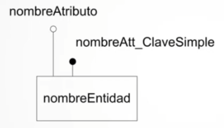
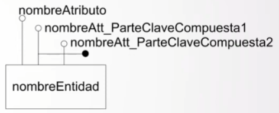
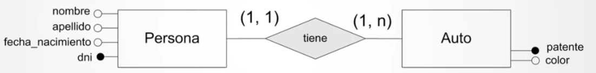
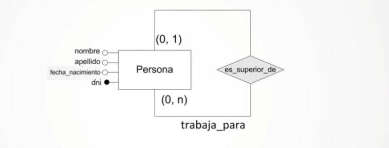
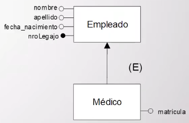
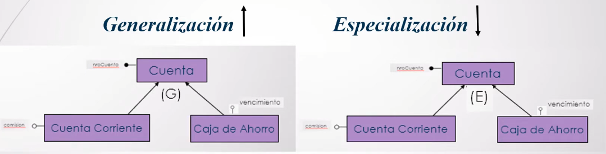

## 📒 Estudiando 

import YoutubeVideo from "@/components/YoutubeVideo.astro"

<YoutubeVideo id="EN9Rtvq_gUo"/>

Aquí tenés una versión **más clara, prolija y bien redactada**, ideal para tu blog. Mantiene tu contenido, pero lo ordena mejor, corrige errores y mejora la lectura.

---

## Modelado de Datos (Conceptos Generales)

El **modelado de datos** proporciona una notación para describir cómo se organizan, estructuran y manipulan los datos dentro de un sistema. Un modelo de datos suele incluir:

* **Estructura de los datos**
* **Restricciones** que deben cumplir los datos
* **Operaciones** permitidas sobre esos datos

En conjunto, estos elementos definen la **estructura subyacente de una base de datos**.

### Clasificación de los modelos de datos

Una forma habitual de clasificarlos es distinguir entre:

* **Modelos lógicos**
* **Modelos físicos**

La diferencia principal radica en **el nivel de abstracción** y **el tipo de elementos que representan**. Mientras que los modelos lógicos se enfocan en *qué* datos se manejan y sus relaciones, los modelos físicos se concentran en *cómo* se almacenan esos datos en el sistema.

### Modelos de datos lógicos

Dentro de los modelos lógicos, podemos distinguir dos grandes grupos:

#### 📌 Modelos lógicos basados en **objetos**

* Modelo de **Entidades y Relaciones (ER)**
* Modelo **Orientado a Objetos**

#### 📌 Modelos lógicos basados en **registros**

* **Modelo Relacional** → *Este es el que utilizaremos en la materia.*

---

<YoutubeVideo id="sbRPSqvlmKs"/>

Algunos modelos en particular
- Modelo de Entidades y Relaciones (ER)

### Modelo de Entidades y relaciones (ER)

Es un modelo de datos lógico basado en objetos:
- abstracción del mundo real
- Representa el significado de los datos
- Es independiente de los detalles de la implementación física

Modelo de entidades y relaciones desde los elementos que define un modelo de datos:

- Estructura
    - Conjunto de Entidades
    - Conjunto de Relaciones
    - Atributos
- Restricciones del modelo
    - Cardinalidad, identificador, grado

#### Entidades

Es una 'cosa o concepto' que puede ser identificada y distinguible de otra 'cosa o concepto'. Como por ejemplo:

- 'Juan con DNI 12345678'
- 'Auto modelo 2015 patente PRI'

#### Relación
Es una asociación de entidades como por ejemplo:

- Juan con dni 1234567 **es_dueño_de** Auto modelo 2015 patente PRI

#### Atributo

Representa información acerca de una entidad o una relación. Por ejemplo:
- Nombre, DNI, Patente, Modelo, Patente

#### Dominio de un Atributo

Conjunto de valores que pueden tomar un atributo en particular. Por ejemplo:

- Nombre puede ser una cadena de máximo 50 letras del abecedario.

#### Rol de una entidad en una relacion

Indica la función que tiene la entidad en la relación. Por ejemplo:

- **tutor_de** Jose con dni 123456 es **tutor_de** Juan cuyo dni es 234567. Juan, tiene el rol de **tutelado_por**

#### Conjunton de Entidades

Es un conjunto de entidades del mismo tipo. Por ejemplo:
- El conjunto de todas las personas que poseen un nombre y tienen DNI puede llamarse PERSONA.
- El conjunto de todos los autos que poseen información del modelo y de la patente puede llamarse AUTO.

#### Conjunto de Relaciones
Es un conjunto de relaciones del mismo tipo. Por ejemplo:
- **ES_DUEÑO_DE** es un conjunto de relaciones entre entidades `PERSONA` y `AUTO`.

> Los terminos entidad y conjunto de entidades seran intercambiables, haciendo abuso del vocabulario
> Los terminos relacion y conjunto de relaciones seran intercambiables, haciendo abuso del vocabulario

#### Restricciones: **Cardinalidad**

Determina el número de veces en el que puede participar una entidad en una relación.

Indica dependencia (importancia de la cardinalidad mínima)

- Total o de existencia: participación obligatoria (mínimo 1)
- Parcial: participación opcional (mínimo 0)

Tomamos un conjunto binario de relaciones R entre dos conjuntos de entidades A y B, la cardinalidad (considerando los extremos máximos de cada lado de R) puede ser:

- 1 a 1
- 1 a muchos
- Muchos a muchos

#### Restricciones: **Grado**

Representa el número máximo de veces que una entidad puede estar relacionada con otra.

Ejemplos:
- 1, n -> Grado n
- 1, 1 -> Grado 1

#### Restricciones: **Clave o Identificador**
- Restricción de unicidad del valor del atributo
- Sirven para identificar de manera única a una `entidad``
- Toda entidad posee al menos una posible clave o identificador
- Puede ser:
    - Simple
    - Compuesto

#### Diagrama de entidades y relaciones

Representación gráfica de la estructura de los datos

Como se representan los elementos

| Entidad | Relación | Atributo | Cardinalidad |
|-----------|-----------|-----------|-----------|
|  |  |  |  |

Notación de atributos descriptores e identificadores simples y compuestos en una entidad

| Simple | Compuesto | De una entidad (Solo descriptivos) |
|-----------|-----------|-----------|
|  |  |  |

Ejemplo de un diagrama de Entidades y Relaciones

**¿Como se lee esta cardinalidad?**

Una persona tiene al menos 1 auto y al menos un auto y a lo sumo n. Y un auto es poseído por una única persona.

---

Un ejemplo de diagrama de entidades y relaciones -ROL-

**¿Como se lee esta cardinalidad?**

Una persona es superior de cero o muchas otras personas. Una persona trabaja para a lo sumo una persona.

> En algunos ejemplos se **omite** poner atributos en las entidades
> Al momento de realizar los ejercicios propuestos en la materia, tener en cuenta que **toda entidad debe al menos tener un atributo.**

---

<YoutubeVideo id="0V3FoYNO6cM"/>

## Modelo de entidades y relaciones ampliado
### Especialización y Generalización

#### Especialización

Es el resultado de tomar un subconjunto de entidades de un nivel para formar un conjunto de entidades de nivel más bajo. Por ejemplo:

Tenemos empleados de un hospital. De los médicos nos interesa su matrícula. Puede haber empleados que no son médicos.

#### Generalización

Es el resultado de tomar uno o más conjuntos de entidades (de nivel más bajo) y producir un conjunto de entidades de un nivel más alto. Por ejemplo:

Distintos tipos de cuenta: cajas de ahorro y cuentas corrientes, pero ambas son consideradas cuentas

Mecanismos de abstracción

