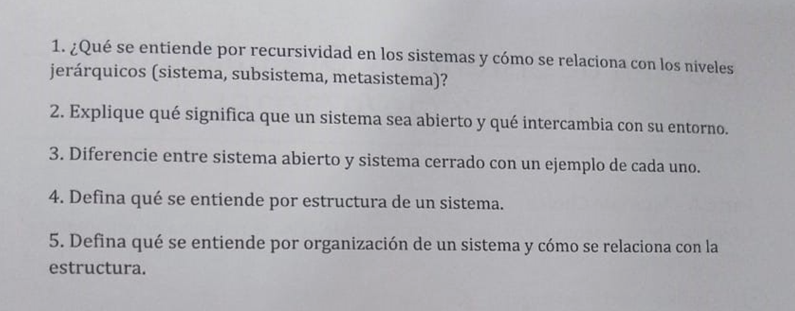

## **Examen de Sistemas y Organizaciones – Tema 2 (29/9/2025)**

**Parte A – Múltiple Choice**

**1. Según la Teoría General de Sistemas, el aporte metodológico se relaciona principalmente con:**

* La simplificación del lenguaje
* La reducción de costos
* La programación de computadoras
* La estructura del razonamiento

Ver respuestas

* La estructura del razonamiento ✅

---

**2. Existe sinergia cuando:**

* No hay interacción entre subsistemas
* El todo es igual a la suma de las partes
* El todo es más que la suma de las partes
* El todo es menos que la suma de las partes

Ver respuestas

* El todo es más que la suma de las partes ✅

---

**3. Un sistema abierto se caracteriza porque:**

* Intercambia energía, materia e información con el medio
* No intercambia energía ni información con el medio
* Permanece aislado totalmente
* Funciona únicamente en equilibrio

Ver respuestas

* Intercambia energía, materia e información con el medio ✅

---

**4. ¿Quién es considerado el fundador de la TGS moderna?**

* Norbert Wiener
* Kenneth Boulding
* George Klir
* Ludwig von Bertalanffy

Ver respuestas

* Ludwig von Bertalanffy ✅

---

**5. El contexto de un sistema es:**

* Un elemento interno del sistema
* Lo mismo que metasistema
* El conjunto de objetos exteriores que rodean e influyen en el sistema
* El conjunto de subsistemas

Ver respuestas

* El conjunto de objetos exteriores que rodean e influyen en el sistema ✅

Preguntas de desarrollo

---

1. ¿Qué significa que la TGS sea una teoría integradora y cuál es su importancia?

2. Defina las componentes básicas de un sistema (entradas, procesos, salidas, retroalimentación).

3. Explique con ejemplos la diferencia entre un sistema, un metasistema y el contexto.

4. Defina sinergia y explique por qué "el todo es más que la suma de las partes".

5. ¿Qué se entiende por recursividad en los sistemas y cómo se relaciona con los niveles jerárquicos (sistema, subsistema, metasistema)?

## Otro parcial

---

1. ¿Qué se entiende por recursividad en los sistemas? ¿Cómo se relaciona con los niveles jerárquicos (sistema, subsistema, metasistema)?

2. Explique qué significa que un sistema sea abierto y qué intercambia con su entorno.

3. Diferencie entre sistema abierto y sistema cerrado con un ejemplo de cada uno.

4. Defina qué se entiende por estructura de un sistema.

5. Defina qué se entiende por organización de un sistema y cómo se relaciona con la estructura.

## Parte A - Múltiple Choice

1. ¿Quién es considerado el fundador de la TGS moderna?

* Kenneth Boulding
* Norbert Wiener
* George Klir
* Ludwig von Bertalanffy

Ver respuestas

✅ **Ludwig von Bertalanffy**

---

2. Un sistema abierto se caracteriza porque:

* No intercambia energía ni información con el medio
* Funciona únicamente en equilibrio
* Permanece aislado totalmente
* Intercambia energía, materia e información con el medio

Ver respuestas

✅ **Intercambia energía, materia e información con el medio**

---

3. Según la Teoría General de Sistemas, el aporte metodológico se relaciona principalmente con:

* La programación de computadoras
* La simplificación del lenguaje
* La reducción de costos
* La estructura del razonamiento

Ver respuestas

✅ **La estructura del razonamiento**

---

4. Existe sinergia cuando:
* No hay interacción entre subsistemas
* El todo es más que la suma de las partes
* El todo es menos que la suma de las partes
* El todo es igual a la suma de las partes

Ver respuestas

* El todo es más que la suma de las partes ✅

---

5. El contexto de un sistema es:

* El conjunto de objetos exteriores que rodean e influyen en el sistema
* El conjunto de subsistemas
* Un elemento interno del sistema
* Lo mismo que metasistema

Ver respuestas

✅ **El conjunto de objetos exteriores que rodean e influyen en el sistema**

## Teoricas

1. Explique la diferencia entre homeostasis y morfogénesis.

2. Defina qué es un sistema de control y su relación con la información.

3. Explique la diferencia entre retroalimentación positiva y negativa.

4. Defina qué se entiende por variedad en un sistema y cómo el control actúa sobre ella.

5. Detalle los principales aportes de la Teoría General de Sistemas y explique por qué representaron un cambio frente al pensamiento mecanicista.

---

