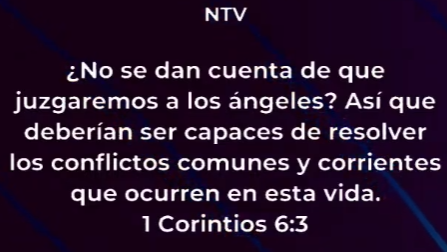
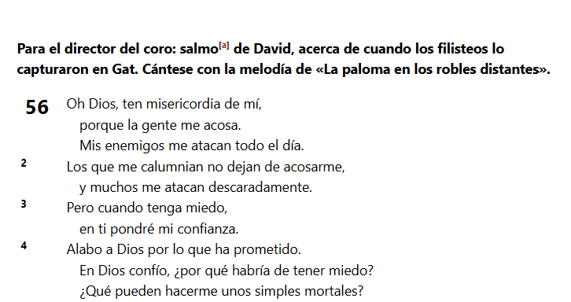
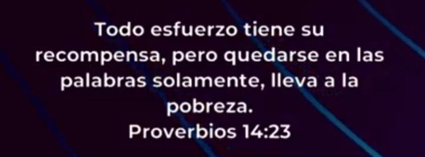

## Introducción

Primero que nada, ser cristianos no significa que no vamos a tener problemas, y mucha gente a la mínima que tiene un problema pierde la fe, y Jesús nos dice con su parábola.

**Mateo 13:1-23**

No significa que nada nos va a pasar.

**Juan 16:33**

Podemos saltar cualquier obstáculo.

Lo importante no es cuán grande sea la montaña, sino que el Señor con su granito de mostaza pueda hacer su voluntad en nosotros.

Dice la Biblia que Noé condenó al mundo, pero no porque él era un juez, sino porque demostró que había una alternativa conforme a la voluntad de Dios que se podía llevar a cabo.

Entonces nosotros, cuando estamos acá, estamos demostrando que existe una alternativa, a pesar de cualquier circunstancia, que podemos confiar en Dios.

Si en algún momento todos seremos juzgados como dice el versículo, ¿cómo es posible que los problemas pequeños no los podamos solucionar?

**Romanos 12:12**

---

Nos vamos de campamento y no nos podemos olvidar de estas tres. 

### Tenés que conocer la palabra de Dios.

A medida que más conocemos la palabra de Dios, más rápido vamos a tener respuestas a los problemas. Porque ya no vas a tener dudas, sino que sabrás de antemano qué hacer.

**Éxodo 18:20**

Y enseña a ellos las ordenanzas y las leyes, y muéstrales el camino por donde deben andar, y lo que han de hacer.

[Completo](https://www.biblegateway.com/passage/?search=%C3%89xodo%2018-20&version=RVR1960)

> Jetro le daba ese consejo a Moises. El trabajaba todo el dia pero sabia que tenia trabajo que delegar.

Podemos decir que él sabía que tenía que agradar a Dios, pero no tenía las instrucciones precisas de cómo hacerlo.

A veces, como cristianos, nos quedamos con lo que Dios quiere o agrada, pero la parte del cómo hacerlo no la tenemos clara.

**2 Timoteo 4:2**

2 Que prediques la palabra; que instes a tiempo y fuera de tiempo; redarguye, reprende, exhorta con toda paciencia y doctrina.

- Cómo buscarlo -> https://www.biblegateway.com/passage/?search=Mateo%206&version=NTV

Si no conocemos la palabra, somos como un barco sin timón, que va a la deriva.

---

### Oración

Cuando nosotros oramos, tampoco es que mágicamente uno va a tener todas las respuestas, pero Dios nos va dando más o menos pautas de cómo actuar. Y uno va analizando qué es lo que hizo mal durante el día y demás.

---

### Confiar en Dios

> CUANDO TENGO MIEDO EN TI CONFIO

**Salmos 56**

Solo podemos ser victoriosos cuando tenemos batalla.

---

## Herramientas naturales

### Trata de tener una vista panorámica de la situación.

A Salomón le habían llevado un bebé porque una de las madres perdió el bebé. Traigan una espada y lo dividimos a la mitad.

Nono, que se lo lleve ella.

No nos tenemos que abrumar.

### Pon esfuerzo propio

Uno tiene que hacer todo lo humanamente posible; hace ese esfuerzo propio.

No es que el señor me dejó solo en el problema, sino que nosotros tenemos que hacer lo que está en nuestro alcance.

Él sabe cuál es tu límite.

> Demostrale a dios que queres salir de ese problema en el que estas

Dios nos dice: "Bueno, te di dos manos y entendimiento, ahora muévete".

---

Haz todo lo posible y déjame a mí lo imposible.

Demuéstrale a Dios que de verdad quieres salir de un problema.

**Josué 1:9**

Mi mandato es: “¡Sé fuerte y valiente! No tengas miedo ni te desanimes, porque el Señor tu Dios está contigo dondequiera que vayas”».

3ro, no te adelantes a los acontecimientos.

---

3 promesas

El Señor siempre estará presente.

Estos son los currículums que tiré.

Parece que a todos nos cuesta el doble cuando tenemos algún bajón. 

