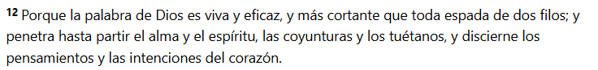
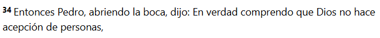
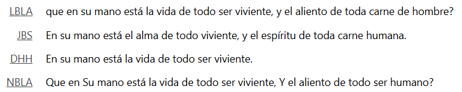
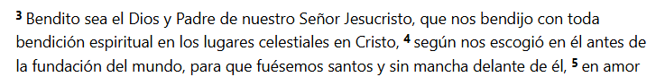
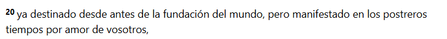

- [Link de la reunion](https://www.youtube.com/live/axbSxhv95E0?si=M3B_e1kHXO0YHzDI)

La idea de estos blogs que es podamos vivir el evangelio de modo practico y no solo teorico. La palabra de dios es viva y eficaz.

**Hebreos 4:12**

Si yo creo en dios, si yo soy un hijo de dios, si yo soy creyente. Tengo que vivir una vida cristiana, no me puedo quedar en un marco teorico, con pensamiento o ideas.

Entonces las vida plena la encontramos en Jesus y es atraves de la gracia

**Juan 1:16**

Y es por gracia y para todos

**Hechos 10:34**

Y es gracias y por voluntad de dios

**Job 12:10**

---

# Introducción

> Si queremos tener una vida plena, este es el primer ladrillo que tenemos que poner

- **Vida espiritual** -------> Caracter
- **Caracter** -------> Conjunto de cualidades o circunstancias propias de una cosa, de una persona o de una colectividad, que las distingue, por su modo de ser u obrar, de las demás. El carácter español. El carácter insufrible de Fulano.

Todos tenemos diferentes caracteristicas personales.

Cuando nosotros vivimos una vida espiritual hay caracteristicas, mas alla de nuestras caracteristicas personales, que nos definen como cristianos, como hijos de dios.

SI NO ENTENDES LO QUE ES LA VIDA ESPIRITUAL, NI VENGAS A LAS PROXIMAS REUNIONES!!! 😂

No tiene sentido enfocarnos en otras areas de la vida si no tenemos una vida espiritual.

---

**Efesios 1:3**

Pero bueno, que significa que yo pueda tener una vida espiritual? En el correr de la vida cristiana se habla mucho del crecer de la vida espiritual.

---

## Mitos del crecimiento espiritual

### No depende del tiempo

El crecimiento espiritual no tiene que ver con el tiempo, el simple echo de que vayas a la iglesia por muchos o pocos años no significa que estes creciendo espiritualmente. No tiene que ver con el paso del tiempo.

Podes estar años y años llendo a una congregación y ser tan bebe como el primer dia que llegaste espiritualmente hablando. O puede ser un tiempo corto y crecer muchisimo.

### No depende de la actividad

Tampoco tiene que ver con la actividad, el hecho de tener una actividad en la iglesia no significa que estes creciendo espiritualmente. Podes estar muy activo en la iglesia y no crecer espiritualmente. Obviamente que es bueno y saludable, pero el simple echo de hacer una tarea no me define como una persona espiritualmente madura.

### No se trata de ganarse el amor de Dios

Tampoco lo espiritual tiene que ver con ganarse el amor de dios, mientras mas vida espiritual yo tenga, dios me va a amar mas. O me va a favorecer mas.

**1 Pedro 1:20**

### No se basa en el conocimiento

Otro mito es el conocimiento, que yo sepa mucho de la palabra de dios que yo sepa mucho como se maneja una iglesia por ejemplo, como es un culto o que te conozcas todos los versiculos, te sabes de memoria la biblia, no significa que estes creciendo espiritualmente.

**¿¿ENTONCES QUE ME HACE UNA PERSONA ESPIRITUAL???**

