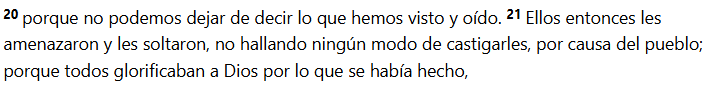

- [Link de la reunion](https://www.youtube.com/live/axbSxhv95E0?si=M3B_e1kHXO0YHzDI)

La idea de estos blogs que es podamos vivir el evangelio de modo practico y no solo teorico. La palabra de dios es viva y eficaz.

**Hebreos 4:12**

Si yo creo en dios, si yo soy un hijo de dios, si yo soy creyente. Tengo que vivir una vida cristiana, no me puedo quedar en un marco teorico, con pensamiento o ideas.

Entonces las vida plena la encontramos en Jesus y es atraves de la gracia

**Juan 1:16**

Y es por gracia y para todos

**Hechos 10:34**

Y es gracias y por voluntad de dios

**Job 12:10**

---

# Introducción

> Si queremos tener una vida plena, este es el primer ladrillo que tenemos que poner

- **Vida espiritual** -------> Caracter
- **Caracter** -------> Conjunto de cualidades o circunstancias propias de una cosa, de una persona o de una colectividad, que las distingue, por su modo de ser u obrar, de las demás. El carácter español. El carácter insufrible de Fulano.

Todos tenemos diferentes caracteristicas personales.

Cuando nosotros vivimos una vida espiritual hay caracteristicas, mas alla de nuestras caracteristicas personales, que nos definen como cristianos, como hijos de dios.

> SI NO ENTENDES LO QUE ES LA VIDA ESPIRITUAL, NI VENGAS A LAS PROXIMAS REUNIONES!!! 😂

No tiene sentido enfocarnos en otras areas de la vida si no tenemos una vida espiritual.

---

**Efesios 1:3**

Pero bueno, que significa que yo pueda tener una vida espiritual? En el correr de la vida cristiana se habla mucho del crecer de la vida espiritual.

---

## Mitos del crecimiento espiritual

### No depende del tiempo

El crecimiento espiritual no tiene que ver con el tiempo, el simple echo de que vayas a la iglesia por muchos o pocos años no significa que estes creciendo espiritualmente. No tiene que ver con el paso del tiempo.

Podes estar años y años llendo a una congregación y ser tan bebe como el primer dia que llegaste espiritualmente hablando. O puede ser un tiempo corto y crecer muchisimo.

### No depende de la actividad

Tampoco tiene que ver con la actividad, el hecho de tener una actividad en la iglesia no significa que estes creciendo espiritualmente. Podes estar muy activo en la iglesia y no crecer espiritualmente. Obviamente que es bueno y saludable, pero el simple echo de hacer una tarea no me define como una persona espiritualmente madura.

### No se trata de ganarse el amor de Dios

Tampoco lo espiritual tiene que ver con ganarse el amor de dios, mientras mas vida espiritual yo tenga, dios me va a amar mas. O me va a favorecer mas.

**1 Pedro 1:20**

### No se basa en el conocimiento

Otro mito es el conocimiento, que yo sepa mucho de la palabra de dios que yo sepa mucho como se maneja una iglesia por ejemplo, como es un culto o que te conozcas todos los versiculos, te sabes de memoria la biblia, no significa que estes creciendo espiritualmente.

**쮼NTONCES QUE ME HACE UNA PERSONA ESPIRITUAL???**

Vamos a la palabra de dios

**Efesios 1:4**

Dios nos escogio antes de la fundacion del mundo y yo ni siquiera puedo imaginarme cuando se fundo el mundo, no me puedo imaginar ese momento.

---

**2 Corintios 3:18**

**Efesios 4:11-13**

> El crecimiento espiritual se relaciona cuando nosotros en nuestro caminar cristiano, somo transformados para ser cada dia mas parecidos a jesus. Hasta la medida de la estatura de la plenitud de cristo. 

SIMPLEMENTE ESO

쯈ue es vivir una vida espiritual?

Dejar que el espiritud santo cada dia me haga mas parecido a jesus. Dejar que el espiritud santo que vive en mi, cada dia me transforme para parecerme mas a jesus.

---

#### **쮺omo nos damos cuenta si nos parecemos a Jesus?**

Bueno, es todo un progreso y dice que vamos siendo transformados.

Aveces pensamos que como hijos de dios va a llegar un momento en el que voy a ir a una gran reunion y va a llegar el rayo santificador y de un momento a otro, empiezo a hacer todo bien.

No se trata de un momento unico, sino que el crecimiento espiritual es un dia a dia. Porque si en una reunion, dios me hablo, eso significa que yo mañana me tengo que levantar a buscarlo. Y asi cada dia.

No se trata de que dios me toca con la varita magica, sino que la biblia habla de un proceso.

Lo que si es instantaneo, es cuando dios te perdona y te justifica.

**Ejemplo**

Hay un juicio a un asesino (Este mato a 20 personas un divino). Se para delante del juez. Este lo mira a los ojos y le dice 'Por lo que hiciste te tendria que condenar de por vida pero sabes que? Yo te perdono, anda tranqui.

El asesino se va feliz dicendio 'wow, me sacaron la condena'. Esa persona cuando sale del tribunal continua siento tan asesino como antes de entrar y probablemente va a volver a matar. No fue contenado pero salio IGUAL.

ESO NO ES EL EVANGELIO.

El evangelio tiene esa cuota de perdon, dios como juez ve que jesus ocupo tu lugar y te dice, si a vos! que cometiste pecado, que sabes bien en tu corazon que hiciste mal, a vos, te perdono porque Jesus ocupo tu lugar. Pero cuando salis del juzgado, dios te dice, pero esperaa. Te voy a dar el espiritud santo para que ya no seas la misma persona y seas transformado.

Entonces cuando nosotros somos perdonados, y dios nos da el espiritu santo para ser transformados para no seguir siendo los mismos.

> Y esa transformacion que nos va cambiando es la vida espiritual. Es por eso que nosotros tenemos que llenarnos para dejar que el espiritu santo nos ministre y transforme.

Dios nos puede llenar en cualquier momento pero nosotros tenemos que 'abrir el recipiente'.

> El crecimiento espiritual se relaciona con abrirle al espiritud santo todas las puertas de mi corazon.

No es que el espiritud se quede corto sino que nosotros no le abrimos las puertas.

**Salmos 16:8**

**쯏 yo porque voy a querer poner primero a dios??**

Cuando entendemos lo que dios hizo por nosotros, cuando entendemos que Jesus nos libro de la condenación. Cuando realmente comprendemos de lo que fuimos rescatados, el deseo de nuestro corazon no va a ser otro que el querer onrarle. Y que querer vivir para el.

El evangelio no se trata de hacer las cosas bien, para que me vaya bien a mi (te puede ir bien pero es una consecuencia). Sino que se trata de entender de que soy perdonado entonces vivo para onrar a dios.

Si nunca en la vida sentiste un puñal de que soy un pecador de que yo necesito que dios me perdone no entendi el evangelio.

---

## No negociables

---

## 1) Habla con Dios cada día

**Mateo 26:41**

Tu cuerpo no quiere que ores, tu mente te dice que hay cosas mas importantes. Si vos queres vivir tu vida espiritual, no negocies la oración.

**Daniel 6:10**

Hoy no tenemos amenaza de muerte sobre ninguno de nosotros y a pesar de eso negociamos la oración.

**Hebreos 11:6**

Yo tengo que ser conciente que cuando yo oro, y cuando digo 'Padre en el nombre de Jesus' DE VERDAD ESTOY HABLANDO CON DIOS.

---

## 2) Deja que Dios te hable cada día

No podemos negociar la palabra de dios, es la palabra la que nos da las herramientas para vivir una vida cristiana. Es la que nos aumenta la fe. Toda la biblia es inspiradad.

**2 Timoteo 3:16-17**

**Salmo 119**

La palabra del señor nos enseña, a vivir por la eternidad, como no vamos a amar su palabra

---

## 3) Habla de Dios cada dia

Que sale de tu boca? Estas hablando de dios? A tus amigos? a las personas que te rodean?

Si nadie sabe en tu entorno que vos crees en dios, que amas a Jesus, es hora de que lo sepan.

**Hechos 4:20-21**

---

## 4) Recuerda que tus ojos son la lámpara del cuerpo

No contamines tus ojos

Tenemos que ser cuidadosos con lo que vemos y oimos si queremos tener un vida espiritual

---

## 5) Alimenta tu mente con pensamientos saludables, desecha los pensamientos que te contaminan.

Generalmente lo que entra por los ojos y oidos es lo que alimenta nuestros pensamientos.

A nuestra mente la tenemos que alimentar con pensamientos saludables. Y que hago???

Por eso es importante la palabra de dios.

**Filipenses 4:8**

Tu mente tiene que ser un filtro y mas hoy en dia. Cualquier pensamiento que sea mentira y que no se condiga con la palabra, que sea impuro, cualquier pensamiento que no onre a dios, inmediatamente lo tenes que desechar. No tenes que perder el tiempo peleando con ese mal pensamiento.

---

## 6) Llenate del Espiritu Santo

> Recuerda que el carácter del cristiano tiene frutos espirituales.

Como se si estoy lleno del espiritu santo? Porque se ven los frutos del espiritu en mi vida.

Si yo no le abro todas las puertas al espiritu, nunca me voy a poder llenar, no porque el espiritu se quede corto sino porque yo no le abro las puertas.

Como se si estoy lleno del espiritu santo? Porque se ven los frutos del espiritu en mi vida.

- Gozo ->  Sentimiento de complacencia en la posesión, recuerdo o esperanza de bienes o cosas apetecibles.
- Paz ->   Estado de quien no está perturbado por ningún conflicto o inquietud. Disfrutar de una paz profunda.
- Benignidad ->  Antónimos u opuestos de «benignidad»
malignidad, maldad.
- Fe -> Encontre este blog que habla bastante sobre este tema [Link](https://www.unrudodespertar.tv/emuna-la-fe-que-nos-sustenta/) Tambien encontre este [쯃a «fe» es una idea bíblica?](https://weekly.israelbiblecenter.com/es/la-fe-es-una-idea-biblica)
- Mansedumbre -> Este blog lo explica bastante bien [Link](https://www.bibliaon.com/es/significado_biblico_mansedumbre/)

Si estas cosas abundan en mi, estoy lleno del espiritu santo. Si estas cosas no abundan en mi, tengo que entregarle mas al señor. Tengo que dejar que el llene mas areas de mi vida.

Podes tener el mejor auto del mundo pero si no tenes combustible no sirve de nada.

Porque decimos esto? Porque el espiritu santo, es el combustible de nuestra vida espiritual.

Como puedo cumplir esto?? Llenate del espiritu santo, entregale tu vida al espiritu.

---

## 7) Sirve al Señor. Recuerda que el servicio del cristiano es según los dones espirituales.

Los frutos del espiritu revelan nuestro caracter, nos sirven para parecernos mas a Jesus, los dones del espiritud son los que determinan nuestro servicio. Dios a cada uno nos permite tener los frutos y los frutos son para todos por igual. 

Los dones los da de manera especial a cada uno, como el quiere. Esos dones son para que los pongas al servicio del señor. Porque son herramientas que dios te dio para vendecir a otros

**1 Corintios 12**

Muchas veces nosotros tenemos una habilidad, tenemos un don, pero no dejamos que el señor trabaje en los frutos y el ejercer el don sin el fruto del espiritu, es decir, ejercer mi habilidad sin el caracter lamentablemente, puede ser un desastre. Porque yo necesito estar formado en el caracter, en los frutos del espiritu.

---

## 8) Se humilde. Todo es por gracia y todo es a través de sus fuerzas.

---

## 9) No te menosprecies. Porque asi no podrás cumplir el segundo mandamiento.

---

## 10) Honra a Dios en todo

---

## 11) Recuerda que el carácter del cristiano se perfecciona mediante una vida de relación. Es allí donde evalúas como estás.