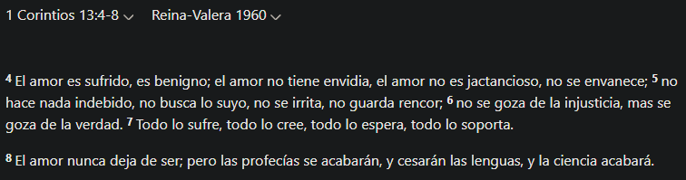

## **10 Máximas de la vida familiar**

### Punto 1

Una relación sentimental sin un proyecto de familia es una pérdida de tiempo **(Marcos 10:7)**

---

### Punto 2

Lo que siembre en mi familia de hoy, será mi cosecha en mi familia de mañana **(Gálatas 6:7)**

---

### Punto 3

La atracción es inevitable, pero el Espíritu Santo nos da el dominio propio **(Romanos 7:24-25)** Y **(2 Timoteo 1:7)**

---

### Punto 4

Las relaciones amorosas están diseñadas para personas que han alcanzado cierto grado de madurez **(Efesios 5:31, Proverbios 18:22, 2 Timoteo 3:16-17, 1 Corintios 7:32-40)**

---

### Punto 5

Mi forma de tratar con el otro tiene que estar regida por dos principios: Prudencia y Pureza **(Tito 2:6-7, 1 Timoteo 5:2)**

---

### Punto 6

Debo conducirme con santidad y no ser de tropiezo. "Kadash" y "Hagiasmos". Separado, purificado **(1 Pedro 1:15-16, Hebreos 12:14, Mateo 18:7-9)**

---

### Punto 7

Antes de mirar a alguien más debo mirarme a mí mismo **(Mateo 7:3)**

---

### Punto 8

Cuando tengo intenciones de iniciar una relación con alguien, es aconsejable comentárselo a solo tres personas: a Dios, abriéndole tu corazón en oración; a un referente espiritual, con respeto y humildad; y a la otra persona, con sinceridad, no busques forzar la casualidad **(Filipenses 4:6-7, Proverbios 4:23, Proverbios 1:5, Proverbios 12:17)**

| Reina Valera 1960 | Nueva Traduccion Viviente |
|-----------|-----------|
|     |     |

---

### Punto 9

Recuerda que en la I.C.L.P. tenemos tres etapas:
- Amistad especial (etapa de conocimiento sincero, contacto físico mínimo, como con cualquier otra persona - saludo por ej.)
- Noviazgo (etapa de compromiso y preparación, contacto físico de cariño, no sexual ni sugerente)
- Casamiento (etapa de amor incondicional, una sola carne. Se forma un hogar en el Señor).

> Como pueden observar, no tenemos "etapa de coqueteo".

**(1 Corintios 14:33, Proverbios 12:20, Lucas 14:28, Proverbios 31:30, 1 Samuel 16:7, Proverbios 16:9, Salmos 25:15, Eclesiastés 7:26, Proverbios 13:16, Proverbios 15:21, 2 Corintios 6:14-16, 1 Corintios 13:4-8, Génesis 2:24, Génesis 12:3)**

¿A qué se refiere con lazos y redes?

Pero tampoco me quedo muy claro y buscamos en otras traduciones:

> La necedad es la actitud o cualidad de una persona necia, es decir, alguien que actúa con ignorancia, obstinación y falta de juicio, a menudo desoyendo consejos o advertencias razonables.

> El término proviene del latín nescius, que significa “ignorante” o “que no sabe”. Quien actúa con necedad suele mostrarse terco, testarudo y cerrado al diálogo, lo que lo lleva a cometer errores evitables o a comportarse de forma torpe o insensata.

---

### Punto 10

Las relaciones sexuales únicamente están reservadas para el esposo con la esposa **(Hebreos 13:4)**

---

### Resumen de notas con Notion-Transcription (Tomar con pinzas)

**Contexto**

Esta charla es parte de una serie sobre diferentes esferas de la vida cristiana. Previamente se habló sobre la vida espiritual, y esta sesión se enfoca en la vida familiar, específicamente en relaciones sentimentales con un enfoque bíblico. En futuras reuniones se abordarán la vida laboral y administrativa.

**Las 10 Máximas sobre la Vida Familiar**

1. **Una relación sin proyecto de familia es una pérdida**
    - Basado en Mateo 19:5-6: la unión matrimonial como propósito divino
    - Los sentimientos deben orientarse hacia un proyecto de familia
2. **Lo que siembro en mi familia de origen, lo cosecharé en mi familia futura**
    - Basado en Gálatas 6:7: "todo lo que el hombre sembrare, eso también segará"
    - El respeto y obediencia a los padres prepara para la futura familia
3. **La atracción es inevitable, pero requiere dominio propio**
    - Reconocimiento de nuestra naturaleza humana (Romanos 7:24)
    - El Espíritu Santo nos da poder, amor y dominio propio (2 Timoteo 1:7)
4. **Las relaciones amorosas están diseñadas para personas con cierto grado de madurez**
    - Efesios 5:31: "dejará el hombre a su padre y a su madre y se unirá a su mujer"
    - Proverbios 18:22: "El que halla esposa halla el bien"
    - La palabra "perfecto" en la Biblia significa "maduro"
5. **El comportamiento en el cortejo debe guiarse por prudencia y pureza**
    - Tito 2:6: exhorta a los jóvenes a ser prudentes
    - 1 Timoteo 5:2: tratar a "las jovencitas como a hermanas, con toda pureza"
6. **Debemos conducirnos con santidad y no ser tropiezo**
    - 1 Pedro 1:15-16: "como aquel que os llamó es santo, sed también vosotros santos"
    - Hebreos 12:14: "Seguid la paz y la santidad, sin la cual nadie verá al Señor"
    - Mateo 18:7-9: advertencia sobre ser causa de tropiezo
7. **Antes de mirar a alguien más, debemos mirarnos a nosotros mismos**
    - Mateo 7:3: "¿Por qué miras la paja en el ojo de tu hermano...?"
    - Enfocarse en la propia madurez espiritual antes de buscar cualidades en otros
8. **Al iniciar una relación, es aconsejable comentarlo a tres personas:**
    - Primero a Dios en oración
    - A un referente espiritual/mentor
    - Finalmente, a la persona de interés con claridad de intenciones
9. **Respetar las tres etapas de una relación:**
    - Etapa de amistad especial (conocimiento, contacto físico mínimo)
    - Etapa de noviazgo (compromiso y preparación)
    - Etapa de matrimonio (amor incondicional, 1 Corintios 13:4-8)
10. **Las relaciones sexuales están reservadas exclusivamente para el matrimonio**
    - Hebreos 13:4: "Honroso sea en todos el matrimonio, y el lecho sin mancilla"

**Aplicación Práctica**

- Tomar decisiones basadas en la palabra de Dios, no en las normas del mundo
- Ser luz en medio de la oscuridad a través de relaciones que honran a Dios
- Formar familias sólidas que puedan resistir problemas como violencia, abuso o engaño
- Evitar simular o forzar situaciones; ser sinceros en las relaciones
- Reconocer que estas directivas requieren la ayuda del Espíritu Santo

**Acción Futura**

- [ ]  La próxima semana se abordará la esfera de la vida laboral
- [ ]  Meditar en la palabra recibida para tomar buenas decisiones
- [ ]  Aplicar estos principios para formar familias que sean bendición para otras