- [Link de la reunion](https://www.youtube.com/live/t1qBwq6yfo0?si=Zq3ItR5dok3PhnTT)

Hacemos memoria de lo que fue la vida de jesus, acordandonos de que este comenzo su ministerio a los 30 años (Lucas 3:23-38). 

Antes de eso no tenemos mucha informacion de lo que fue su juventud, pero si sabemos que fue carpintero.

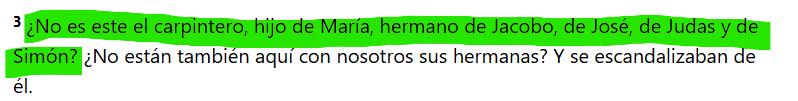

Jesus antes de su ministerio era mas conocido por ser un simple carpintero, que por ser un predicador. El era tan hijo de dios cuando era carpintero, como cuando comenzo su ministerio (Exactamente el mismo).

Nos podemos imaginar a Jesus en el dia a dia, al momento de ralizar un trabajo, el aplicaba toda su sabiduria y conocimiento, para hacer un buen trabajo.

Jesus siendo el hijo de dios, dedico muchos años de su vida a lo que hoy en dia, lo llamamos cecular (o del mundo). 

Muchas veces inconcientemente 'reducimos' el evangelio a la congregación (Solo lo que pasa dentro de la iglesia).

> EL EVANGELIO SE VIVE TODO EL TIEMPO EN TODOS LADOS, porque jesus es mi señor todo el tiempo y en todos lados.

Muchas veces creemos que en la iglesia aprendemos cosas abstractas pensando que no lo podemos aplicar en la vida cotidiana. 

Génesis 2:8

Antes de que se genere la caida del hombre, ya dios le habia dado un proposito al Adam.

a trabajaar pibee!!

Genesis 2:15

Labrar en hebreo
- **Pronuciación** -> abád
- **Derivación** -> raíz prim.
- **Definición** -> trabajar (en todo sentido); por impl. servir, arar, cultivar, (caus.) esclavizar,etc.
- **Def. en RV** -> adorar, arar, culto, desempeñar, ejercer, esclava, honrar, librador, labrar, ministrar, prestar, servidumbre, servir, siervo, sujetar, trabajador, trabajar.

El trabajo en si, no es algo puramente terrenal, de este 'mundo corrupto'. Ya que los versiculos que estamos mostrando son previos a la caida del hombre (Que este caiga en pecado).

Absolutamente todo el ecosistema en el que vivimos tiene un proposito, y el trabajo es parte de ese proposito.

Juan 5:17

Tu trabajo es el medio que dios te da para honrarlo a él. 

Servir a dios es algo que vos podes hacer todos los dias de tu vida, desde el minuto cero.

Nosotros no vemos a jesus haciendo una mesa con una pata mas corta o un trabajo a medias por el simple hecho de que 'es un trabajo terrenal'. No lo vemos de esa forma, porque jesus hacia todo con excelencia y aun en esas pequeñas cosas el mostraba los destellos de honrar a dios

**2 Tesalonicenses 3:10-11**

> Para los griegos, el trabajo es la a-schole, el nec-otium, es decir, una actividad secundaria impropia del hombre, que, por el contrario, se dedica al ocio y a la vida buena en la polis

Fuente - [Link](https://www.philosophica.info/voces/trabajo/Trabajo.html#:~:text=La%20noci%C3%B3n%20de%20trabajo%20seg%C3%BAn%20estas%20tradiciones%20filos%C3%B3ficas,-De%20este%20brev%C3%ADsimo&text=Para%20los%20griegos%2C%20el%20trabajo,vida%20buena%20en%20la%20polis.)

Pero nosotros vemos en los conceptos biblicos que dios le da trabajo al hombre en el Edem, en el momento en el que lo ponen en el huerto como algo bueno/de bendicion.

Joe mensiona este estudio o uno similar

- [Fuente](https://www.eldia.com/nota/2025-3-2-5-29-32-jovenes-que-no-estudian-ni-trabajan-de-la-exclusion-al-incentivo-temas)

Hoy por hoy estamos muy sumergidos en la cultura del oscio y del entretenimiento.

Estas son situaciones que el enemigo usa para que no hagamos lo que nos corresponde hacer. Si nosotros leemos las historias de la palabras de dios, nos muestra a hombres y mujeres que glorificaron a dios y que dios los uso en sus actividades.

- David era pastor de ovejas, y en ese trabajo dios lo uso para cuidar a su pueblo.
- Josue era un soldado, y en ese trabajo dios lo uso para conquistar la tierra prometida.
- Daniel era un politico
- Nehemias era un copero, y en ese trabajo dios lo uso para reconstruir los muros de jerusalen.

Todos surgieron de un trabajo simple y sencillo. Nos hablar de hombres y mujeres que en su sencillez, se encontraron con dios. Y lo mismo con los discipulos de jesus que tenian oficios simples.

> Todos ellos dejaron que jesus entre en su dia a dia ¿Vos permitis que jesus irrumpa en tu dia a dia? o simplemente guardas el dia de culto y reuniones y el resto del tiempo haces lo que queres?

Antes de comenzar con el trabajo o con algun asunto importante es recomendable que nos tomemos un tiempo para orar y pedirle a dios que nos guie en lo que vamos a hacer.

## Punto 1 Trabajar es un mandamiento de Dios.

**Exodo 20:9**

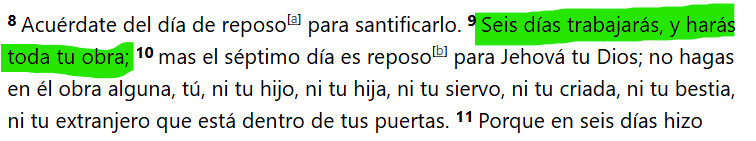

---

## Punto 2 Mi trabajo es mi manera de honrar a Dios.

**Colosenses 3:22-24**

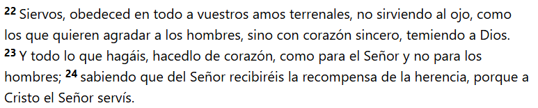

**Mateo 5:16**

Otro versiculo que nos habla sobre honrar a dios con nuestro trabajo.

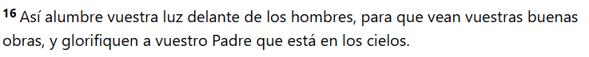

**1 Timoteo 5:8**`

A mi me pasa en este pasaje que veo muy a menudo amigos o familiares que prefieren gastar mas con sus amigos, ya sea saliendo a comer algo, o cualquier otro plan, y se olvidan completamente de su familia. Es una situación que me paso a mi tambien ya que muchas veces uno tiende a minimizar lo que tiene, como diciendo **'total es mi familia, siempre van a estar ahi'** y no es asi.

---

## Punto 3 El ocioso le abre un portón a la tentación.

**Proverbios 13:4**

> Una persona diligente se caracteriza por su responsabilidad, compromiso, puntualidad, organización y atención al detalle. Se esfuerza por hacer las cosas bien y a tiempo, y busca siempre la mejor manera de lograr sus objetivos.
> Una persona diligente es aquella que tiene una actitud favorable hacia el trabajo y las obligaciones, haciendo uso de su inteligencia, con economía de recursos y alto grado de eficiencia.

**2 Samuel 11:1-5**

La historia comienza con una situacion de oscio ya que no estaba donde debia estar (En la guerra).

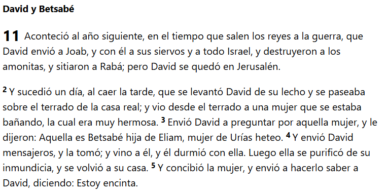

Si en mi vida priorizo el oscio, le estoy abriendo la puerta a la tentacion.

**2 Pedro 1:5-10**

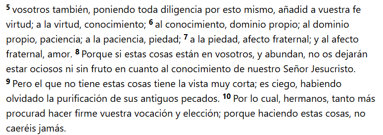

---

## Punto 4 Trabaja con excelencia, no solo para zafar. Jesus nos pide una milla más

**Proverbios 18:9**

A mi me venia pasando ultimamente que como estamos en epocas de examenes, estaba mas preocupado en estudiar que en hacer bien mi trabajo. En cambio cuando no estaba en epoca de examenes dedicaba todo el tiempo posible a hacer bien mi trabajo. A medida que uno va adquiriendo responsabilidades, tiende a querer zafar de las cosas y hacerlas a medias. Pero dios nos pide que hagamos todo con excelencia.

En **Efesios 5**, nos habla de que debemos imitar a dios en todo lo que hacemos.

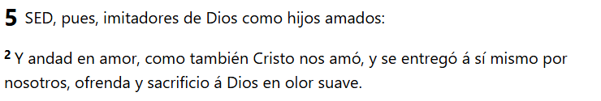

**Proverbios 22:29**

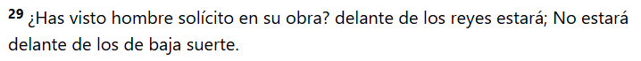

**Proverbios 24:10**

**Mateo 5:41**

Dejo Éxodo 40 que habla sobre como dios le pide a Moises que arme el tabernaculo con excelencia.

Éxodo 40

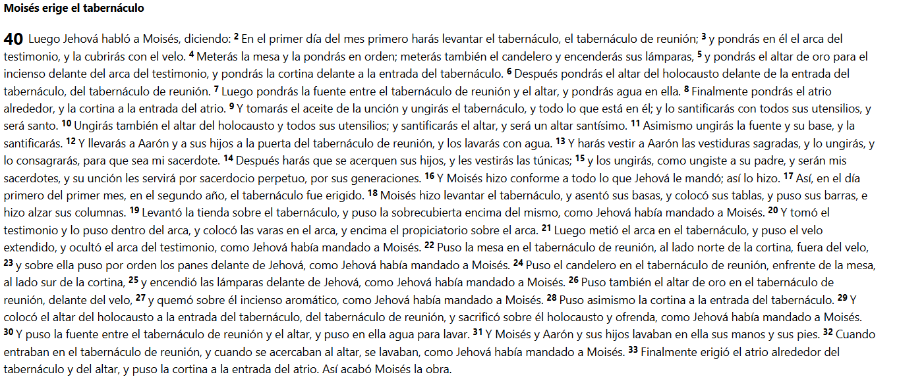

---

## Punto 5 No intentes ser el mejor, sino dar lo mejor. Es para Su gloria, no para la nuestra.

La idea principal es no caer en el egoismo, comparandonos constanemtene con los demas. Sino que debemos enfocarnos en dar lo mejor de nosotros, sin importar si somos los mejores o no. Que usualmente cuando uno se enfoca en dar lo mejor de si, termina acercandose.

Cuando tengas un exito, cuando apruebes una materia, cuando te recibas, cuando te asciendan en el trabajo, vas a entender que es para su gloria, no para la nuestra. Es para onrarlo a el, no para nostros.

**1 Corintios 10:31**

**2 Crónicas 32:27-31**

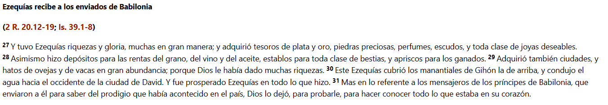

---

## La santidad y la justicia deben reflejarse en mi trabajo y mi estudio. No las comprometas por tomar un atajo.

**Proverbios 20:23**

Puede que nos encontremos en situaciones que por tomar un atajo, negociemos nuestra integridad. Ya sea en un examen, en un mal trabajo o en un negocio. Pero nosotros sabemos que el que ve todas las cosas es el señor. Incluso lo hacemos por accion o por omision. (De esto se habla tambien en un pasaje Santiago 4:17 si mal no recuerdo)

> Dios tampoco nos llama a ser un justiciero, andar por ahi juzgando a todo el mundo. Te llama a ser una persona justa en mirarte primero a vos y decirte si verdaderamente estas trabajando con justicia.

**Salmo 128:1-2**

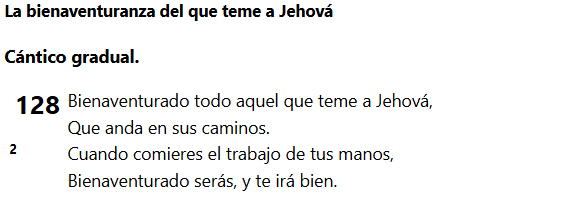

---

## Punto 7 Esfuérzate en todo, pero nunca negocies tus prioridades. Dios, familia, trabajo/carrera.

**Proverbios 15:27**

Esto puede pasar cuando estamos tan enfocados en conseguir un aumento o en aprobar la maxima de materias posibles o querer seguir una dieta estricta y entrenar que muchas veces descuidamos lo mas importante que es dios y la familia. En mi caso particular, escucho bastante la biblia por audio pero despues no me tomo el tiempo en profundizar en muchos temas.

**Mateo 16:26**

**Juan 6:27**

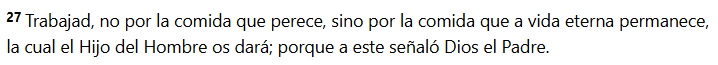

---

## Punto 8 El tiempo es un don de Dios, adminístralo con sabiduría.

**Salmos 31:14-15**

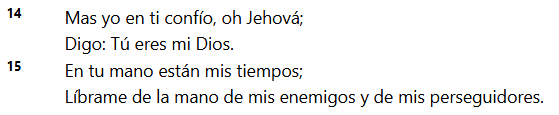

''No tengo tiempo'', muchos dicen, pero la verdad es que todos tenemos las mismas 24 hs y muchos no lo sabemos administrar de la mejor manera.

- [Fuente](https://www.tiempoar.com.ar/ta_article/adolescentes-y-celulares-cada-vez-mas-horas-de-uso-impacto-en-la-salud-mental-y-el-sueno/#:~:text=La%20muestra%2C%20tal%20como%20comparti%C3%B3,entre%2011%20y%2018%20a%C3%B1os.&text=Los%20datos%20reflejaron%20un%20incremento,entre%20chicas%20que%20entre%20chicos.)

---

## Punto 9 Dale a Dios lo que es de Dios. Sé generoso. Así evitarás que el dinero se convierta en tu idolo.

**Proverbios 19:17**

**Proverbios 28:27**

**2 Corintios 9:6**

**Malaquías 3:10**

**Génesis 14:20**

**1 Corintios 16:2**

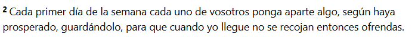

**Génesis 4:4-5**

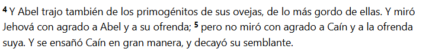

**Lucas 21:1-4**

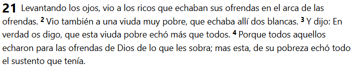

**1 Timoteo 6:10**

---

## Tu trabajo, tu carrera y tus ocupaciones son una bendición, no una crisis. Jesús es de paz.

Muchas veces estamos durante la semana con tantas actividades que somos un cumulo de nervios. Yo por lo menos trabajo de lunes a viernes 8/9hs, trato de estudiar un par de horas y a la noche voy a hacer deporte. Por suerte a medida que uno va profundizando en la palabra de dios, se va organizando mejor y va entendiendo que todo lo que hace es una bendicion.

**1 Tesalonicenses 4:11**

Dice ocupense, no dice 'preocupense'

**Eclesiastés 3:9**

Desde el Edem, el trabajo es una bendicion y el diablo quiere es que te preocupes y alteres por eso. Ya que uno cosa lleva a la otra y podemos terminar alejandonos de dios.

**Mateo 6:25-34**

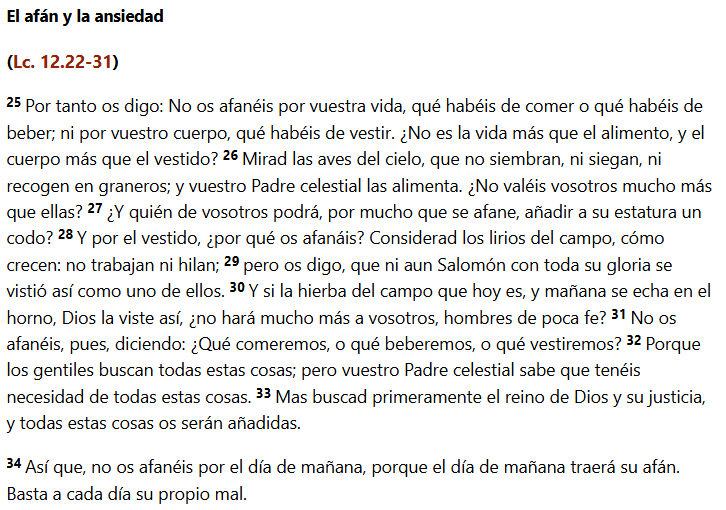

**Filipenses 4:6-7**

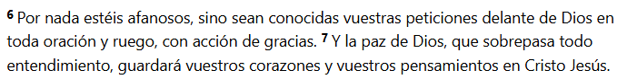